 

 

 

# 区块链技术原理与应用开发教程

#  

# 第一篇 区块链技术基本原理篇

 

# 第1章 区块链技术概述

一、**区块链**

区块链是[分布式](https://baike.baidu.com/item/分布式/19276232)数据存储、点对点传输、共识机制、[加密算法](https://baike.baidu.com/item/加密算法)等计算机技术的新型应用模式。

狭义来讲，区块链是一种按照时间顺序将数据区块以顺序相连的方式组合成的一种链式数据结构， 并以密码学方式保证的不可篡改和不可伪造的分布式账本。

广义来讲，区块链技术是利用块链式数据结构来验证与存储数据、利用分布式节点共识算法来生成和更新数据、利用密码学的方式保证数据传输和访问的安全、利用由自动化脚本代码组成的智能合约来编程和操作数据的一种全新的分布式基础架构与计算方式。


区块链（Blockchain）是[比特币](https://baike.baidu.com/item/比特币/4143690)的一个重要概念，它本质上是一个去中介化的[数据库](https://baike.baidu.com/item/数据库)，同时作为[比特币](https://baike.baidu.com/item/比特币/4143690)的底层技术，是一串使用[密码学](https://baike.baidu.com/item/密码学/480001)方法相关联产生的[数据块](https://baike.baidu.com/item/数据块/107672)，每一个数据块中包含了一次比特币网络交易的信息，用于验证其信息的有效性（[防伪](https://baike.baidu.com/item/防伪/9638550)）和生成下一个区块。


区块链避免了中心化存储带来的安全和单点崩溃问题，同时结合共识机制来保证数据的一致性。非对称加密：包含两个密钥：公钥(publickey)和私钥(privatekey)。它们是成对存在的。公钥用来对数据进行加密和验签，私钥用来对数据进行解密和签名;一般公钥是公开的，私钥是自己保存，相对了传统的对称加密而言更具有安全性，是一种高级加密方式。

区块链分类：

 


区块链是比特币的底层技术，像一个数据库账本，记载所有的交易记录。这项技术也因其安全、便捷的特性逐渐得到了银行与金融业的关注。

所谓的区块链就是一种网络技术，通过程序员敲代码形成的网络，各方相互合作交易均可直接对接完成，不需要靠第三方平台，也就省去了中间的一些程序和费用(省时省力还省钱)，但为了合作或交易的安全，系统会将每一个参与者的动作广播给所有参与者，保障了整个过程的安全、透明，解决了信任问题。

区块链的基本原理：


希望解决当下教育环节中出现的问题：


通过区块链技术我们可以实现：

• 独有的课程空投机制，学链对于课程提供商界面友好，采用和比特币类似的空投 / 分叉机制。

• 基于社交网络的用户社区，学链定期空投课程到学链钱包，用户领取的免费 课程会持续增加；学链用户可以学习这些课程，也可以在微信等社交网络上卖出课程，用户卖出空投课程产生的法币收益全部归自己所有。

• 去中心化的市场机制，课程作为去中心化的资产，学链用户之间可以自由转让，方便用户根据自己需求交易买卖。学链基金会不介入交易，也不收取佣金。

总结来看，区块链带给教育行业的机会有三方面：

1、证书及学业信息不再需要厚重的纸质档案来记载，区块链可以帮助实现学业学位记录，并保障该信息的安全与真实性。

2、参与区块链的教育机构可以降低信息管理成本，减少人力物力在这方面的投放。

3、教育货币的诞生有助于简化支付流程。


通俗一点地说，区块链是一个收录所有历史交易的总帐，每个区块中包含若干笔交易记录。如果说区块链是账本，那么区块就是账本的每一页。交易的细节都被记录在一个网络里任何人都可以看得到的公开账簿上。区块就是很多交易数据的集合，它被标记上时间戳和之前一个区块的独特标记。有效的区块获得全网络的共识认可以后会被追加到主区块链中。区块链是有包含交易信息的区块从后向前有序链接起来的数据结构。

人工智能简单地说，就是建造能够执行似乎需要智力的任务的理论和实践。同时，区块链本质上是一种新的数字信息归档系统，它以加密的、分布式的账本格式存储数据。由于数据是加密的，并且分布在许多不同的计算机上，所以它允许创建防篡改、高度健壮的数据库，只有获得许可的人才能读取和更新数据库。


 


## **1.1** **区块链技术演进**

### **1.1.1** 比特币（Bitcoin)

####  1.1.1.1 比特币技术架构


#### 1.1.1.2 比特币网络模型


#### 1.1.1.3比特币账本模型


#### 1.1.1.4比特币共识模型


#### 1.1.1.5比特币UTXO模型


#### 1.1.1.6 比特币事务处理流程


#### 1.1.1.7 比特币隐私模型


#### 1.1.1.8 比特币Token激励模型


### **1.1.2** 以太坊(Ethereum)

####   1.1.2.1 以太坊技术架构


#### 1.1.2.2 以太坊网络模型


#### 1.1.2.3以太坊账本模型


#### 1.1.2.4以太坊共识模型


#### 1.1.2.5以太坊身份模型


#### 1.1.2.6 以太坊事务处理流程


#### 1.1.2.7 以太坊隐私模型


#### 1.1.2.8 以太坊激励模型


### 1.1.3 超级账本（Hyperledger ）

####  1.1.3.1 Fabric技术架构


#### 1.1.3.2 Fabric网络模型


#### 1.1.3.3 Fabric账本模型


#### 1.1.3.4 Fabric共识模型


#### 1.1.3.5 Fabric身份模型


#### 1.1.3.6 Fabric事务处理流程


#### 1.1.3.7 Fabric隐私模型


#### 1.1.3.8 Fabric联盟激励模型


## **1.2** 区块链基本原理

###  1.2.1 区块链内涵与特征

 

###  1.2.2 区块链技术架构

 

### 1.2.3 区块链处理流程


## **1.3**  区块链技术发展现状

### 1.3.1 概述


### 1.3.2 技术架构


### 1.3.3 共识模型


###  1.3.4 智能合约


### 1.3.5 隐私模型


### 1.3.6 应用场景

 

## 1.4 区块链技术应用场景

###  1.4.1 应用场景概述


### 1.4.2 数字金融


### 1.4.3 智慧城市


### 1.4.4 智慧交通


### 1.4.5  智慧供应链


### 1.4.6 智慧金融


### 1.4.7 智能制造


# 第2章 区块链密码学理论基础


**密码学数学基础请参考：**

算法数论：格、数域、曲线和密码学 **[Algorithmic Number Theory Lattices, Number Fields, Curves and Cryptography]**

[美] [J.P.Buhler](https://book.jd.com/writer/J.P.Buhler_1.html)，[P.Stevenhagen](https://book.jd.com/writer/P.Stevenhagen_1.html) 编，[王元](https://book.jd.com/writer/王元_1.html)，[冯克勤](https://book.jd.com/writer/冯克勤_1.html)，[张俊](https://book.jd.com/writer/张俊_1.html) 译


密码学基础知识建议参考这些书籍：《应用密码学：协议、算法与C源程序（原书第2版）》、《密码工程：原理与应用》、《图解密码技术（第3版）》、《密码学 - C/C++语言实现》等。


Python密码学编程 第2版

[美] [阿尔·斯维加特](https://book.jd.com/writer/阿尔·斯维加特_1.html)（[Al Sweigart](https://book.jd.com/writer/Al Sweigart_1.html)） 著，[郑新芳](https://book.jd.com/writer/郑新芳_1.html)，[赵怡翾](https://book.jd.com/writer/赵怡翾_1.html) 译


## 2.1 密码学概述

密码学不是孤立存在的，而是由其他硬件和软件系统、人、经济、伦理、文化差异、政治、法律等组成的更大生态系统的一部分。决定安全性的永远都是最弱的那个环节，而密码学中的数学几乎从来不是最弱的环节。密码学的基础是重要的，但更重要的是如何实现和使用这些基础。每个系统都可能受到攻击，并没有所谓的绝对安全。安全系统的意义就是保证某些人可以访问系统而其他人则不可以，所以最终我们总要以某种安全方式信任一些人，而这些人也可能会攻击系统。密码学不是安全问题的唯一解决方案，它可能是解决方案的一部分，也可能是问题的一部分。在某些情况下密码学会使问题变得更糟，甚至根本不清楚使用密码学是否是一种改进。分发和管理密钥是密码学中非常困难的一个问题，我们只有部分解决方案。非对称密码使得分发密钥的问题变得非常简单。


**参考文献**

- Bruce Schneier，应用密码学：协议、算法与C源程序（原书第2版），世忠/祝世雄/张文政等译，机械工业出版社，2014年1月。
- [美]尼尔斯·弗格森（Niels Ferguson） 布鲁斯·施奈尔（Bruce出版社，密码工程：原理与应用，赵一鸣、沙朝锋、李景涛等译，机械工业出版社，2017年12月。
- [日]结城浩出版社，图解密码技术（第3版），人民邮电出版社出版时间，2016年06月。
- [德]迈克尔·威尔森巴赫，密码学 - C/C++语言实现，杜瑞颖、何琨、周顺淦译，机械工业出版社，2016年11月。

  

## 2.2 密码学数学基础

### 2.2.1 大数

表 1-1 大数

| 物理模拟量                                             | 大数                                                         |
| ------------------------------------------------------ | ------------------------------------------------------------ |
| 每天被闪电杀死的可能性                                 | 90 亿 () 分之一 |
| 赢得国家发行彩票头等奖的可能性                         | 400 万 () 分之一 |
| 赢得国家发行彩票头等奖励并且在同一天被闪电杀死的可能性 |  分之一 |
| 每年淹死的可能性                                       | 59 000 () 分之一 |
| 1993 年在美国交通事故中死亡的可能性                    | 6100 () 分之一 |
| 在美国死于交通事故的可能性                             | 88 () 分之一 |
| 到下一个冰川年代的时间                                 | 14 000 () 分之一 |
| 到太阳变成新星的时间                                   |  () 年 |
| 行星的年龄                                             |  () 年 |
| 宇宙的年龄                                             |  () 年 |
| 行星中的原子数                                         |  () |
| 太阳中的原子数                                         |  () |
| 银河系中的原子数                                       |  () |
| 宇宙中的原子数                                         |  () |

### 2.2.2 数论

这里仅列出一些对密码学有用的思想，关于数论更详细的知识请参考专业文献。

#### 2.2.2.1 模运算

本质上，如果  对某些整数  成立，那么 )。如果  为正， 为 0 ~ n，那么你可将  看做  被  整除后的余数。有时  叫做  模  的余数 (residue)。有时  叫做与  模  同余 (congruent) (三元等号  表示同余)。

从  的整数组成的集合构成了模  的完全剩余集 (complete set of residue)。这意味着，对于每一个整数 ，它的模  的余项是从  的某个数。

 模  的运算给出了  的余数，余数是从  的某个整数，这种运算称为模变换 (modular reduction)。例如，。

模运算就像普通运算一样，它是可交换的、可结合的和可分配的。而且，简化每一个中间结果的模  运算，其作用与先进行全部运算再简化模  运算是一样的。
 %20mod%20%5C%20n%20%3D%20((a%20%5C%20mod%20%5C%20n)%20%2B%20(b%20%5C%20mod%20%5C%20n))mod n)

%20mod%20%5C%20n%20%3D%20((a%20%5C%20mod%20%5C%20n)%20-%20(b%20%5C%20mod%20%5C%20n))mod n)

%20mod%20%5C%20n%20%3D%20((a%20%5C%20mod%20%5C%20n)%20%5Ctimes%20(b%20%5C%20mod%20%5C%20n))mod  n)

密码学用了许多模  运算，因为像计算离散对数和平方根这样的问题很困难，而模运算可将所有中间结果和最后结果限制在一个范围内，所以用它进行计算比较容易。对一个  位的模数 ，任何加、减、乘的中间结果将不会超过  位长。因此可以用模运算进行指数运算而又不会产生巨大的中间结果。虽然计算某数的乘方并对其取模的运算
 

将导致一系列的乘法和除法运算，但有加速运算的方法：一种方法指在最小化模乘法运算的数量；另一种旨在优化单个模乘法运算。因为操作步骤划分后，当完成一串乘法，并且每次都进行模运算后，指数运算就更快，这样就与一般取幂没有多大差别，但当用 200 位的数字进行运行时，情况就不同了。

例如，如果要计算 ，不要直接进行七次乘法和一个大数的模化简：
 %20mod%20%5C%20n)

相反，应进行三次较小的乘法和三次较小的模化简：
 %5E2%20mod%20%5C%20n)%5E2%20mod%20%5C%20n)

以此类推，
 %5E2%20mod%20%5C%20n)%5E2%20mod%20%5C%20n)%5E2%20mod%20%5C%20n)

当  不是 2 的幂次方时，计算  稍微要难些。可将  表示成 2 的幂次方之和：在二进制中，25 是 11001，因此 。故：
 mod%20%5C%20n%20%3D%20(a%20%5Ctimes%20a%5E8%20%5Ctimes%20a%5E%7B16%7D)mod%20%5C%20n%20%3D%20(a%20%5Ctimes%20((a%5E2)%5E2)%5E2)%20%5Ctimes%20(((a%5E2)%5E2)%5E2)%5E2)%20mod%20%5C%20n%20%3D%20((((a%5E2%20%5Ctimes%20a)%5E2)%5E2)%5E2%20%5Ctimes%20a)%20mod%20%5C%20n)

注意，上面的公式利用了，%5En)。

适当利用存储的中间结果，只需要 6 次乘法：
 %20%5Ctimes%20a)mod%20%5C%20n)%5E2%20mod%20%5C%20n)%5E2%20mod%20%5C%20n)%5E2%20mod%20%5C%20n)%20%5Ctimes%20a)%20mod%20%5C%20n)

这种算法称为加法链 (addition chaining)，或二进制平方和乘法方法。它用二进制表示了一个简单明了的加法链。算法的 C 语言描述如下：


```c
unsigned long qe2(unsigned long x, unsigned long y, unsigned long n) {
    unsigned long s, t, u;
    int i;

    s = 1; t = x; u = y;
    while (u)
    {
        if (u&1) s = (s * t) % n;
        u >>= 1;
        t = (t * t) % n;
    }
    
    return s;
}
```

另一种递归算法为：


```c
unsigned long fast_exp(unsigned long x, unsigned long y, unsigned long N) {
    unsigned long tmp;
    if (y == 1) return (x % N);

    if ((y & 1) == 0) {
        tmp = fast_exp(x, y/2, N);
        return ((tmp * tmp) % N);
    }
    else {
        tmp = fast_exp(x, (y-1) / 2, N);
        tmp = (tmp * tmp) % N;
        tmp = (tmp * x) % N;
        return (tmp);
    }
}
```

对应的 python 实现如下。


```python
def qe2(x, y, n):
    s = 1
    t = x
    u = y

    while (u):
        if (u&1):
            s = (s * t) % n
        u >>= 1
        t = (t * t) % n
    
    return s
```

另一种递归算法为：


```python
def fast_exp(x, y, N):
    if (y == 1):
        return (x % N)

    if ((y & 1) == 0):
        tmp = fast_exp(x, y/2, N)
        return ((tmp * tmp) % N)
    else:
        tmp = fast_exp(x, (y-1) / 2, N)
        tmp = (tmp * tmp) % N
        tmp = (tmp * x) % N
        return (tmp)
```

如果用  表示数  中位数的长度，这项技术平均可减少  次操作。

#### 2.2.2.2 整除性与素数

素数是这样一种数：比 1 大，其因子只有 1 和它本身，没有其他数可以整除它。2 是一个素数，其他的素数如 73、2521、2365347734399 和  等。素数是无限的。密码学，特别是公开密钥密码学常用大的素数 (512 位，甚至更大)。

如果  除以  余数为 0，则称  是  的一个因子 (记叙 ，读作 “a整除b”)。比如，7 是 35 的一个因子，记作 。如果一个数只有 1 和它自身两个正因子，我们就称这个数是素数。比如，13 是素数，两个因子为 1 和 13。最初几个素数很容易找到：2、3、5、7、11、13...... 如果一个整数大于 1 且不为素数，我们就称为合数。1 既不是素数也不是合数。

下面是关于整除性的一个简单的引理。

引理 1：如果  且 ，那么 。

证明：如果 ，那么存在整数  使得  (由  能被  整除可知  是  的倍数)；如果 ，同样存在整数  使得 。综上可知，t%3Da(st))，所以  为  的一个因子。

引理 2：如果  为大于 1 的正整数且  为  除 1 之外最小的因子，那么  是素数。

证明：首先，我们必须保证  是被明确定义的。(如果对于某个 ，除 1 之外不存在一个最小的因子，那么  的定义就不恰当，引理 2 就毫无意义。) 由于  也是  的一个因子，而 ，所以  至少有一个大于 1 的因子，也必然有一个大于 1 的最小因子。

为证明  是素数，我们使用一种标准的数学技巧，称为反证法。为证明结论 X，反证法的一般思路是假设 X 不成立，接着从这个假设推出矛盾；如果假设 X 不成立能够推出矛盾，那么 X 必须是正确的。

在这个例子中，我们假设  不是素数，那么  肯定存在满足  的因子 。但是从引理 1 可知，如果  且 ，那么 ，即  也是  的一个因子且 。这样就产生了矛盾，因为  被定义为  除 1 之外最小的因子，因此我们的假设是错误的，从而  是素数。

定理 3 (殴几里得)：素数有无穷多个。

证明：我们仍然使用反证法来证明。假设素数的个数是有限的，那么一个包含所有素数的列表也是有限的，记为 ，这里  表示素数的个数。定义 ，即  为所有素数的乘积加上 1。

考虑  除 1 之外的最小因子，我们仍用  来表示这个因子。由引理 2 可知， 为素数且 ；但是在那个有限的素数列表中，没有一个素数是  的因子，因为它们都是  的因子， 除以列表中任何一个素数  都会有余数 1，所以  为素数且不在列表中。而列表在定义时就包含了所有素数的，这样就出现了矛盾，所以素数的个数是有限的这个假设是错误的，从而可知素数有无穷多个。

#### 2.2.2.3 最大公因子

两个数互素 (relatively prime) 是指：当它们除了 1 外没有共同的因子。换句话说，如果  和  的最大公因子 (greatest common divisor) 等于 1，那么可写作：
 %20%3D%201)

数 15 和 28 是互素的，15 和 27 不是，而 13 和 500 是。一个素数与它的倍数以外的任何其他数都是互素的。

计算两个数的最大公因子最容易的方法是用殴几里得算法 (Euclid's algorithm)。殴几里德在公元前 300 年所写的《Elements》中描述了这个算法。这个算法并非由他发明，历史学家相信这个算法在当时已有 200 年历史。它是幸存到现在最古老的非凡的算法，至今它仍是完好的。

算法的 C 语言描述如下：


```c
/* returns gcd of x and y */
int gcd(int x, int y) {
    int g;

    if (x < 0)
        x = -x;
    
    if (y < 0)
        y = -y;

    if (x + y == 0)
        exit(1);

    g = y;

    while (x > 0)
    {
        g = x;
        x = y % x;
        y = g;
    }
    
    return g;
}
```

这个算法可以推广为返回由 m 个数组成的 gcd 数组。


```c
/* return the gcd of x1, x2, ..., xm */
int multiple_gcd(int m, int *x) {
    size_t i;
    int g;

    if (m < 1)
        return 0;
    
    g = x[0];

    for (i = 1; i < m; ++i) {
        g = gcd(g, x[i]);

        /* optimization, since for random x(i), g==1 60% of the time: */
        if (g == 1)
            return 1;
    }

    return g;
}
```

对应的 python 实现如下。


```python
# returns gcd of x and y
def gcd(x, y):
    if (x < 0):
        x = -x
    
    if (y < 0):
        y = -y

    if (x + y == 0):
        exit(1)

    g = y

    while (x > 0):
        g = x
        x = y % x
        y = g
    
    return g
```

这个算法可以推广为返回由 m 个数组成的 gcd 数组。


```python
# return the gcd of x1, x2, ..., xm
def multiple_gcd(m, x):
    if (m < 1):
        return 0
    
    g = x[0]

    for i in range(m):
        g = gcd(g, x[i])

        # optimization, since for random x(i), g==1 60% of the time:
        if (g == 1):
            return 1

    return g
```

#### 2.2.2.4 殴几里得算法

求最大公因子 (GCD) 的算法。

#### 2.2.2.5 求模逆元

记得逆元 (inverse) 吗？4 的乘法逆元是 1/4，因为 。在模运算的领域，这个问题更复杂：
 )

这个方程等价于寻找一组  和 ，以使：
 

这里  和  均为整数。

更为一般的问题是寻找一个 ，使得：
 %20mod%20%5C%20n)

也可写作：
 )

解决模的逆元问题很困难。有时候有一个方案，有时候没有。例如，5 模 14 的逆元是 3：)。2 模 14 却没有逆元。

一般而论，如果  和  是互素的，那么 ) 有唯一解；如果  和  不是互素的，那么 ) 没有解。如果  是素数，那么从  的每一个数与  都是互素的，且在这个范围内恰好有一个逆元。

一切顺利。现在，怎样找出  模  的逆元呢？有一系列的方法。殴几里得算法也能计算  模  的逆元，有时候这叫做扩展殴几里得算法 (extended Euclidean algorithm)。

下面是用 C++ 写的算法：


```cpp
#include <stdlib.h>

#include <iostream>

using namespace std;

#define isEven(x)       ((x & 0x01) == 0)
#define isOdd(x)        (x & 0x01)
#define swap(x,y)       (x ^= y, y ^= x, x ^= y)

void ExtBinEuclid(int *u, int *v, int *u1, int *u2, int *u3) {
    // warning: u and v will be swapped if u < v
    int k, t1, t2, t3;

    if (*u < *v) swap(*u, *v);

    for (k = 0; isEven(*u) && isEven(*v); ++k) {
        *u >>= 1; *v >>= 1;
    }

    *u1 = 1; *u2 = 0; *u3 = *u; t1 = *v; t2 = *u - 1; t3 = *v;
    
    do {
        do {
            if (isEven(*u3)) {
                if (isOdd(*u1) || isOdd(*u2)) {
                    *u1 += *v; *u2 += *u;
                }

                *u1 >>= 1; *u2 >>= 1; *u3 >>= 1;
            }

            if (isEven(t3) || *u3 < t3) {
                swap(*u1, t1); swap(*u2, t2); swap(*u3, t3);
            }
        } while (isEven(*u3));
        
        while (*u1 < t1 || *u2 < t2) {
            *u1 += *v; *u2 += *u;
        }

        *u1 -= t1; *u2 -= t2; *u3 -= t3;
    } while (t3 > 0);
    
    while (*u1 >= *v && *u2 >= *u) {
        *u1 -= *v; *u2 -= *u;
    }
    
    *u1 <<= k; *u2 <<= k; *u3 <<= k;
}

int main(int argc, char **argv) {
    int a, b, gcd;

    if (argc < 3) {
        std::cerr << "Usage: xeuclid u v" << std::endl;
        
        return -1;
    }

    int u = atoi(argv[1]);
    int v = atoi(argv[2]);

    if (u <= 0 || v <= 0) {
        std::cerr << "Arguments must be positive!" << std::endl;

        return -2;
    }

    // warning: u and v will be swapped if u < v
    ExtBinEuclid(&u, &v, &a, &b, &gcd);

    std::cout << a << " * " << u << " + (-"
            << b << ") * " << v << " = " << gcd << std::endl;

    if (gcd == 1)
        std::cout << "the inverse of " << v << " mod " << u << " is: " << u - b << std::endl;
    
    return 0;
}
```

此算法通过迭代运算来实现，对于大的整数，其运行可能较慢。Knuth 指出这个算法完成的除法的平均数目是
 %20%2B%201.47)

#### 2.2.2.6 求系数

殴几里得算法可用于解决下面的一类问题：给出一个包含  个变量  的数组，求一个包含  个系数  的数组，使得
 

#### 2.2.2.7 费马小定理

如果  是一个素数，且  不是  的倍数，那么，根据费马小定理 (Fermat's little theorem) 有：
 )

#### 2.2.2.8 欧拉函数

还有另一种方法计算模  的逆元，但不是在任何情况下都能使用。模  的余数化简集 (reduced set of residues) 是余数完全集合的子集，与  互素。例如，模 12 的余数化简集是 。如果  是素数，那么模  的余数化简集是从  的所有整数集合。对  不等于 1 的数，数 0 不是余数化简集的元素。

欧拉函数 (Euler totient fuction)，也称为欧拉  函数，写作 )，它表示模  的余数化简集中元素的数目。换句话说，) 表示与  互素的小于  的正整数的数目 ()。

如果  是素数，那么 %3Dn-1)；如果 ，且  和  互素，那么 %3D(p-1)(q-1))。这些数字在随后谈到的公开密钥系统中将再次出现，它们都来自于此。

根据费马小定理的欧拉推广，如果 %3D1)，那么
 %7D%20%5C%20mod%20%5C%20n%20%3D%201)

现在计算  模  很容易：
 -1%7D%20%5C%20mod%20%5C%20n)

现在计算  模  很容易：
 -1%7D%20%5C%20mod%20%5C%20n)

证明：
 mod%20%5C%20n%20%3D%20(a%20%5Ctimes%20a%5E%7B%5Cphi(n)-1%7D)mod%20%5C%20n%20%3D%20a%5E%7B%5Cphi(n)%7D%20%5C%20mod%20%5C%20n%20%3D%201)

例如，求 5 模 7 的逆元是多少？既然 7 是素数，%3D7-1%3D6)。因此，5 模 7 的逆元是
 

计算逆元的两种方法都推广到在一般性的问题中求解  (如果 %3D1))：
 %20mod%20%5C%20n%20%3D%20b)

用欧拉推广公式，解：
 -1%7D)%20mod%20%5C%20n)

用殴几里得算法，解：
 )%20mod%20%5C%20n)

通常，殴几里得算法在计算逆元方面比欧拉推广更快，特别是对于 500 位范围内的数。如果 %20%5Cneq%201)，并非一切都没用了。这种一般情况而言，%20%5C%20mod%20%5C%20n%20%3D%20b)，可能有多个解或无解。

#### 2.2.2.9 中国剩余定理

如果已知  的素因子，那么就能利用中国剩余定理 (Chinese remainder theorem) 求解整个方程组，这个定理的最初形式是由 1 世纪的中国数学家孙子发现的。

一般而言，如果  的素因子可分解为 ，那么方程组
 %20%3D%20a_i%20%5Cqquad%20i%3D1%2C2%2C...%2Ct)

有唯一解，这里  (注意，有些素数可能不止一次地出现。例如，p_1 可能等于 p_2)。换句话说，一个数 (小于一些素数之积) 被它的余数模这些素数唯一确定。

例如，取素数 3 和 5，取一个数 14，那么 。则小于  且具有上述余数的数只有 14，即由这两个余数唯一地确定了数 14。

如果对任意  和  ( 和  都是素数)，那么，当  时，存在一个唯一的 ，使得
 %20%E4%B8%94%20x%20%5Cequiv%20b%20(mod%20%5C%20q))

为求出这个 ，首先用殴几里得算法找到 ，使得
 )

然后计算：
 %20%5Ctimes%20u)%20mod%20%5C%20p)%20%5Ctimes%20q%20%2B%20b)

用 C 语言所写的中国剩余定理如下：


```c
/* r is the number of elements in arrays m and u;
m is the array of (pairwise relatively prime) moduli
u is the array of coefficients
return value is n such than n == u[k]%m[k] (k=0..r-1) and
    n < m[0]*m[1]*...*m[r-1]
*/

/* totient() is left as an exercise to the reader. */

int chinese_remainder(size_t r, int *m, int *u) {
    size_t i;
    int modulus;
    int n;
    modulus = 1;
    for (i = 0; i < r; ++i)
        modulus *= m[i];
    n = 0;
    for (i = 0; i < r; ++i) {
        n += u[i] * modexp(modulus / m[i], totient(m[i]), m[i]);
        n %= modulus;
    }
    
    return n;
}
```

中国剩余定理的一个推论可用于求出一个类似问题的解：如果  和  都是素数，且 ，那么存在一个唯一的 ，使得
 %20%E4%B8%94%20b%20%5Cequiv%20x%20(mod%20%5C%20q))

如果 ，那么
 )%20%5Ctimes%20u)%20mod%20%5C%20p)%20%5Ctimes%20q%20%2B%20b)

如果 ，那么
 )%20%5Ctimes%20u)%20mod%20%5C%20p)%20%5Ctimes%20q%20%2B%20b)

#### 2.2.2.10 二次剩余

如果  是素数，且 ，如果
 %20%5Cqquad%20%E5%AF%B9%E6%9F%90%E4%BA%9B%20x%20%E6%88%90%E7%AB%8B)

那么称  是对模  的二次剩余 (quadratic residue)。

不是所有的  的值都满足这个特性。如果  是对模  的一个二次剩余，那么它必定是对模  的所有素因子的二次剩余。例如，如果 ，那么二次剩余是 1、2 和 4：
 )

)

)

)

)

)

注意，每一个二次剩余在上面都出现了两次。

没有  值可满足下列这些方程的任意一个：
 )

)

)

对模 7 的二次非剩余 (quadratic nonresidue) 是 3、5 和 6。

很容易证明，当  为奇数时，对模  的二次剩余数目恰好是 %2F2)，且与其二次非剩余的数目相同。而且，如果  等于二次剩余模 ，那么  恰好有两个平方根：其中一个在 %2F2) 之间；另一个在 %2F2%20%5Cthicksim%20(p-1)) 之间。这两个平方根中的一个也是模  的二次剩余，称为主平方根 (pricipal square root)。

如果  是两个素数  和  之积，那么模  恰好有 (q-1)%2F4) 个二次剩余。模  的一个二次剩余是模  的一个完全平方。这是因为要成为模  的平方，其余数必须有模  的平方和模  的平方。例如，模 35 有 11 个二次剩余：1、4、9、11、14、15、16、21、25、29、30。每一个二次剩余恰好有 4 个平方根。

### 2.2.3 有限域上的离散对数

模指数运算是频繁地用于密码学中的另一种单向函数。计算下面的表达式很容易：
 

模指数运算的逆问题是找出一个数的离散对数，这是一个难题：
 )

例如：
 

不是所有的离散对数都有解 (记住，只有整数才是合法的解)。发现下面的方程没有解  很容易：
 

对 1024 位的数求离散对数更加困难。

#### 2.2.3.1 计算有限群中的离散对数

密码设计者对下面三个主要群的离散对数很感兴趣：

- 素数域的乘法群：)。
- 特征为 2 的有限域上的乘法群：)。
- 有限域  上的椭圆曲线群：)。

许多公开密钥算法的安全性是基于寻找离散对数的，因此对这个问题进行了广泛的研究。


作者：furnace
链接：https://www.jianshu.com/p/068f99486f06
来源：简书
著作权归作者所有。商业转载请联系作者获得授权，非商业转载请注明出处。


## 2.3 密码学基础知识

### 2.3.1 密码学概述


### 2.3.2 密码体制


# 第3章 区块链分布式系统理论基础

参考文献：

[http://guanzhou.pub/2018/06/04/Distributed/#1-%E6%A6%82%E5%BF%B5](http://guanzhou.pub/2018/06/04/Distributed/#1-概念)

## 3.1 区块链分布式理论概述

### 3.1.1 分布式的诞生

（冯诺依曼瓶颈问题）

在上世纪末，互联网发展十分迅猛，更快的计算能力和更大的存储空间是计算机学科领域思考的两大问题。在细分领域，人们不断提出提高单机的性能和存储，IBM等公司开发了不同种类的微型机、小型机和大型机，将单机的计算和IO处理能力一再推向高潮。然而，很快人们就发现，这是一条前景黯淡的道路，单机再强大，也有天花板。主要体现在：

- 有性能上限，无法水平扩展；
- 单点的高可用性无法保证
- 造价高昂；

随着网络带宽的提高，一些分布式的架构出现（即将一些廉价的主机通过网络连接起来，企图达到计算能力和存储容量累加的目的）并迅速发展。

分布式系统并非灵丹妙药，解决问题的关键还是看你对问题本身的了解。通常我们需要使用分布式的常见理由是：

为了性能扩展——系统负载高，单台机器无法承载，希望通过使用多台机器来提高系统的负载能力

为了增强可靠性——软件不是完美的，网络不是完美的，甚至机器本身也不可能是完美的，随时可能会出错，为了避免故障，需要将业务分散开保留一定的冗余度。在以提供 Service 为主的服务端软件开发过程中常常遇到这些问题。

### 3.1.2 分布式的特点及挑战

不同于大型机那种集中式的架构，分布式有很多鲜明的特点。（这里建议阅读Google分布式理论的几篇论文了解。）
分布式节点之间仅仅依赖网络通信，分布随机；没有全局时钟。
在《分布式系统概念与设计》一书中有如下定义：

- 分布性。分布式节点空间随意分布，且动态变化；

- 对等性。 节点之间地位平等，没有主从之分；

- 并发性。同一个分布式系统各个节点，可能会并发操作一些共享的资源，如数据库和分布式存储；

- 没有全局时钟。 分布式系统由多个随意分布的进程组成，通过交换消息相互通信。很难判断事件发生的先后顺序；

- 故障的必然性。
  
  

这也使得，在高并发环境下，共享数据的修改存在比单机更大的安全性问题；此外，网络的不可靠性，也会导致出现网络分区，多分区下的数据很难保证一致性。

分布式系统需要大量机器协作，面临诸多的挑战：

1.异构的机器与网络：

　　分布式系统中的机器，配置不一样，其上运行的服务也可能由不同的语言、架构实现，因此处理能力也不一样；节点间通过网络连接，而不同网络运营商提供的网络的带宽、延时、丢包率又不一样。怎么保证大家齐头并进，共同完成目标，这四个不小的挑战。
　　

2.普遍的节点故障：

　　虽然单个节点的故障概率较低，但节点数目达到一定规模，出故障的概率就变高了。分布式系统需要保证故障发生的时候，系统仍然是可用的，这就需要监控节点的状态，在节点故障的情况下将该节点负责的计算、存储任务转移到其他节点
　　

3.不可靠的网络：

　　节点间通过网络通信，而网络是不可靠的。可能的网络问题包括：网络分割、延时、丢包、乱序。
　　相比单机过程调用，网络通信最让人头疼的是超时：节点A向节点B发出请求，在约定的时间内没有收到节点B的响应，那么B是否处理了请求，这个是不确定的，这个不确定会带来诸多问题，最简单的，是否要重试请求，节点B会不会多次处理同一个请求。

总而言之，分布式的挑战来自不确定性，不确定计算机什么时候crash、断电，不确定磁盘什么时候损坏，不确定每次网络通信要延迟多久，也不确定通信对端是否处理了发送的消息。而分布式的规模放大了这个不确定性，不确定性是令人讨厌的，所以有诸多的分布式理论、协议来保证在这种不确定性的情况下，系统还能继续正常工作。


### 3.1.3 解决方案理论基础

#### 3.1.3.1 CAP理论

上面也提到了，数据的一致性在分布式系统中，是一种巨大的挑战。回顾单机，我们可以通过事务去控制多个操作是否得到一致的执行。这一套在多节点下，显然不再适用。Eric Brewer在ACM会议上提出著名的CAP理论。


CAP理论分别提到了一致性、可用性和分区容错性。

##### 3.1.3.1.2 一致性

在分布式环境，一致性是指数据在多个副本之间保持一致的特性。在数据一致的某个时间点，执行更新操作后，也要求系统各部分数据是一致的。

##### 3.1.3.1.3 可用性

可用性是指，系统对于外部的请求，必须在一定可容忍有限时间内给出应答。

##### 3.1.3.1.4 分区容错性

首先要了解网络分区，即在分布式系统内，不同节点归属在不同网络子网，子网络之间可能出现网络不连通情况，但在子网内部的通信是正常的。
分区容错性，约束了分布式系统在遭遇任何网络分区后，仍要对外提供一致性和可用性的服务，除非所有环境都出现故障。
CAP理论告诉我们，一个分布式系统不能够同时满足一致性、可用性和分区容错性，且至多满足其中两个特性。
牺牲P：

牺牲A：

牺牲C：


#### 3.1.3.2 BASE理论

从客户端角度，多进程并发访问时，更新过的数据在不同进程如何获取的不同策略，决定了不同的一致性。对于关系型数据库，要求更新过的数据能被后续的访问都能看到，这是强一致性。如果能容忍后续的部分或者全部访问不到，则是弱一致性。如果经过一段时间后要求能访问到更新后的数据，则是最终一致性。
BASE是Basically Available（基本可用）、Soft state（软状态）和Eventually consistent（最终一致性）三个短语的缩写。权衡了CAP理论中的A和C。

##### 3.1.3.2.1 基本可用

当出现故障时，允许出现部分不可用，这不等同于系统整体不可用。基本可用，可以体现在**响应时间上的损失**和**功能上的损失**。在大促期间，流量激增，活动页的响应时间会数倍增长；很多耗时服务，可能由于压力被降级到一些轻量的降级预案。这些措施只会影响轻微的体验和系统目标，而不会带来整体不可用的灾难后果。

##### 3.1.3.2.2 软状态

软状态是指，系统中的节点数据都存在中间状态，该中间状态的存在不会影响到整体的可用性，这通常体现在数据在一致性同步复制过程中，允许存在延时。

##### 3.1.3.2.3 最终一致性

数据在同步复制中虽然存在延时，但终究会达到最终的一致。最终一致性是一种弱一致性，数据一定能够达到最终一致的状态，所有客户端最终也可以得到最新的值。
总的来说，BASE理论面向的是大型高可用可扩展的分布式系统，和传统的事物ACID特性是相反的，它完全不同于ACID的强一致性模型，而是通过牺牲强一致性来获得可用性，并允许数据在一段时间内是不一致的，但最终达到一致状态。但同时，在实际的分布式场景中，不同业务单元和组件对数据一致性的要求是不同的，因此在具体的分布式系统架构设计过程中，ACID特性和BASE理论往往又会结合在一起。


## 3.2 区块链分布式系统基本原理

### **3.2.1 概念**

#### **3.2.1.1 模型**

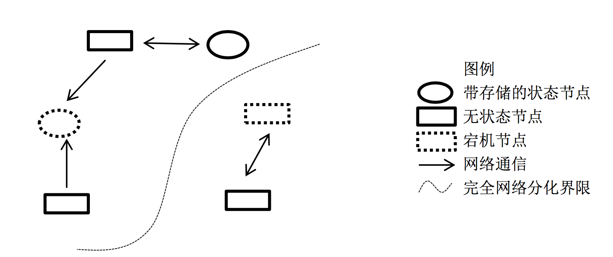

**节点**

在具体的工程项目中，一个节点往往是一个操作系统上的进程。在本文的模型中，认为节点是一个完整的、不可分的整体，如果某个程序进程实际上由若干相对独立部分构成，则在模型中可以将一个进程划分为多个节点。

**异常**

1. **机器宕机**：机器宕机是最常见的异常之一。在大型集群中每日宕机发生的概率为千分之一左右，在实践中，一台宕机的机器恢复的时间通常认为是24 小时，一般需要人工介入重启机器。
2. **网络异常**：消息丢失，两片节点之间彼此完全无法通信，即出现了“网络分化”；消息乱序，有一定的概率不是按照发送时的顺序依次到达目的节点，考虑使用序列号等机制处理网络消息的乱序问题，使得无效的、过期的网络消息不影响系统的正确性；数据错误；不可靠的TCP，TCP 协议为应用层提供了可靠的、面向连接的传输服务，但在分布式系统的协议设计中不能认为所有网络通信都基于TCP 协议则通信就是可靠的。TCP协议只能保证同一个TCP 链接内的网络消息不乱序，TCP 链接之间的网络消息顺序则无法保证。
3. **分布式三态**：如果某个节点向另一个节点发起RPC(Remote procedure call)调用，即某个节点A 向另一个节点B 发送一个消息，节点B 根据收到的消息内容完成某些操作，并将操作的结果通过另一个消息返回给节点A，那么这个RPC 执行的结果有三种状态：“成功”、“失败”、“超时（未知）”，称之为分布式系统的三态。
4. **存储数据丢失**:对于有状态节点来说，数据丢失意味着状态丢失，通常只能从其他节点读取、恢复存储的状态。
5. **异常处理原则**：被大量工程实践所检验过的异常处理黄金原则是：任何在设计阶段考虑到的异常情况一定会在系统实际运行中发生，但在系统实际运行遇到的异常却很有可能在设计时未能考虑，所以，除非需求指标允许，在系统设计时不能放过任何异常情况。

#### **3.2.1.2 副本**

副本（replica/copy）指在分布式系统中为数据或服务提供的冗余。对于数据副本指在不同的节点上持久化同一份数据，当出现某一个节点的存储的数据丢失时，可以从副本上读到数据。数据副本是分布式系统解决数据丢失异常的唯一手段。另一类副本是服务副本，指数个节点提供某种相同的服务，这种服务一般并不依赖于节点的本地存储，其所需数据一般来自其他节点。

副本协议是贯穿整个分布式系统的理论核心。

#### 3.2.1.3 副本一致性

分布式系统通过副本控制协议，使得从系统外部读取系统内部各个副本的数据在一定的约束条件下相同，称之为副本一致性(consistency)。副本一致性是针对分布式系统而言的，不是针对某一个副本而言。

1. **强一致性(strong consistency)**：任何时刻任何用户或节点都可以读到最近一次成功更新的副本数据。强一致性是程度最高的一致性要求，也是实践中最难以实现的一致性。
2. **单调一致性(monotonic consistency)**：任何时刻，任何用户一旦读到某个数据在某次更新后的值，这个用户不会再读到比这个值更旧的值。单调一致性是弱于强一致性却非常实用的一种一致性级别。因为通常来说，用户只关心从己方视角观察到的一致性，而不会关注其他用户的一致性情况。
3. **会话一致性(session consistency)**：任何用户在某一次会话内一旦读到某个数据在某次更新后的值，这个用户在这次会话过程中不会再读到比这个值更旧的值。会话一致性通过引入会话的概念，在单调一致性的基础上进一步放松约束，会话一致性只保证单个用户单次会话内数据的单调修改，对于不同用户间的一致性和同一用户不同会话间的一致性没有保障。实践中有许多机制正好对应会话的概念，例如php 中的session 概念。
4. **最终一致性(eventual consistency)**：最终一致性要求一旦更新成功，各个副本上的数据最终将达 到完全一致的状态，但达到完全一致状态所需要的时间不能保障。对于最终一致性系统而言，一个用户只要始终读取某一个副本的数据，则可以实现类似单调一致性的效果，但一旦用户更换读取的副本，则无法保障任何一致性。
5. **弱一致性(week consistency)**：一旦某个更新成功，用户无法在一个确定时间内读到这次更新的值，且即使在某个副本上读到了新的值，也不能保证在其他副本上可以读到新的值。弱一致性系统一般很难在实际中使用，使用弱一致性系统需要应用方做更多的工作从而使得系统可用。

### **3.3.2 分布式系统原理**

#### **3.3.2.1 数据分布方式**

所谓分布式系统顾名思义就是利用多台计算机协同解决单台计算机所不能解决的计算、存储等问题。单机系统与分布式系统的最大的区别在于问题的规模，即计算、存储的数据量的区别。将一个单机问题使用分布式解决，首先要解决的就是如何将问题拆解为可以使用多机分布式解决，使得分布式系统中的每台机器负责原问题的一个子集。由于无论是计算还是存储，其问题输入对象都是数据，所以如何拆解分布式系统的输入数据成为分布式系统的基本问题。

##### **3.3.2.1.1 哈希方式**

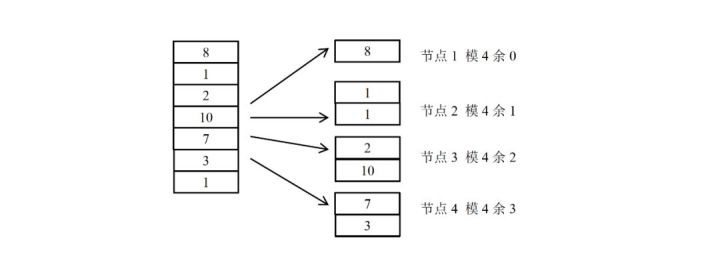

哈希分布数据的缺点同样明显，突出表现为可扩展性不高，一旦集群规模需要扩展，则几乎所有的数据需要被迁移并重新分布。工程中，扩展哈希分布数据的系统时，往往使得集群规模成倍扩展，按照数据重新计算哈希，这样原本一台机器上的数据只需迁移一半到另一台对应的机器上即可完成扩展。

针对哈希方式扩展性差的问题，一种思路是不再简单的将哈希值与机器做除法取模映射，而是将对应关系作为元数据由专门的元数据服务器管理.同时，哈希值取模个数往往大于机器个数，这样同一台机器上需要负责多个哈希取模的余数。但需要以较复杂的机制维护大量的元数据。哈希分布数据的另一个缺点是，一旦某数据特征值的数据严重不均，容易出现“数据倾斜”（data skew）问题。

哈希分布数据的另一个缺点是，一旦某数据特征值的数据严重不均，容易出现“数据倾斜”（data skew）问题

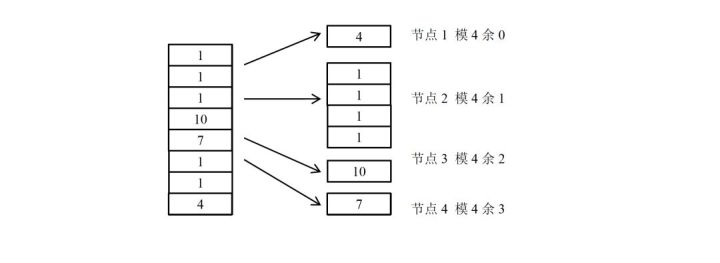


##### 3.3.2.1.2 按数据范围分布

按数据范围分布是另一个常见的数据分布式，将数据按特征值的值域范围划分为不同的区间，使得集群中每台（组）服务器处理不同区间的数据。

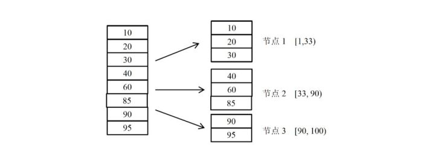


工程中，为了数据迁移等负载均衡操作的方便，往往利用动态划分区间的技术，使得每个区间中服务的数据量尽量的一样多。当某个区间的数据量较大时，通过将区间“分裂”的方式拆分为两个区间，使得每个数据区间中的数据量都尽量维持在一个较为固定的阈值之下。

一般的，往往需要使用专门的服务器在内存中维护数据分布信息，称这种数据的分布信息为一种元信息。甚至对于大规模的集群，由于元信息的规模非常庞大，单台 计算机无法独立维护，需要使用多台机器作为元信息服务器。

##### 3.3.2.1.3按数据量分布

数据量分布数据与具体的数据特征无关，而是将数据视为一个顺序增长的文件，并将这个文件按照某一较为固定的大小划分为若干数据块（chunk），不同的数据块分布到不同的服务器上。与按数据范围分布数据的方式类似的是，按数据量分布数据也需要记录数据块的具体分布情况，并将该分布信息作为元数据使用元数据服务器管理。

由于与具体的数据内容无关，按数据量分布数据的方式一般没有数据倾斜的问题，数据总是被均匀切分并分布到集群中。当集群需要重新负载均衡时，只需通过迁移数据块即可完成。集群扩容也没有太大的限制，只需将部分数据库迁移到新加入的机器上即可以完成扩容。按数据量划分数据的缺点是需要管理较为复杂的元信息，与按范围分布数据的方式类似，当集群规模较大时，元信息的数据量也变得很大，高效的管理元信息成为新的课题。

##### 3.3.2.1.4一致性哈希

一致性哈希（consistent hashing）是另一个种在工程中使用较为广泛的数据分布方式。一致性哈希最初在P2P 网络中作为分布式哈希表（DHT）的常用数据分布算法。一致性哈希的基本方式是使用一个哈希函数计算数据或数据特征的哈希值，令该哈希函数的输出值域为一个封闭的环，即哈希函数输出的最大值是最小值的前序。将节点随机分布到这个环上，每个节点负责处理从自己开始顺时针至下一个节点的全部哈希值域上的数据。

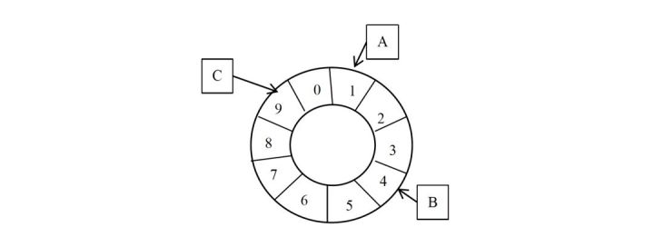


使用一致性哈希的方式需要将节点在一致性哈希环上的位置作为元信息加以管理，这点比直接使用哈希分布数据的方式要复杂。然而，节点的位置信息只于集群中的机器规模相关，其元信息的量通常比按数据范围分布数据和按数据量分布数据的元信息量要小很多。

为此一种常见的改进算法是引入虚节点（virtual node）的概念，系统初始时就创建许多虚节点，虚节点的个数一般远大于未来集群中机器的个数，将虚节点均匀分布到一致性哈希值域环上，其功能与基本一致性哈希算法中的节点相同。为每个节点分配若干虚节点。操作数据时，首先通过数据的哈希值在环上找到对应的虚节点，进而查找元数据找到对应的真实节点。使用虚节点改进有多个优点。首先，一旦某个节点不可用，该节点将使得多个虚节点不可用，从而使得多个相邻的真实节点负载失效节点的压里。同理，一旦加入一个新节点，可以分配多个虚节点，从而使得新节点可以 负载多个原有节点的压力，从全局看，较容易实现扩容时的负载均衡。

##### **3.3.2.1.5副本与数据分布**

分布式系统容错、提高可用性的基本手段就是使用副本。对于数据副本的分布方式主要影响系统的可扩展性。一种基本的数据副本策略是以机器为单位，若干机器互为副本，副本机器之间的数据完全相同。这种策略适用于上述各种数据分布方式。其优点是非常简单，其缺点是恢复数据的效率不高、可扩展性也不高。

更合适的做法不是以机器作为副本单位，而是将数据拆为较合理的数据段，以数据段为单位作为副本。实践中，常常使得每个数据段的大小尽量相等且控制在一定的大小以内。数据段有很多不同的称谓，segment，fragment，chunk，partition 等等。数据段的选择与数据分布方式直接相关。对于哈希分数据的方式，每个哈希分桶后的余数可以作为一个数据段，为了控制数据段的大小，常常使得分桶个数大于集群规模。一旦将数据分为数据段，则可以以数据段为单位管理副本，从而副本与机器不再硬相关，每台机器都可以负责一定数据段的副本。

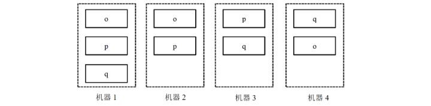

一旦副本分布与机器无关，数据丢失后的恢复效率将非常高。这是因为，一旦某台机器的数据丢失，其上数据段的副本将分布在整个集群的所有机器中，而不是仅在几个副本机器中，从而可以从整个集群同时拷贝恢复数据，而集群中每台数据源机器都可以以非常低的资源做拷贝。作为恢复数据源的机器即使都限速1MB/s，若有100 台机器参与恢复，恢复速度也能达到100MB/s。再者，副本分布与机器无关也利于集群容错。如果出现机器宕机，由于宕机机器上的副本分散于整个集群，其压力也自然分散到整个集群。最后，副本分布与机器无关也利于集群扩展。理论上，设集群规模 为N 台机器，当加入一台新的机器时，只需从各台机器上迁移1/N – 1/N+1 比例的数据段到新机器即实现了新的负载均衡。由于是从集群中各机器迁移数据，与数据恢复同理，效率也较高。工程中，完全按照数据段建立副本会引起需要管理的元数据的开销增大，副本维护的难度也相应增大。一种折中的做法是将某些数据段组成一个数据段分组，按数据段分组为粒度进行副本管理。这样做可以将副本粒度控制在一个较为合适的范围内。

##### **3.3.2.1.6本地化计算**

在分布式系统中，数据的分布方式也深深影响着计算的分布方式。在分布式系统中计算节点和保存计算数据的存储节点可以在同一台物理机器上，也可以位于不同的物理机器。如果计算节点和存储节点位于不同的物理机器则计算的数据需要通过网络传输，此种方式的开销很大，甚至网络带宽会成为系统的总体瓶颈。另一种思路是，将计算尽量调度到与存储节点在同一台物理机器上的计算节点上进行，这称之为本地化计算。本地化计算是计算调度的一种重要优化，其体现了一种重要的分布式调度思想：“移动数据不如移动计算”。

##### 3.3.2.1.7数据分布方式的选择**

在实际工程实践中，可以根据需求及实施复杂度合理选择数据分布方式。另外，数据分布方式是可以灵活组合使用的，往往可以兼备各种方式的优点，收到较好的综合效果。

例：数据倾斜问题，在按哈希分数据的基础上引入按数据量分布数据的方式，解决该数据倾斜问题。按用户id 的哈希值分数据，当某个用户id 的数据量特别大时，该用户的数据始终落在某一台机器上。此时，引入按数据量分布数据的方式，统计用户的数据量，并按某一阈值将用户的数据切为多个均匀的数据段，将这些数据段分布到集群中去。由于大部分用户的数据量不会超过阈值，所以元数据中仅仅保存超过阈值的用户的数据段分布信息，从而可以控制元数据的规模。这种哈希分布数据方式与按数据量分布数据方式组合使用的方案，在某真实系统中使用，取得了较好的效果。

#### **3.3.2.2 基本副本协议**

副本控制协议指按特定的协议流程控制副本数据的读写行为，使得副本满足一定的可用性和一致性要求的分布式协议。副本控制协议要具有一定的对抗异常状态的容错能力，从而使得系统具有一定的可用性，同时副本控制协议要能提供一定一致性级别。由CAP 原理（在2.9 节详细分析）可知，要设计一种满足强一致性，且在出现任何网络异常时都可用的副本协议是不可能的。为此，实际中的副本控制协议总是在可用性、一致性与性能等各要素之间按照具体需求折中。

副本控制协议可以分为两大类：“中心化(centralized)副本控制协议”和“去中心化(decentralized)副本控制协议”。

##### **3.3.2.2.1中心化副本控制协议**

中心化副本控制协议的基本思路是由一个中心节点协调副本数据的更新、维护副本之间的一致性。图给出了中心化副本协议的通用架构。中心化副本控制协议的优点是协议相对较为简单，所有的副本相关的控制交由中心节点完成。并发控制将由中心节点完成，从而使得一个分布式并发控制问题，简化为一个单机并发控制问题。所谓并发控制，即多个节点同时需要修改副本数据时，需要解决“写写”、“读写”等并发冲突。单机系统上常用加锁等方式进行并发控制。对于分布式并发控制，加锁也是一个常用的方法，但如果没有中心节点统一进行锁管理，就需要完全分布式化的锁系统，会使得协议非常复杂。中心化副本控制协议的缺点是系统的可用性依赖于中心化节点，当中心节点异常或与中心节点通信中断时，系统将失去某些服务（通常至少失去更新服务），所以中心化副本控制协议的缺点正是存在一定的停服务时间。


##### **3.3.2.2.2 primary-secondary 协议**

在primary-secondary 类型的协议中，副本被分为两大类，其中有且仅有一个副本作为primary 副本，除primary 以外的副本都作为secondary 副本。维护primary 副本的节点作为中心节点，中心节点负责维护数据的更新、并发控制、协调副本的一致性。

Primary-secondary 类型的协议一般要解决四大类问题：数据更新流程、数据读取方式、Primary 副本的确定和切换、数据同步（reconcile）。

**1.数据更新基本流程**

1. 数据更新都由primary 节点协调完成。
2. 外部节点将更新操作发给primary 节点
3. primary 节点进行并发控制即确定并发更新操作的先后顺序
4. primary 节点将更新操作发送给secondary 节点
5. primary 根据secondary 节点的完成情况决定更新是否成功并将结果返回外部节点


在工程实践中，如果由primary 直接同时发送给其他N 个副本发送数据，则每个 secondary 的更新吞吐受限于primary 总的出口网络带宽，最大为primary 网络出口带宽的1/N。为了解决这个问题，有些系统（例如，GFS），使用接力的方式同步数据，即primary 将更新发送给第一 个secondary 副本，第一个secondary 副本发送给第二secondary 副本，依次类推。

**数据读取方式**

数据读取方式也与一致性高度相关。如果只需要最终一致性，则读取任何副本都可以满足需求。如果需要会话一致性，则可以为副本设置版本号，每次更新后递增版本号，用户读取副本时验证版本号，从而保证用户读到的数据在会话范围内单调递增。使用primary-secondary 比较困难的是实现强一致性。

1.由于数据的更新流程都是由primary 控制的，primary 副本上的数据一定是最新的，所以 如果始终只读primary 副本的数据，可以实现强一致性。如果只读primary 副本，则secondary 副本将不提供读服务。实践中，如果副本不与机器绑定，而是按照数据段为单位维护副本，仅有primary 副本提供读服务在很多场景下并不会造出机器资源浪费。

将副本分散到集群中个，假设primary 也是随机的确定的，那么每台机器上都有一些数据的primary 副本，也有另一些数据段的secondary 副本。从而某台服务器实际都提供读写服务。

2.由primary 控制节点secondary 节点的可用性。当primary 更新某个secondary 副本不成功时，primary 将该secondary 副本标记为不可用，从而用户不再读取该不可用的副本。不可用的 secondary 副本可以继续尝试与primary 同步数据，当与primary 完成数据同步后，primary 可以副本标记为可用。这种方式使得所有的可用的副本，无论是primary 还是secondary 都是可读的，且在一个确定的时间内，某secondary 副本要么更新到与primary 一致的最新状态，要么被标记为不可用，从而符合较高的一致性要求。这种方式依赖于一个中心元数据管理系统，用于记录哪些副本可用，哪些副本不可用。某种意义上，该方式通过降低系统的可用性来提高系统的一致性。

**primary 副本的确定与切换**

在primary-secondary 类型的协议中，另一个核心的问题是如何确定primary 副本，尤其是在原primary 副本所在机器出现宕机等异常时，需要有某种机制切换primary 副本，使得某个secondary 副本成为新的primary 副本。

通常的，在primary-secondary 类型的分布式系统中，哪个副本是primary 这一信息都属于元信息，由专门的元数据服务器维护。执行更新操作时，首先查询元数据服务器获取副本的primary 信息，从而进一步执行数据更新流程。

由于分布式系统中可靠的发现节点异常是需要一定的探测时间的，这样的探测时间通常是10 秒级别，这也意味着一旦primary 异常，最多需要10 秒级别的发现时间，系统才能开始primary 的切换，在这10 秒时间内，由于没有primary，系统不能提供更 新服务，如果系统只能读primary 副本，则这段时间内甚至不能提供读服务。从这里可以看到，primary-backup 类副本协议的最大缺点就是由于primary 切换带来的一定的停服务时间。

**数据同步**

不一致的secondary 副本需要与primary 进行同步（reconcile）。

通常不一致的形式有三种：一、由于网络分化等异常，secondary 上的数据落后于primary 上的数据。二、在某些协议下，secondary 上的数据有可能是脏数据，需要被丢弃。所谓脏数据是由于primary 副本没有进行某一更新操作，而secondary 副本上反而进行的多余的修改操作，从而造成secondary 副本数据错误。三、secondary 是一个新增加的副本，完全没有数据，需要从其他副本上拷贝数据。

对于第一种secondary 数据落后的情况，常见的同步方式是回放primary 上的操作日志（通常是redo 日志），从而追上primary 的更新进度。对于脏数据的情况，较好的做法是设计的分布式协议不产生脏数据。如果协议一定有产生脏数据的可能，则也应该使得产生脏数据的概率降到非常低得情况，从而一旦发生脏数据的情况可以简单的直接丢弃有脏数据的副本，这样相当于副本没有数据。另外，也可以设计一些基于undo 日志的方式从而可以删除脏数据。如果secondary 副本完全没有数据，则常见的做法是直接拷贝primary 副本的数据，这种方法往往比回放日志追更新进度的方法快很多。但拷贝数据时primary 副本需要能够继续提供更新服务，这就要求primary 副本支持快照(snapshot)功能。即对某一刻的副本数据形成快照，然后拷贝快照，拷贝完成后使用回放日志的方式追快照形成后的更新操作。

##### **3.3.2.2.3 去中心化副本控制协议**

去中心化副本控制协议没有中心节点，协议中所有的节点都是完全对等的，节点之间通过平等协商达到一致。从而去中心化协议没有因为中心化节点异常而带来的停服务等问题。

去中心化协议的最大的缺点是协议过程通常比较复杂。尤其当去中心化协议需要实现强一致性时，协议流程变得复杂且不容易理解。由于流程的复杂，去中心化协议的效率或者性能一般也较中心化协议低。一个不恰当的比方就是，中心化副本控制协议类似专制制度，系统效率高但高度依赖于中心节点，一旦中心节点异常，系统受到的影响较大；去中心化副本控制协议类似民主制度，节点集体协商，效率低下，但个别节点的异常不会对系统总体造成太大影响。


#### **3.3.2.3 Lease 机制**

Lease 机制是最重要的分布式协议，广泛应用于各种实际的分布式系统中。

##### **3.3.2.3.1基于lease 的分布式cache 系统**

基本的问题背景如下：在一个分布式系统中，有一个中心服务器节点，中心服务器存储、维护着一些数据，这些数据是系统的元数据。系统中其他的节点通过访问中心服务器节点读取、修改其上的元数据。由于系统中各种操作都依赖于元数据，如果每次读取元数据的操作都访问中心服务器 节点，那么中心服务器节点的性能成为系统的瓶颈。为此，设计一种元数据cache，在各个节点上 cache 元数据信息，从而减少对中心服务器节点的访问，提高性能。另一方面，系统的正确运行严格依赖于元数据的正确，这就要求各个节点上cache 的数据始终与中心服务器上的数据一致，cache 中的数据不能是旧的脏数据。最后，设计的cache 系统要能最大可能的处理节点宕机、网络中断等异常，最大程度的提高系统的可用性。

为此，利用lease 机制设计一套cache 系统，其基本原理为如下。中心服务器在向各节点发送数据时同时向节点颁发一个lease。每个lease 具有一个有效期，和信用卡上的有效期类似，lease 上的 有效期通常是一个明确的时间点，例如12:00:10，一旦真实时间超过这个时间点，则lease 过期失效。这样lease 的有效期与节点收到lease 的时间无关，节点可能收到lease 时该lease 就已经过期失效。这里首先假设中心服务器与各节点的时钟是同步的，在下节中讨论时钟不同步对lease 的影响。中心服务器发出的lease 的含义为：在lease 的有效期内，中心服务器保证不会修改对应数据的值。因此，节点收到数据和lease 后，将数据加入本地Cache，一旦对应的lease 超时，节点将对应的本地cache 数据删除。中心服务器在修改数据时，首先阻塞所有新的读请求，并等待之前为该数据发出的所有lease 超时过期，然后修改数据的值。

基于lease 的cache，客户端节点读取元数据

1. 判断元数据是否已经处于本地cache 且lease 处于有效期内1.1 是：直接返回cache 中的元数据1.2 否：向中心服务器节点请求读取元数据信息1.2.1 服务器收到读取请求后，返回元数据及一个对应的lease 1.2.2 客户端是否成功收到服务器返回的数据 1.2.2.1 失败或超时：退出流程，读取失败，可重试1.2.2.2 成功：将元数据与该元数据的lease 记录到内存中，返回元数据
2. 基于lease 的cache，客户端节点修改元数据流程2.1 节点向服务器发起修改元数据请求。2.2 服务器收到修改请求后，阻塞所有新的读数据请求，即接收读请求，但不返回数据。2.3 服务器等待所有与该元数据相关的lease 超时。2.4 服务器修改元数据并向客户端节点返回修改成功。

上述机制可以保证各个节点上的cache 与中心服务器上的中心始终一致。这是因为中心服务器节点在发送数据的同时授予了节点对应的lease，在lease 有效期内，服务器不会修改数据，从而客户端节点可以放心的在lease 有效期内cache 数据。上述lease 机制可以容错的关键是：服务器一旦 发出数据及lease，无论客户端是否收到，也无论后续客户端是否宕机，也无论后续网络是否正常，服务器只要等待lease 超时，就可以保证对应的客户端节点不会再继续cache 数据，从而可以放心的修改数据而不会破坏cache 的一致性。

上述基础流程有一些性能和可用性上的问题，但可以很容易就优化改性。优化点一：服务器在修改元数据时首先要阻塞所有新的读请求，造成没有读服务。这是为了防止发出新的lease 从而引起不断有新客户端节点持有lease 并缓存着数据，形成“活锁”。优化的方法很简单，服务器在进入修改数据流程后，一旦收到读请求则只返回数据但不颁发lease。从而造成在修改流程执行的过程中，客户端可以读到元数据，只是不能缓存元数据。进一步的优化是，当进入修改流程，服务器颁发的lease 有效期限选择为已发出的lease 的最大有效期限。这样做，客户端可以继续在服务器进入修改流程后继续缓存元数据，但服务器的等待所有lease 过期的时间也不会因为颁发新的lease 而不断延长。

最后，=cache 机制与多副本机制的区别。Cache 机制与多副本机制的相似之处都 是将一份数据保存在多个节点上。但Cache 机制却要简单许多，对于cache 的数据，可以随时删除丢弃，并命中cache 的后果仅仅是需要访问数据源读取数据；然而副本机制却不一样，副本是不能随意丢弃的，每失去一个副本，服务质量都在下降，一旦副本数下降到一定程度，则往往服务将不再可用。

##### **3.3.2.3.2 lease 机制的分析**

lease 的定义：Lease 是由颁发者授予的在某一有效期内的承诺。颁发者一旦发出lease，则无论接受方是否收到，也无论后续接收方处于何种状态，只要lease 不过期，颁发者一定严守承诺；另一方面，接收方在lease 的有效期内可以使用颁发者的承诺，但一旦lease 过期，接收方一定不能继续使用颁发者的承诺。

Lease 机制具有很高的容错能力。首先，通过引入有效期，Lease 机制能否非常好的容错网络异常。Lease 颁发过程只依赖于网络可以单向通信，即使接收方无法向颁发者发送消息，也不影响lease 的颁发。由于lease 的有效期是一个确定的时间点，lease 的语义与发送lease 的具体时间无关，所以 同一个lease 可以被颁发者不断重复向接受方发送。即使颁发者偶尔发送lease 失败，颁发者也可以 简单的通过重发的办法解决。一旦lease 被接收方成功接受，后续lease 机制不再依赖于网络通信，即使网络完全中断lease 机制也不受影响。再者，Lease 机制能较好的容错节点宕机。如果颁发者宕机，则宕机的颁发者通常无法改变之前的承诺，不会影响lease 的正确性。在颁发者机恢复后，如果颁发者恢复出了之前的lease 信息，颁发者可以继续遵守lease 的承诺。如果颁发者无法恢复lease 信息，则只需等待一个最大的lease 超时时间就可以使得所有的lease 都失效，从而不破坏lease机制。

例如上节中的cache 系统的例子中，一旦服务器宕机，肯定不会修改元数据，重新恢复后，只需等待一个最大的lease 超时时间，所有节点上的缓存信息都将被清空。对于接受方宕机的情况，颁发者 不需要做更多的容错处理，只需等待lease 过期失效，就可以收回承诺，实践中也就是收回之前赋予的权限、身份等。最后，lease 机制不依赖于存储。颁发者可以持久化颁发过的lease 信息，从而在 宕机恢复后可以使得在有效期的lease 继续有效。但这对于lease 机制只是一个优化，如之前的分析，即使颁发者没有持久化lease 信息，也可以通过等待一个最大的lease 时间的方式使得之前所有颁发 的lease 失效，从而保证机制继续有效。

Lease 机制依赖于有效期，这就要求颁发者和接收者的时钟是同步的。一方面，如果颁发者的 时钟比接收者的时钟慢，则当接收者认为lease 已经过期的时候，颁发者依旧认为lease 有效。接收者可以用在lease 到期前申请新的lease 的方式解决这个问题。另一方面，如果颁发者的时钟比接收 者的时钟快，则当颁发者认为lease 已经过期的时候，接收者依旧认为lease 有效，颁发者可能将lease 颁发给其他节点，造成承诺失效，影响系统的正确性。对于这种时钟不同步，实践中的通常做法是将颁发者的有效期设置得比接收者的略大，只需大过时钟误差就可以避免对lease 的有效性的影响。

##### **3.3.2.3.3 基于lease 机制确定节点状态**

分布式协议依赖于对节点状态认知的全局一致性，即一旦节点Q 认为某个节点 A 异常，则节点A 也必须认为自己异常，从而节点A 停止作为primary，避免“双主”问题的出现。解决这种问题有两种思路，第一、设计的分布式协议可以容忍“双主”错误，即不依赖于对节点状 态的全局一致性认识，或者全局一致性状态是全体协商后的结果；第二、利用lease 机制。对于第一 种思路即放弃使用中心化的设计，而改用去中心化设计，超过本节的讨论范畴。下面着重讨论利用 lease 机制确定节点状态。

由中心节点向其他节点发送lease，若某个节点持有有效的lease，则认为该节点正常可以提供服 务。用于例2.3.1 中，节点A、B、C 依然周期性的发送heart beat 报告自身状态，节点Q 收到heart beat 后发送一个lease，表示节点Q 确认了节点A、B、C 的状态，并允许节点在lease 有效期内正常工 作。节点Q 可以给primary 节点一个特殊的lease，表示节点可以作为primary 工作。一旦节点Q 希望切换新的primary，则只需等前一个primary 的lease 过期，则就可以安全的颁发新的lease 给新的 primary 节点，而不会出现“双主”问题。

在实际系统中，若用一个中心节点发送lease 也有很大的风险，一旦该中心节点宕机或网络异常，则所有的节点没有lease，从而造成系统高度不可用。为此，实际系统总是使用多个中心节点互为副本，成为一个小的集群，该小集群具有高可用性，对外提供颁发lease 的功能。chubby 和zookeeper 都是基于这样的设计。

##### **3.3.2.3.4lease 的有效期时间选择**

工程中，常选择的lease 时长是10 秒级别，这是一个经过验证的经验值，实践中可以作为参考并综合选择合适的时长。

#### **3.3.2.4 Quorum 机制**

先做这样的约定：更新操作（write）是一系列顺序的过程，通过其他机制确定更新操作的顺序（例如primary-secondary 架构中由primary 决定顺序），每个更新操作记为wi， i 为更新操作单调递增的序号，每个wi 执行成功后副本数据都发生变化，称为不同的数据版本，记 作vi。假设每个副本都保存了历史上所有版本的数据。

##### **3.3.2.4.1 write-all-read-one**

Write-all-read-one（简称WARO）是一种最简单的副本控制规则，顾名思义即在更新时写所有的副本，只有在所有的副本上更新成功，才认为更新成功，从而保证所有的副本一致，这样在读取数据时可以读任一副本上的数据。

由于更新操作需要在所有的N 个副本上都成功，更新操作才能成 功，所以一旦有一个副本异常，更新操作失败，更新服务不可用。对于更新服务，虽然有N 个副本， 但系统无法容忍任何一个副本异常。另一方面，N 个副本中只要有一个副本正常，系统就可以提供读服务。对于读服务而言，当有N 个副本时，系统可以容忍N-1 个副本异常。从上述分析可以发现WARO 读服务的可用性较高，但更新服务的可用性不高，甚至虽然使用了副本，但更新服务的可用性等效于没有副本。

##### **3.3.2.4.2 Quorum 定义**

在Quorum 机制下，当某次更新操作wi 一旦在所有N 个副本中的W 个副本上都成功，则就称 该更新操作为“成功提交的更新操作”，称对应的数据为“成功提交的数据”。令R>N-W，由于更新 操作wi 仅在W 个副本上成功，所以在读取数据时，最多需要读取R 个副本则一定能读到wi 更新后 的数据vi 。如果某次更新wi 在W 个副本上成功，由于W+R>N，任意R 个副本组成的集合一定与 成功的W个副本组成的集合有交集，所以读取R 个副本一定能读到wi 更新后的数据vi。如图 2-10， Quorum 机制的原理可以文森图表示。


某系统有5 个副本，W=3，R=3，最初5 个副本的数据一致，都是v1，某次更新操作 w2 在前3 副本上成功，副本情况变成（v2 v2 v2 v1 v1）。此时，任意3 个副本组成的集合中一定包括 v2。在上述定义中，令W=N，R=1，就得到WARO，即WARO 是Quorum 机制的一种特例。与分析WARO 相似，分析Quorum 机制的可用性。限制Quorum 参数为W+R=N+1。由于更新 操作需要在W 个副本上都成功，更新操作才能成功，所以一旦N-W+1 个副本异常，更新操作始终无法在W 个副本上成功，更新服务不可用。另一方面，一旦N-R+1 个副本异常，则无法保证一定可以读到与W 个副本有交集的副本集合，则读服务的一致性下降。

再次强调：仅仅依赖quorum 机制是无法保证强一致性的。因为仅有quorum 机制时无法确定最新已成功提交的版本号，除非将最新已提交的版本号作为元数据由特定的元数据服务器或元数据集群管理，否则很难确定最新成功提交的版本号。在下一节中，将讨论在哪些情况下，可以仅仅 通过quorum 机制来确定最新成功提交的版本号。

Quorum 机制的三个系统参数N、W、R 控制了系统的可用性，也是系统对用户的服务承诺：数据最多有N 个副本，但数据更新成功W 个副本即返回用户成功。对于一致性要求较高的Quorum 系统，系统还应该承诺任何时候不读取未成功提交的数据，即读取到的数据都是曾经在W 个副本上成功的数据。

##### **3.3.2.4.3 读取最新成功提交的数据**

Quorum 机制只需成功更新N 个副本中的W 个，在读取R 个副本时，一定可以读到最新的成功提交的数据。但由于有不成功的更新情况存在，仅仅读取R 个副本却不一定能确定哪个版本的数据 是最新的已提交的数据。对于一个强一致性Quorum 系统，若存在个数据少于W 个，假设为X 个，则继续读取其他副本，直若成功读取到W 个 该版本的副本，则该数据为最新的成功提交的数据；如果在所有副本中该数据的个数肯定不满 足W 个，则R 中版本号第二大的为最新的成功提交的副本。例：在读取到（v2 v1 v1）时，继续读取剩余的副本，若读到剩余两个副本 为（v2 v2）则v2 是最新的已提交的副本；若读到剩余的两个副本为（v2 v1）或（v1 v1）则v1 是最新成功提交的版本；若读取后续两个副本有任一超时或失败，则无法判断哪个版本是最新的成功提交的版本。

可以看出，在单纯使用Quorum 机制时，若要确定最新的成功提交的版本，最多需要读取R+ （W-R-1）=N 个副本，当出现任一副本异常时，读最新的成功提交的版本这一功能都有可能不可用。实际工程中，应该尽量通过其他技术手段，回避通过Quorum 机制读取最新的成功提交的版本。例如，当quorum 机制与primary-secondary 控制协议结合使用时，可以通过读取primary 的方式读取到最新的已提交的数据。

##### **3.3.2.4.5 基于Quorum 机制选择primary副本**

读取数据时依照一致性要求的不同可以有不同的做法：如果需要强一致性的立刻读取到最新的成功提交的数据，则可以简单的只读取primary 副本上的数据即可，也可以通过上节的方式读取；如果需要会话一致性，则可以根据之前已经读到的数据版本号在各个副本上进行选择性读取；如果只需要弱一致性，则可以选择任意副本读取。

在primary-secondary 协议中，当primary 异常时，需要选择出一个新的primary，之后secondary 副本与primary 同步数据。通常情况下，选择新的primary 的工作是由某一中心节点完成的，在引入 quorum 机制后，常用的primary 选择方式与读取数据的方式类似，即中心节点读取R 个副本，选择 R 个副本中版本号最高的副本作为新的primary。新primary 与至少W 个副本完成数据同步后作为新的primary 提供读写服务。首先，R 个副本中版本号最高的副本一定蕴含了最新的成功提交的数据。再者，虽然不能确定最高版本号的数是一个成功提交的数据，但新的primary 在随后与secondary 同 步数据，使得该版本的副本个数达到W，从而使得该版本的数据成为成功提交的数据。

例：在N=5，W=3，R=3 的系统中，某时刻副本最大版本号为（v2 v2 v1 v1 v1），此时v1 是系统的最新的成功提交的数据，v2 是一个处于中间状态的未成功提交的数据。假设此刻原primary 副本异常，中心节点进行primary 切换工作。这类“中间态”数据究竟作为“脏数据”被删除，还是作为新的数据被同步后成为生效的数据，完全取决于这个数据能否参与新primary 的选举。下面分别分析这两种情况。


第一、如图 2-12，若中心节点与其中3 个副本通信成功，读取到的版本号为（v1 v1 v1），则任 选一个副本作为primary，新primary 以v1 作为最新的成功提交的版本并与其他副本同步，当与第1、第2 个副本同步数据时，由于第1、第2 个副本版本号大于primary，属于脏数据，可以按照2.2.2.4 节中介绍的处理脏数据的方式解决。实践中，新primary 也有可能与后两个副本完成同步后就提供数据服务，随后自身版本号也更新到v2，如果系统不能保证之后的v2 与之前的v2 完全一样，则新 primary 在与第1、2 个副本同步数据时不但要比较数据版本号还需要比较更新操作的具体内容是否一样。


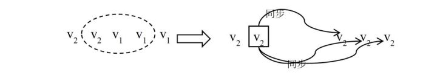

第二、若中心节点与其他3 个副本通信成功，读取到的版本号为（v2 v1 v1），则选取版本号为 v2 的副本作为新的primary，之后，一旦新primary 与其他2 个副本完成数据同步，则符合v2 的副 本个数达到W 个，成为最新的成功提交的副本，新primary 可以提供正常的读写服务。

#### **3.3.2.5 日志技术**

日志技术是宕机恢复的主要技术之一。日志技术最初使用在数据库系统中。严格来说日志技术不是一种分布式系统的技术，但在分布式系统的实践中，却广泛使用了日志技术做宕机恢复，甚 至如BigTable 等系统将日志保存到一个分布式系统中进一步增强了系统容错能力。

##### **3.3.2.5.1 Redo Log 与Check point**

设计一个高速的单机查询系统，将数据全部存放在内存中以实现高速的数据查询，每次更新操作更新一小部分数据（例如 key-value 中的某一个key）。现在问题为利用日志技术实现该内存查询系统的宕机恢复。与数据库的事务不同的是，这个问题模型中的每个成功的更新操作都会生效。这也等效为数据库的每个事务只有一个更新操作，且每次更新操作都可以也必须立即提交（Auto commit）。

- **Redo Log**

1. 将更新操作的结果（例如Set K1=1，则记录K1=1）以追加写（append）的方式写入磁盘的 日志文件
2. 按更新操作修改内存中的数据
3. 返回更新成功

从Redo Log 的流程可以看出，Redo 写入日志的是更新操作完成后的结果（虽然本文不讨论Undo Log，这点是与Undo Log 的区别之一），且由于是顺序追加写日志文件，在磁盘等对顺序写有力的 存储设备上效率较高。

用Redo Log 进行宕机恢复非常简单，只需要“回放”日志即可。

流程2.5.2： Redo Log 的宕机恢复

**·**从头读取日志文件中的每次更新操作的结果，用这些结果修改内存中的数据。

从Redo Log 的宕机恢复流程也可以看出，只有写入日志文件的更新结果才能在宕机后恢复。这也是为什么在Redo Log 流程中需要先更新日志文件再更新内存中的数据的原因。假如先更新内存中的数据，那么用户立刻就能读到更新后的数据，一旦在完成内存修改与写入日志之间发生宕机，那么最后一次更新操作无法恢复，但之前用户可能已经读取到了更新后的数据，从而引起不一致的问题。

- **Check point**

在简化的模型下，check point 技术的过程即将内存中的数据以某种易于重新加载的数据组织方式完整的dump 到磁盘，从而减少宕机恢复时需要回放的日志数据。

流程：check point

1. 向日志文件中记录“Begin Check Point”
2. 将内存中的数据以某种易于重新加载的数据组织方式dump 到磁盘上
3. 向日志文件中记录“End Check Point” 在check point 流程中，数据可以继续按照流程2.5.1 被更新，这段过程中新更新的数据可以dump 到磁盘也可以不dump 到磁盘，具体取决于实现。例如，check point 开始时k1=v1，check point 过程 中某次更新为k1 = v2，那么dump 到磁盘上的k1 的值可以是v1 也可以是v2。

流程：基于check point 的宕机恢复流程

1. 将dump 到磁盘的数据加载到内存。
2. 从后向前扫描日志文件，寻找最后一个“End Check Point”日志。
3. 从最后一个“End Check Point”日志向前找到最近的一个“Begin Check Point”日志，并回 放该日志之后的所有更新操作日志。

- **No Undo/No Redo log**

若数据维护在磁盘中，某批更新由若干个更新操作组成，这些更新操作需要原子生效，即要么同时生效，要么都不生效。

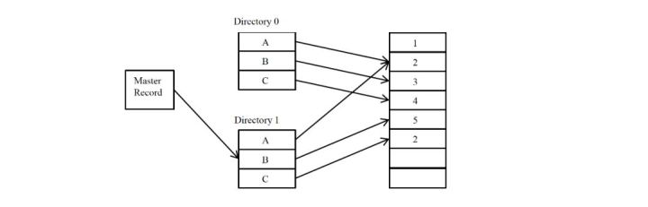

0/1 目录技术中有两个目录结构，称为目录0(Directory 0)和目录1(Directory 1)。另有一个结构称为主记录（Master record）记录当前正在使用的目录称为活动目录。主记录中要么记录使用目录0，要么记录使用目录1。目录0 或目录1 中记录了各个数据的在日志文件中的位置。0/1 目录的数据更新过程始终在非活动目录上进行，只是在数据生效前，将主记录中的0、1 值反转，从而切换主记录。

流程：0/1 目录数据更新流程

1. 将活动目录完整拷贝到非活动目录。
2. 对于每个更新操作，新建一个日志项纪录操作后的值，并在非活动目录中将相应数据的位置修改为新建的日志项的位置。
3. 原子性修改主记录：反转主记录中的值，使得非活动目录生效。

0/1 目录的更新流程非常简单，通过0、1 目录的主记录切换使得一批修改的生效是原子的。0/1 目录将批量事务操作的原子性通过目录手段归结到主记录的原子切换。由于多条记录的原子修改一般较难实现而单条记录的原子修改往往可以实现，从而降低了问题实现的难度。在工程中0/1 目录的思想运用非常广泛，其形式也不局限在上述流程中，可以是内存中的两个数据结构来回切换，也可以是磁盘上的两个文件目录来回生效切换。

#### **3.3.2.6 两阶段提交协议**

两阶段提交协议是一种经典的强一致性中心化副本控制协议。虽然在工程中该协议有较多的问题，但研究该协议能很好的理解分布式系统的几个典型问题。

##### **3.3.2.6.1流程描述**

两阶段提交协议是一种典型的“中心化副本控制”协议。在该协议中，参与的节点分为两类：一个中心化协调者节点（coordinator）和N 个参与者节点（participant）。每个参与者节点即上文背景介绍中的管理数据库副本的节点。

两阶段提交的思路比较简单，在第一阶段，协调者询问所有的参与者是否可以提交事务（请参与者投票），所有参与者向协调者投票。在第二阶段，协调者根据所有参与者的投票结果做出是否事务可以全局提交的决定，并通知所有的参与者执行该决定。在一个两阶段提交流程中，参与者不能改变自己的投票结果。两阶段提交协议的可以全局提交的前提是所有的参与者都同意提交事务，只要有一个参与者投票选择放弃(abort)事务，则事务必须被放弃。

流程：两阶段提交协调者流程

1. 写本地日志“begin_commit”，并进入WAIT 状态；
2. 向所有参与者发送“prepare 消息”；
3. 等待并接收参与者发送的对“prepare 消息”的响应；3.1 若收到任何一个参与者发送的“vote-abort 消息”；3.1.1 写本地“global-abort”日志，进入ABORT；3.1.2 向所有的参与者发送“global-abort 消息”；3.1.3 进入ABORT 状态；3.2 若收到所有参与者发送的“vote-commit”消息；3.2.1 写本地“global-commit”日志，进入COMMIT 状态；3.1.2 向所有的参与者发送“global-commit 消息”；
4. 等待并接收参与者发送的对“global-abort 消息”或“global-commit 消息”的确认响应消息，一旦收到所有参与者的确认消息，写本地“end_transaction” 日志流程结束。

流程：两阶段提交协调者流程

1. 写本地日志“init”记录，进入INIT 状态
2. 等待并接受协调者发送的“prepare 消息”，收到后 2.1 若参与者可以提交本次事务 2.1.1 写本地日志“ready”，进入READY 状态 2.1.2 向协调者发送“vote-commit”消息 2.1.4 等待协调者的消息2.1.4.1 若收到协调者的“global-abort”消息2.1.4.1.1 写本地日志“abort”，进入ABORT 状态2.1.4.1.2 向协调者发送对“global-abort”的确认消息 2.1.4.2 若收到协调者的“global-commit”消息2.1.4.1.1 写本地日志“commit”，进入COMMIT 状态 2.1.4.1.2 向协调者发送对“global-commit”的确认消息 2.2 若参与者无法提交本次事务 2.2.1 写本地日志“abort”，进入ABORT 状态 2.2.2 向协调者发送“vote-abort”消息 2.2.3 流程对该参与者结束 2.2.4 若后续收到协调者的“global-abort”消息可以响应
3. 即使流程结束，但任何时候收到协调者发送的“global-abort”消息或“global-commit”消息也都要发送一个对应的确认消息。

##### **3.3.2.6.2异常处理** (宕机恢复)

1.协调者宕机恢复 协调者宕机恢复后

首先通过日志查找到宕机前的状态。如果日志中最后是“begin_commit”记录，说明宕机前协调者处于WAIT 状态，协调者可能已经发送过“prepare 消息”也可能还没发送，但协调者一定还没有发送过“global-commit 消息”或“global-abort 消息”，即事务的全局状态还没有确定。此时，协调者可以重新发送“prepare 消息” 继续两阶段提交流程，即使参与者已经发送过对“prepare 消息”的响应，也不过是再次重传之前的响应而不会影响协议的一致性。如果日志中最后是“global-commit”或“global-abort”记录，说明宕机前协调者处于COMMIT 或ABORT 状态。此时协调者只需重新向所有的参与者发送“global-commit 消息”或“global-abort 消息”就可以继续两阶段提交流程。

2.参与者宕机恢复参与者宕机恢复后

首先通过日志查找宕机前的状态。如果日志中最后是“init”记录，说明参与者处于INIT 状态，还没有对本次事务做出投票选择，参与者可以继续流程等待协调者发送的“prepare 消息”。如果日志中最后是“ready”记录，说明参与者处于REDAY 状态，此时说明参与者已经就本次 事务做出了投票选择，但宕机前参与者是否已经向协调者发送“vote-commit”消息并不可知。所以此时参与者可以向协调者重发“vote-commit”，并继续协议流程。如果日志中最后是“commit”或“abort”记录，说明参与者已经收到过协调者的“global-commit 消息”（处于COMMIT 状态）或者“global-abort 消息”（处于ABORT 状态）。至于是否向协调者发 送过对“global-commit”或“global-abort”的确认消息则未知。但即使没有发送过确认消息，由于协调者会不断重发“global-commit”或“global-abort”，只需在收到这些消息时发送确认消息既可，不影响协议的全局一致性。

##### **3.3.2.6.3 协议分析**

两阶段提交协议在工程实践中真正使用的较少，主要原因有以下几点：

1. 两阶段提交协议的容错能力较差。从上文的分析可以看出，两阶段提交协议在某些情况下存在流程无法执行下去的情况，且也无法判断流程状态。在工程中好的分布式协议往往总是可以在即使发生异常的情况下也能执行下去。例如，回忆Lease 机制（2.3 ），一旦lease 发出，无论出现任何异常，Lease 服务器节点总是可以通过时间判定出Lease 是否有效，也可以用等待Lease 超时的方法收回Lease 权限，整个Lease 协议的流程不存在任何流程被阻塞而无法执行下去的情况。与Lease 机制的简单有效相比，两阶段提交的协议显得较为复杂且容错能力差。
2. 两阶段提交协议的性能较差。一次成功的两阶段提交协议流程中，协调者与每个参与者 之间至少需要两轮交互4 个消息“prepare”、“vote-commit”、“global-commit”、“确认global-commit”。过多的交互次数会降低性能。另一方面，协调者需要等待所有的参与者的投票结果，一旦存在较慢的参与者，会影响全局流程执行速度。

虽然存在一些改进的两阶段提交协议可以提高容错能力和性能，然而这类协议依旧是在工程中使用较少的一类协议，其理论价值大于实践意义。

#### **3.3.2.7 MVCC**

MVCC(Multi-version Cocurrent Control，多版本并发控制)技术。MVCC 技术最初也是在数据库系统中被提出，但这种思想并不局限于单机的分布式系统，在分布式系统中同样有效。

MVCC 即多个不同版本的数据实现并发控制的技术，其基本思想是为每次事务生成 一个新版本的数据，在读数据时选择不同版本的数据即可以实现对事务结果的完整性读取。在使用MVCC 时，每个事务都是基于一个已生效的基础版本进行更新，事务可以并行进行，从而可以产生一种图状结构。


基础数据的版本为1，同时产生了两个事务：事务A 与事务B。这两个事务都各自对数据进行了一些本地修改（这些修改只有事务自己可见，不影响真正的数据），之后事务A 首先提交，生成数据版本2；基于数据版本2，又发起了事务C，事务C 继续提交，生成了数据版 本3；最后事务B 提交，此时事务B 的结果需要与事务C 的结果合并，如果数据没有冲突，即事务 B 没有修改事务A 与事务C 修改过的变量，那么事务B 可以提交，否则事务B 提交失败。MVCC 的流程过程非常类似于SVN 等版本控制系统的流程，或者说SVN 等版本控制系统就是 使用的MVCC 思想。事务在基于基础数据版本做本地修改时，为了不影响真正的数据，通常有两种做法，一是将基础数据版本中的数据完全拷贝出来再修改，SVN 即使用了这种方法，SVN check out 即是拷贝的过程；二是每个事务中只记录更新操作，而不记录完整的数据，读取数据时再将更新操作应用到用基础版本的数据从而计算出结果，这个过程也类似SVN 的增量提交。

#### **3.3.2.8 Paxos协议**

Paxos 协议是少数在工程实践中证实的强一致性、高可用的去中心化分布式协议。Paxos 协议的流程较为复杂，但其基本思想却不难理解，类似于人类社会的投票过程。Paxos 协议中，有一组完全对等的参与节点（称为accpetor），这组节点各自就某一事件做出决议，如果某个决议获得了超过半数节点的同意则生效。Paxos 协议中只要有超过一半的节点正常，就可以工作，能很好对抗宕机、网络分化等异常情况。

##### **3.3.2.8.1角色**

Proposer：提案者。Proposer 可以有多个，Proposer 提出议案（value）。所谓value，在工程中可以是任何操作，例如“修改某个变量的值为某个值”、“设置当前primary 为某个节点”等等。Paxos 协议中统一将这些操作抽象为value。不同的Proposer 可以提出不同的甚至矛盾的value，例如某个Proposer 提议“将变量X 设置为1”，另一个Proposer 提议“将变量X 设置为2”，但对同一轮Paxos 过程，最多只有一个value 被批准。Acceptor：批准者。Acceptor 有N 个，Proposer 提出的value 必须获得超过半数(N/2+1)的Acceptor 批准后才能通过。Acceptor 之间完全对等独立。Learner：学习者。Learner 学习被批准的value。所谓学习就是通过读取各个Proposer 对value 的选择结果，如果某个value 被超过半数Proposer 通过，则Learner 学习到了这个value。回忆（2.4 ） 不难理解，这里类似Quorum 机制，某个value 需要获得W=N/2 + 1 的Acceptor 批准，从而学习者需要至少读取N/2+1 个Accpetor，至多读取N 个Acceptor 的结果后，能学习到一个通过的value。上述三类角色只是逻辑上的划分，实践中一个节点可以同时充当这三类角色。

##### **3.3.2.8.2 流程**

Paxos 协议一轮一轮的进行，每轮都有一个编号。每轮Paxos 协议可能会批准一个value，也可 能无法批准一个value。如果某一轮Paxos 协议批准了某个value，则以后各轮Paxos 只能批准这个 value。上述各轮协议流程组成了一个Paxos 协议实例，即一次Paxos 协议实例只能批准一个value，这也是Paxos 协议强一致性的重要体现。每轮Paxos 协议分为阶段，准备阶段和批准阶段，在这两个阶段Proposer 和Acceptor 有各自的处理流程。

流程：Proposer 的流程 （准备阶段）

1. 向所有的Acceptor 发送消息“Prepare(b)”；这里b 是Paxos 的轮数，每轮递增
2. 如果收到任何一个Acceptor 发送的消息“Reject(B)”，则对于这个Proposer 而言本轮Paxos 失败，将轮数b 设置为B+1 后重新步骤1；（批准阶段，根据收到的Acceptor 的消息作出不同选择）
3. 如果接收到的Acceptor 的“Promise(b, v_i)”消息达到N/2+1 个（N 为Acceptor 总数，除法取整， 下同）；v_i 表示Acceptor 最近一次在i 轮批准过value v。3.1 如果收到的“Promise(b, v)”消息中，v 都为空，Proposer 选择一个value v，向所有Acceptor 广播Accept(b, v)；3.2 否则，在所有收到的“Promise(b, v_i)”消息中，选择i 最大的value v，向所有Acceptor 广播消息Accept(b，v)；
4. 如果收到Nack(B)，将轮数b 设置为B+1 后重新步骤1；

流程：Accpetor 流程 （准备阶段）

1. 接受某个Propeser 的消息Prepare(b)。参数B 是该Acceptor 收到的最大Paxos 轮数编号；V 是Acceptor 批准的value，可以为空 1.1 如果b>B，回复Promise(b, V_B)，设置B=b; 表示保证不再接受编号小于b 的提案。1.2 否则，回复Reject(B) （批准阶段）
2. 接收Accept(b, v)， 2.1 如果b < B, 回复Nack(B)，暗示proposer 有一个更大编号的提案被这个Acceptor 接收了 2.2 否则设置V=v。表示这个Acceptor 批准的Value 是v。广播Accepted 消息。

##### **3.3.2.8.3 例子**

基本例子里有5 个Acceptor，1 个Proposer，不存在任何网络、宕机异常。我们着重考察各个Accpetor 上变量B 和变量V 的变化，及Proposer 上变量b 的变化。

1. 初始状态


2.Proposer 向所有Accpetor 发送“Prepare(1)”，所有Acceptor 正确处理，并回复Promise(1, NULL


3.Proposer 收到5 个Promise(1, NULL)，满足多余半数的Promise 的value 为空，此时发送 Accept(1, v1)，其中v1 是Proposer 选择的Value。


4.此时，v1 被超过半数的Acceptor 批准，v1 即是本次Paxos 协议实例批准的Value。如果Learner 学习value，学到的只能是v1

在同一个Paxos 实例中，批准的Value 是无法改变的，即使后续Proposer 以更高的序号发起Paxos 协议也无法改变value。Paxos 协议的核心就在于“批准的value 无法改变”，这也是整个协议正确性的基础。

Paxos 协议是被人为设计出来，其设计过程也是协议的推导过程。Paxos 协议利用了Quorom 机 制，选择的W=R=N/2+1。简单而言，协议就是Proposer 更新Acceptor 的过程，一旦某个Acceptor 成功更新了超过半数的Acceptor，则更新成功。Learner 按Quorum 去读取Acceptor，一旦某个value 在超过半数的Proposer 上被成功读取，则说明这是一个被批准的value。协议通过引入轮次，使得高轮次的提议抢占低轮次的提议来避免死锁。协议设计关键点是如何满足“在一次Paxos 算法实例过程中只批准一个Value”这一约束条件。

#### **3.3.2.9 CAP**

CAP 理论的定义很简单，CAP 三个字母分别代表了分布式系统中三个相互矛盾的属性：

- Consistency (一致性)：CAP 理论中的副本一致性特指强一致性（1.3.4 ）；
- Availiablity(可用性)：指系统在出现异常时已经可以提供服务；
- Tolerance to the partition of network (分区容忍)：指系统可以对网络分区（1.1.4.2 ）这种异常情 况进行容错处理；

CAP 理论指出：无法设计一种分布式协议，使得同时完全具备CAP 三个属性，即1)该种协议下的副本始终是强一致性，2)服务始终是可用的，3)协议可以容忍任何网络分区异常；分布式系统协议只能在CAP 这三者间所有折中。

热力学第二定律说明了永动机是不可能存在的，不要去妄图设计永动机。与之类似，CAP 理论的意义就在于明确提出了不要去妄图设计一种对CAP 三大属性都完全拥有的完美系统，因为这种系统在理论上就已经被证明不存在。

- Lease 机制: Lease 机制牺牲了部分异常情况下的A，从而获得了完全的C 与很好的P。
- Quorum 机制: Quorum 机制，在CAP 三大因素中都各做了折中，有一定的C，有较好 的A，也有较好的P，是一种较为平衡的分布式协议。
- 两阶段提交协议: 两阶段提交系统具有完全的C，很糟糕的A，很糟糕的P。
- Paxos 协议：同样是强一致性协议，Paxos 在CAP 三方面较之两阶段提交协议要优秀得多。Paxos 协议具有 完全的C，较好的A，较好的P。Paxos 的A 与P 的属性与Quorum 机制类似，因为Paxos 的协议本 身就具有Quorum 机制的因素。

编辑于 2020-01-07


#### 3.3.2.10 衡量分布式系统的指标**

1. **性能**：系统的吞吐能力，指系统在某一时间可以处理的数据总量，通常可以用系统每秒处理的总的数据量来衡量；系统的响应延迟，指系统完成某一功能需要使用的时间；系统的并发能力，指系统可以同时完成某一功能的能力，通常也用QPS(query per second)来衡量。上述三个性能指标往往会相互制约，追求高吞吐的系统，往往很难做到低延迟；系统平均响应时间较长时，也很难提高QPS。
2. **可用性**：系统的可用性(availability)指系统在面对各种异常时可以正确提供服务的能力。系统的可用性可以用系统停服务的时间与正常服务的时间的比例来衡量，也可以用某功能的失败次数与成功次数的比例来衡量。可用性是分布式的重要指标，衡量了系统的鲁棒性，是系统容错能力的体现。
3. **可扩展性**：系统的可扩展性(scalability)指分布式系统通过扩展集群机器规模提高系统性能（吞吐、延迟、并发）、存储容量、计算能力的特性。好的分布式系统总在追求“线性扩展性”，也就是使得系统的某一指标可以随着集群中的机器数量线性增长。
4. **一致性**：分布式系统为了提高可用性，总是不可避免的使用副本的机制，从而引发副本一致性的问题。越是强的一致的性模型，对于用户使用来说使用起来越简单。

## 3.3 区块链分布式共识算法

### 3.3.1 分布式一致性和区块链共识

相同点：

- Append only
- 强调序列化
- 少数服从多数原则
- 分离覆盖的问题：即长链覆盖短链区块，多节点覆盖少数节点日志

不同点：

- 传统分布式一致性算法大多不考虑拜占庭容错(Byzanetine Paxos除外)，即假设所有节点只发生宕机、网络故障等非人为问题，并不考虑恶意节点篡改数据的问题；
- 传统分布式一致性算法是面向日志（数据库）的，即更通用的情况，而区块链共识模型面向交易的，所以严格来说，传统分布式一致性算法应该处于区块链共识模型的下面一层。

 

### 3.3.2 区块链共识与一致性算法的关系

考虑上面的不同点，结合私有链和行业链的性质，我们有：

- 私有链：封闭生态的存储网络，所有节点都是可信任的，如某大型集团内部多数公司。
- 行业链：半封闭生态的交易网络，存在对等的不信任节点，如房地产行业A、B、C、D公司。
- 公有链：开放生态的交易网络，这层主要是为行业链和私有链提供全球交易网络。

由于私有链是封闭生态的存储网络，也就是说使用传统分布式一致性模型应该是最优的；

由于联盟行业链其半封闭半开放特性，使用Delegated Proof of XXX 是最优的，可以考虑以传统一致性算法作为基础加入拜占庭容错/安全防护机制进行改进。

公有链PoW应该仍然是最优的选择。


## 3.4 分布式一致性算法 

本文主要讨论主流的Paxos算法家族和Raft算法，这里抛砖引玉，网络上有关两者的资料非常丰富，大家可自行搜索查阅。

### 3.4.1. Paxos 算法家族

1998年Lamport提出Paxos算法，后续又增添多个改进版本的Paxos形成Paxos协议家族，且Paxos都有共同点是不容易工程实现。

- **Classic Paxos ：**LeaderLess，又名Basic Paxos，以下均为Paxos的变种，基于CAP定律，侧重了不同方向。

- **Cheap Paxos**
- **Egalitarian Paxos ：** conflicts rare
- **Fast Paxos ：** Leader only when needed ，conflicts common
- **Multi-Paxos ：**Leader driven
- **Byzanetine Paxos**

"Byzantine Paxos adds an extra message (Verify) which acts to distribute knowledge and verify the actions of the other processors".Lamport 在2011年的论文《Leaderless Byzanetine Paxos》中表示不清楚实践中是否有效，考虑Paxos本身实现的难度，此方案工程角度不是最优，但是系统角度应该是最好的。

本小节Ref：

[Wikipedia_Paxos](https://en.wikipedia.org/wiki/Paxos_(computer_science))

[Leaderless Byzanetine Paxos](http://research.microsoft.com/en-us/um/people/lamport/pubs/disc-leaderless-web.pdf)

 

### **3.4.2 Raft 算法**

这是一个非常友好的算法，容易理解、实现，不过它是Strong Leadership的，也就是说，

任意包含Leader的时刻，Leader拥有完全记账权，如果此Leader节点是恶意的，后果不堪设想。

且leadership的一致性算法都有个通病，吞吐量受单个节点的限制，这点在Raft身上体现尤甚。

Raft算法简介：https://raft.github.io/

Raft算法动态演示：http://thesecretlivesofdata.com/raft/

### 3.4.3 POW


### 3.4.4 PBFT


### 建议参考文献：

## 30种共识算法完全列表

共识算法是所有区块链 / DAG 的基础，它们构成了区块链 / DAG 平台中的最重要部分。

如果没有共识算法，我们得到只是一个不可写的哑（dummy）数据库。

我将在本文中尽可能列出所有主要的共识算法，评估各自的优劣之处。如果读者发现有所遗漏，或是存在错误，希望能通过评论指出。此外，我个人也在逐步深入研究共识算法及其对经济的影响，为此本文也将做定期的更新。

另：本文假定读者理解共识算法及其在区块链中的重要性。

下面列出 30 种共识算法。

## 1. 工作量证明（PoW，Proof of Work）

**优点**:

- 自 2009 年以来得到了广泛测试，目前依然得到广泛的使用。

**不足**：

- 速度慢。
- 耗能巨大，对环境不好。
- 易受 “规模经济”（[economies of scale](https://en.wikipedia.org/wiki/Economies_of_scale)）的影响。

使用者：[Bitcoin](https://bitcoin.org/)、[Ethereum](https://ethereum.org/)、[Litecoin](https://litecoin.org/)、[Dogecoin](http://dogecoin.com/) 等。

**类型**：有竞争共识（Competitive consensus）。

**解释**：PoW 是是首个共识算法。它是由中本聪在他的[论文](https://bitcoin.org/bitcoin.pdf)中提出的，用于建立分布式无信任共识并识别 “双重支付”（double spend）问题。PoW 并非一个新理念，但是中本聪将 Pow 与加密签名、Merkle 链和 P2P 网络等已有理念结合，形成一种可用的分布式共识系统。加密货币是这样系统的首个基础和应用，因而独具创新性。

在 PoW 的工作方式中，区块链参与者（称为 “矿工”）要在区块链中添加一块交易，必须解决某种“复杂但是无用” 的计算问题。

本质上，这种做法可确保矿工花费了一些金钱或资源（矿机）完成工作，这表示了它们将不会损害区块链系统，因为对系统的损害也将会导致投资的损失，进而损害他们自身。

为保证运行区块时间不变，问题的复杂性会发生变化。有时，会存在多名矿工同时解决了问题。在这种情况下，每位矿工从中选取一个区块链，并以选取最长链者为获胜者。因此，如果假定大多数矿工工作在同一个链上，那么成长最快的链将成为最长和最值得信任的链。这样，只要由矿工提交的工作有超过一半是值得信任的，那么 Bitcoin 就是安全的。

**扩展阅读**： [Proof of work](https://en.bitcoin.it/wiki/Proof_of_work)

## 2. 权益证明（PoS，Proof of Stake）

**优点**：

- 节能。
- 攻击者代价更大。
- 不易受 “规模经济” 的影响。

**不足**：

- “无利害关系 “(Nothing at stake)” 攻击问题。

**使用者**：[Ethereum](https://github.com/ethereum/wiki/wiki/Proof-of-Stake-FAQ)（即将推出）、[Peercoin](https://peercoin.net/)、[Nxt](https://nxtplatform.org/)。

**类型**：有竞争共识。

**解释**：PoS 是作为** Pow 的替代技术**提出的，意在解决 PoW 的一些内在问题。PoS 没有使用挖矿方法，而是用户必须具有系统中的一些权益（币）。因此，如果用户拥有 10% 的权益（代币），那么该用户挖掘下一个区块的可能性就是 10%。

挖矿为解决计算上的挑战，需要运行各种加密计算，这需要耗费大量的算力。算力将转变为 PoW 所需的大量电能。据估计在 2015 年时，一个 Bitcoin 交易所需的电力，可达 1.57 个美国家庭一日所需的电力。PoS 的提出是为了节约电力耗费。

**在 PoS 中，一个美元就是一个美元**。例如，假定有一万名每位每分钟花费 1 美元（一年 8760 万美元）的矿工，要比一位具有每分钟花费一万美元挖掘矿池能力的矿工拥有更少的哈希能力（Hashing Power）。但是在 PoS 中不支持一次用光所有算力，一美元就是一美元。因此 PoS 不易受 “规模经济” 的影响。

此外，攻击 PoS 系统也要比攻击 PoW 系统的代价更大。引用 [Vlad Zamfir](https://medium.com/@Vlad_Zamfir) 的说法：

> 在 PoS 中，重复 51% 攻击的代价，可类比为每额外运行一轮，都会 “烧毁你的 ASIC 农场”。

这意味着，每次攻击 PoS 系统，攻击者都会失去自己的权益。而在 PoW 中，攻击者不会丢失挖矿设备，或是代币。对 PoW 系统的攻击只会使攻击本身难以执行。

但是 PoS 会在** “无厉害关系”** 上出问题。这种对多个区块历史（forks）投票的方式不会让区块生成器有任何损失，进而阻碍了达成共识。


在 PoS 中，你可以在区块链的双方押注资产（“无厉害关系” 问题）。而在 PoW 中，你不能从链的两个方向同时挖矿，因为这难以实现。

不同于 PoW 系统（用户为扩展链必须做大量的计算），PoS 在多个链上工作的代价很小。有一些项目试图通过多种方式解决这个问题（参见 “扩展阅读”）。例如，一个解决方案就是上文所介绍的，对不好的验证者做惩罚。

**扩展阅读**：[Proof of stake](https://en.wikipedia.org/wiki/Proof-of-stake)

## 3. 延迟工作量证明（dPoW，Delayed Proof-of-Work）

**优点**：

- 节能。
- 安全性增加。
- 可以通过非直接提供 Bitcoin（或是其它任何安全链），添加价值到其它区块链，无需付出 Bitcoin（或是其它任何安全链）交易的代价。

**不足**：

*　只有使用 PoW 或 PoS 的区块链，才能采用这种共识算法。
 *　在 “公证员激活”（Notaries Active）模式下，必须校准不同节点（公证员或正常节点）的哈希率，否则哈希率间的差异会爆炸（下文将给出详细解释）。

**采用者**：[Komodo](https://wiki.komodoplatform.com/wiki/Komodo)

**类型**：协同型共识（Collaborative consensus）

**解释**：dPoW 是一种混合共识方法，允许一个区块链利用第二个区块链的哈希算力（Hashing Power）所提供的安全。该机制是通过一组公证员节点（Notary Node）实现的。公证员节点实现将第一个区块链的数据添加到第二个区块链中。进而，第二个区块链请求在两个区块链间达成妥协，弱化第一个区块链的安全。[Komodo](https://wiki.komodoplatform.com/wiki/Komodo) 是首个使用该共识方法的区块链，它就是附加于 Bitcoin 区块链之上的。


使用 dPoW 的区块链也可以使用 PoW 或 PoS 共识方法工作，并可以附加在任何采用 PoW 的区块链上。但对于由 dPoW 提供安全的区块链，当前 Bitcoin 给出了最高安全层级的哈希率。下图展示了主区块链的单个记录以及其所附着的 PoW 区块链。


图片来源：[https://wiki.komodoplatform.com/wiki/Delayed_Proof_of_Work_%28dPoW%29](https://wiki.komodoplatform.com/wiki/Delayed_Proof_of_Work_(dPoW))

dPoW 系统中有两种类型的节点：公证人节点和正常节点。64 个公证人节点是由 dPoW 区块链的权益持有者（stakeholder）选举产生的，它们可从 dPoW 区块链向所附加的 PoW 区块链添加经公证确认的块。一旦添加了一个块，该块的哈希值将被添加到由 33 个公证人节点签署的 Bitcoin 交易中，并创建一个哈希到 Bitcoin 区块链的 dPow 块记录。该记录已被网络中的大多数公证人节点公证。

为避免公证人节点间在挖矿上产生战争，进而降低网络的效率，Komodo 设计了一种采用轮询机制的挖矿方法。该方法具有两种运行模式。在 “无公证人”（No Notary）模式下，支持所有网络节点参与挖矿，这类似于传统 PoW 共识机制。而在“公证人激活”（Notaries Active）模式下，网络公证人使用一种显著降低的网络难度率挖矿。“公证人激活” 模式下，允许每位公证人使用其当前的难度挖掘一个区块，而其它公证人节点必须采用 10 倍难度挖矿，所有正常节点使用公证人节点难度的 100 倍挖矿。

但这会导致一些问题。我在与 Komodo 创始人的一次谈话中提及，这将导致公证人矿工和正常矿工间的哈希率存在很高的差异：


图 本文作者与 Komodo 创始人间就不一致性问题进行交流的截图

dPoW 系统在设计上支持区块链在没有公证人节点的情况下继续运行。在这种情况下，dPoW 区块链可以基于初始的共识方法继续运行，但将不再具有所附着区块链增添的安全。


[image](https://s3.amazonaws.com/infoq.content.live.0/articles/consensuspedia-an-encyclopedia-of-29-consensus-algorithms/zh/resources/3285-1533408524943.png)


图片来源：[https://wiki.komodoplatform.com/wiki/Delayed_Proof_of_Work_%28dPoW%29](https://wiki.komodoplatform.com/wiki/Delayed_Proof_of_Work_(dPoW))

所有使用 dPoW 的区块链可增加安全，同时降低能耗。例如，Komodo 使用 Equihash 哈希算法防止使用 ASIC 挖矿。其公证人节点依赖于一种轮询挖矿方法，奖励机制考虑了降低节点间竞争的可能性。这些节点将会引发过度耗能或算力。

此外通过非直接提供 Bitcoin 安全，Komodo 这类 dPoW 区块链可以向其它区块链添加价值，无需付出任何 Bitcoin 交易的代价。Komodo 此后附着到 Bitcoin，而第三个使用 dPoW 的区块链可以将自身附着到 Komodo。使用这种方式，dPoW 区块链不必直接附着到 Bitcoin 区块链，就从 Bitcoin 的高哈希率中受益。

最后一点，公证人节点和正常节点分离的功能，确保了初始共识机制在公证人节点失败时继续运行。这种相互独立性建立了一种奖励机制，使得其它网络无需依赖于 Bitcoin 网络的直接功能，即可支持 Bitcoin 网络的继续维护。

**扩展阅读**：[Delegated-Proof of Work](https://wiki.komodoplatform.com/wiki/Delayed_Proof_of_Work_(dPoW))

## 4. 授权 PoS（DPoS，Delegated Proof-of-Stake）

**优点**：

- 节能。
- 快速。高流量博客网站 [Steemit](https://steemit.com/) 就使用了它。EOS 的块时间是 0.5 秒。

**不足**：

- 略为中心化。
- 拥有高权益的参与者可投票使自己成为一名验证者。这是近期已在 EOS 中出现的问题。

**采用者**：[BitShares](https://bitshares.org/)、[Steemit](https://steemit.com/)、[EOS](https://eos.io/)、[Lisk](https://lisk.io/)、[Ark](https://ark.io/)。

**类型**：协同型共识

**解释**：在 DPoS 系统中，权益持有者可以选举领导者（或称为见证人，Witness）。经权益持有者授权，这些领导者可进行投票。该机制使得 DPoS 要快于正常的 PoS。

例如，EOS 中选举出 21 位见证人，并且有一堆节点（潜在的见证人）作为候选者。一旦见证人节点死亡或是做出了恶意行为，新节点就会立刻替代见证人节点。见证人会因为生成区块而获得一笔支付费用。该费用是由权益持有者设立的 。

通常，所有节点采用轮询方式，一次生成一个区块。该机制防止一个节点发布连续的块，进而执行 “双重支付” 攻击。如果一个见证人在分配给他的时间槽中未生成区块，那么该时间槽就被跳过，并由下一位见证人生成下一个区块。如果见证人持续丢失他的区块，或是发布了错误的交易，那么权益持有者将投票决定其退出，用更好的见证人替换他。

在 DPoS 中，矿工可以合作生成块，而不是像在 PoW 和 PoS 中那样竞争生成。通过区块生成的部分中心化，DPoS 的运行可以比其它共识算法呈数量级快。[EOS（使用了 DPoS）是首个实现 0.5 秒生成块的区块链！](https://hackernoon.com/eos-101-getting-started-with-eos-part-1-ab0324c233e0)

这非常快！

**扩展阅读**：[Delegated-Proof of Stake](https://github.com/EOSIO/Documentation/blob/master/TechnicalWhitePaper.md#consensus-algorithm-bft-dpos)

## 5. 权威证明（PoA，Proof-of-Authority）

**优点**：

- 节能。
- 快速。

**不足**：

- 略为中心化。虽然可用于公有区块链，但是通常用于私有区块链和许可区块链。

**使用者**：[POA.Network](https://poa.network/)、[Ethereum Kovan testnet](https://kovan.etherscan.io/)、[VeChain](https://en.wikipedia.org/wiki/VeChain)。

**类型**：协同型共识。

**解释**：基于 PoA 的网络、事务和区块，是由一些经认可的账户认证的，这些被认可的账户称为 “验证者”（Validator）。验证者运行的软件，支持验证者将交易（transaction）置于区块中。该过程是自动的，无需验证者持续监控计算机，但需要维护计算机（权威节点）不妥协（Uncompromised）。

验证者必须满足以下三个条件：

1. 其身份必须在链上得到正式验证，信息可在公有可用域中交叉验证。
2. 其资格必须难以获得，这样所得到的验证块的权利才弥足珍贵（例如，潜在的验证者需要获得公证书）。
3. 建立权威的检查和程序必须完全统一。

使用 PoA，每个个体都具有变成验证者的权利，因此存在一旦获取就保持验证者位置的动机。通过对身份附加一个声誉，可以鼓励验证者去维护交易的过程。因为验证者并不希望让自己获得负面声誉，这会使其失去来之不易的验证者地位。

**扩展阅读**：[Proof of Authority](https://en.wikipedia.org/wiki/Proof-of-authority)

## 6. 权重证明（PoWeight，Proof-of-Weight）

**优点**：

- 节能。
- 高度可定制和可扩展

**不足**：

- 可能难以实现激励。

**采用者**：[Algorand](https://people.csail.mit.edu/nickolai/papers/gilad-algorand-eprint.pdf)。

**类型**：有竞争共识。

**解释**：权重证明（PoWeight）是一类很宽泛的共识算法，它基于 [Algorand](https://people.csail.mit.edu/nickolai/papers/gilad-algorand-eprint.pdf) 共识模型。其基本理念是在 PoS 中，用户所拥有的网络中令牌的百分比，表示了该用户 “发现” 下一个区块的概率。PoWeight 系统中还使用了其它一些相对加权值，实现包括声望证明（PoR，Proof of Reputation）和空间证明（Proof of Space）。

**扩展阅读**：[Proof of Weight](https://people.csail.mit.edu/nickolai/papers/gilad-algorand-eprint.pdf)

## 7. 声誉证明（PoR，Proof of Reputation）


[image](https://s3.amazonaws.com/infoq.content.live.0/articles/consensuspedia-an-encyclopedia-of-29-consensus-algorithms/zh/resources/36-1533408522361.gif)


**优点**：

- 非常适用于私有区块链和许可区块链。

**不足**：

- 只能用于私有区块链和许可区块链。

**采用者**：[GoChain](https://gochain.io/)。

**类型**：协同型共识。

**解释**：PoR 类似于 PoA。[GoChain 文档中给出了如下描述](https://medium.com/gochain/proof-of-reputation-e37432420712)：

> PoR 共识模型依赖参与者在保持网络安全中的声誉。参与者（区块签名者）必须具有足够重要的声誉。一旦他们尝试欺骗系统，那么他们将要面对严重的财政上的和自己名声上的后果。这是一个相对的概念，如果他们被抓到试图欺骗，那么几乎所有的业务将会受到严重的影响。规模越大的企业，通常将会失去更多。这样，相比使用更少的企业（即更小规模的商业），规模更大的企业更易于被选定。

一旦一个企业证明了自己的声誉，并通过了验证，那么他们必须经投票参与到权威节点网络中。这时，PoR 的操作与 PoA 网络一样，即只有权威节点可以签名并验证区块。

在 “扩展阅读” 中提供了更多详细信息。

**扩展阅读**：[Proof of Reputation](https://medium.com/gochain/proof-of-reputation-e37432420712)

## 8. 所用时间证明（PoET，Proof of Elapsed Time）

**优点**：

- 参与代价低。更多人可轻易加入，进而达到去中心化。
- 对于所有参与者而言，更易于验证领导者是通过合法选举产生的。
- 控制领导者选举过程的代价，是与从中获得的价值成正比的。

**不足**：

- 尽管 PoET 的代价低，但是必须要使用特定的硬件。因此不会被大规模采纳。
- 不适用于公有区块链。

**采用者**：[HyperLedger Sawtooth](https://sawtooth.hyperledger.org/docs/)

**类型**：有竞争共识

**解释**：PoET 共识机制算法通常用于许可区块链网络，它可决定网络中获得区块者的挖矿权利。许可区块链网络需要任何预期参与者在加入前验证身份。根据公平彩票系统的原则，每个节点具有同等的可能成为胜出者。PoET 机制赋予大量可能的网络参与者以平等胜出的机会。

PoET 的工作机制如下：网络中的每位参与节点都必须等待一个随机选取的时期，首个完成设定等待时间的节点将获得一个新区块。区块链网络中的每个节点会生成一个随机的等待时间，并休眠一个设定的时间。最先醒来的节点，即具有最短等待时间的节点，唤醒并向区块链提交一个新区块，然后广播必要的信息到整个对等网络中。同一过程将会重复，以发现下一个区块。

在 PoET 网络共识机制中，需要确保两个重要因素。第一，参与节点在本质上会自然地选取一个随机的时间，而非某一个参与者为胜出而刻意选取了较短的时间。第二，胜出者的确完成了等待时间。

PoET 理念是由著名的芯片制造巨头 Intel 于 2016 年早期提出的。Intel 为解决 “随机领导者选举” 的计算问题，实现了一个可用的高科技工具。

这种内在机制允许应用在受保护的环境中执行受信任的代码，它确保了上面提出的两个要求得到满足，即随机选择所有参与节点的等待时间，以及胜出参与者真正完成了等待时间。

这种在安全环境中运行可信代码的机制也同时考虑到了其它一些网络的需求。它确保了受信代码的确运行在安全环境中，并不可被其它外部参与者更改。它也确保了结果可被外部参与者和实体验证，进而提高了网络共识的透明度。

PoET 通过控制代价实现了共识过程，该代价依然是与从过程中获得的价值成正比。这是保证加密货币经济持续繁荣的一个关键需求。

**扩展阅读**：[Proof of Elapsed Time](https://sawtooth.hyperledger.org/docs/core/nightly/0-8/introduction.html#proof-of-elapsed-time-poet)

## 9. 容量证明（PoC，Proof of Capacity），也称为空间证明（PoSpace，Proof of Space）


**优点**：

- 它类似于 PoW，只是使用空间替代了计算。因此更加环境友好。
- 可用于恶意软件检测。通过确定处理器的 L1 缓存是否为空（例如，具有足够空间在没有缓存未命中的情况下计算 PoSpace 过程），或是包含一个拒绝被逐出（evicted）的例程。
- 可用于反垃圾邮件措施，以及防范拒绝服务（DoS）攻击。

**不足**：

- 激励机制可能存在问题。

**使用者**： [Burstcoin](https://www.burst-coin.org/)、[Chia](https://chia.network/)、[SpaceMint](https://dci.mit.edu/research/spacemint-cryptocurrency-mining)。

**类型**：协同型共识。

**解释**：PoSpace，也称为 PoC，通过分配一定数量的内存或磁盘空间用于解决服务提供者所提供挑战的方式，显示了某个人对某个服务（例如发送邮件）具有合法的兴趣。该理念是由 Dziembowski 等在 2015 年形式化定义的。虽然 Ateniese 等人的论文名称也是 “Proof-of-space”，但它事实上一种采用 MHF（Memory Hard Function，一种计算代价取决内存的哈希算法）的 PoW 协议。

PoSpace 非常类似于 PoW，只是使用存储替代了 Pow 中的计算。PoSpace 与 MHF 和可回收性证明（PoR，Proof of Retrievability）有关，但也在很大程度上存在着差异。

PoSpace 是由证明者 (Prover) 发送给验证者 (Verifier) 的一小块数据，该数据确认了证明者已经保留了一定量的空间。出于实用性上的考虑，验证过程需要尽量高效，即消耗尽可能少的空间和时间。出于公平性上的考虑，如果验证者没有保留所声明数量的空间，那么它应该难以通过验证。PoSpace 的一种实现方式是通过使用一个难以实现 Pebbling 的图。验证者请求证明者构建对一个“[非 Pebbling 图](https://en.wikipedia.org/wiki/Graph_pebbling)” 标记。证明者提交标记，进而验证者请求证明者在提交中开放多个随机位置。

由于存储的通用本质，以及存储所需的更低耗能，PoSpace 被认为是一种更公平、更绿色的替换方法。

**扩展阅读**：[Proof of Space](https://en.wikipedia.org/wiki/Proof-of-space)

## 10. 历史证明（PoHistory，Proof of History）

**采用者**：[Solana](https://solana.io/)

**解释**：其基本理念是不相信交易中的时间戳，而是证明交易在某个事件之前或之后的某个时刻发生。

如果我们对某期《纽约时报》的封面拍了张照片，那么我们就创建了一个证明，即我们的拍照时间是在该报纸发行之后，或许也可能是我们有某种途径影响了纽约时报的正常发行。我们可以使用 PoHistory 创建一个历史记录，证明一个事件是发生在特定时间之后的。


[image](https://s3.amazonaws.com/infoq.content.live.0/articles/consensuspedia-an-encyclopedia-of-29-consensus-algorithms/zh/resources/1998-1533408524126.png)


PoHistory 是一种高频[可验证延迟函数（VDF，Verifiable Delay Function）](https://www.youtube.com/watch?v=qUoagL7OZ1k)。VDF 求值需要完成特定数量的顺序步骤，然后生成一个唯一的输出。该输出可被高效地和公开地验证。

VDF 的一个特定实现使用了持续运行于其上的顺序抗预映射哈希（Pre-image Resistant Hash），其中前一次循环生成的输出将用于下一次循环的输入。计数和当前输出形成周期性记录。

如果使用了 SHA256 哈希函数，那么不使用 2128 核的暴力攻击，该过程是不可能并行化的。

因此我们可以确认，每个计数器在生成过程中都的确经历了一定的时间。进而，每个计数器记录的顺序与实时情况是一致的。

在 “扩展阅读” 中提供了更多详细信息。

**扩展阅读**：[Proof of History](https://medium.com/solana-labs/proof-of-history-a-clock-for-blockchain-cf47a61a9274)

## 11. 权益流通证明（PoSV，Proof of Stake Velocity）

**采用者**：[Reddcoin](https://www.reddcoin.com/)

解释：PoSV 是作为 PoW 和 PoS 的一种替代方法而提出的，其目的是提高 P2P 网络的安全性，进而用于确认 Reddcoin 交易。Reddcoin 是一种加密货币，专为加速数字化时代的社交交互而提出的。PoSV 在设计上鼓励所有者（权益）和活动（流通），直接对应于 Reddcoin 作为真实货币的两个主要功能，即存储价值和交换中介。Reddcoin 也可在异构社交场景中作为计量单位使用。

在 “扩展阅读” 中提供了更多详细信息。

**扩展阅读**：[Proof of Stake Velocity](https://www.reddcoin.com/papers/PoSV.pdf)

## 12. 重要性证明（PoImportance，Proof of Importance）

**优点**：

- 在权益计算方面要优于 PoS。

**使用者**：[NEM](https://nem.io/)

**解释**：NEM 共识网络不仅依赖于代币的数量，而且依赖于生成系统行动得到回报的可能性。区块收益机率是各种因素之一，此外还包括不好的名声（受控于不同的框架设计目的）、差额，以及从该处做出和得到的交易数量。它也被称为 “重要性计算”（Importance Calculation），因为它可为“有用的” 系统成员提供更全面的图像。

一名用户要具有资格执行重要性计算，其账户余额至少需要为 10000 枚 XEM。考虑到只有不到 90 亿枚 XEM 在流通，实现这一目标并非过于昂贵。在未来 10000 枚 XEM 的阈值有可能会发生变化，但就目前而言，它仍然没有变化。重要性计算是使用特定算法完成的，而不仅仅考虑用户份额的概率和规模。

需要指出的是，NEM 的 PoImportance 对任何操控都具有抵制力。该共识的底层机制可缓解女巫攻击（Sybil Attack）和循环攻击问题。谨记，“PoImportance 并非 PoS”，尽管两者很容易被同等看待。

**扩展阅读**：[Proof of Importance](https://www.nem.io/wp-content/themes/nem/files/NEM_techRef.pdf#section.7)

## 13. 烧毁证明（PoBurn，Proof of Burn）


[image](https://s3.amazonaws.com/infoq.content.live.0/articles/consensuspedia-an-encyclopedia-of-29-consensus-algorithms/zh/resources/49-1533408523453.gif)


**采用者**：[Slimcoin](http://www.slimcoin.club/)、TGCoin（第三代代币）。

**解释**：PoBurn 并非在昂贵的计算设备上一掷千金，而通过发送代币到一个不可检索地址实现 “烧钱”（Burn）。将代币发送到一个并不存在的地址，用户将根据某个随机选择过程，获得整个生命时间内对系统挖矿的特权。

PoBurn 有多种实现方式，矿工可以烧毁原生的货币，或者烧毁一些其它区块链的货币，例如比特币等。烧毁的代币越多，用户就越有机会被选中去挖掘下一个区块。

随时间的流逝，用户在系统的权益会得到弱化。因此，最终用户为增加在这个博彩中被选中的机会，会考虑烧掉更多的代币（这可类比于比特币的挖矿过程，用户必须不断投资更现代的计算设备以维持哈希能力）。

尽管 PoBurn 是一种有意思的 PoW 替代者，但是该协议依然会毫无必要地浪费资源。另一个批评是，挖矿能力只会偏向于那些愿意烧掉更多钱的人。

## 14. 身份证明（PoI，Proof of Identity）


[image](https://s3.amazonaws.com/infoq.content.live.0/articles/consensuspedia-an-encyclopedia-of-29-consensus-algorithms/zh/resources/810-1533408525751.gif)


**解释**：PoI 是一块表示了加密事实的数据。它支持用户指定一个私钥，并对应到一个经认证的身份，加密将附着到一个指定的交易。来自于某些组中的每个个体都可以创建 PoF(因为它只是一块数据)，并将该数据展示给其它任何处理节点的人。

**扩展阅读**：[Proof of Identity](https://www.reddit.com/r/CryptoUBI/comments/2v2gi6/proof_of_identityproof_of_person_the_elephant_in/)

## 15. 活动证明（PoActivity，Proof Of Activity）

**使用者**：[Decred](https://www.decred.org/)

**解释**：为避免出现恶性通货膨胀（当大量货币充斥系统时就会发生），比特币将只生成两千一百万枚。这意味着，在某些时候，比特币区块奖励补贴将终止，比特币矿工将只能收取交易费用。

一些人猜测这可能会导致由 “[公地悲剧（Tragedy of the commons）](https://en.wikipedia.org/wiki/Tragedy_of_the_commons)” 所引发的安全问题，人们出于自身利益考虑行事并破坏系统。因此，人们提出了 [PoActivity](https://eprint.iacr.org/2014/452.pdf) 作为一种替代 Bitcoin 的激励结构。PoActivity 是一种结合了 PoW 和 PoS 的混合方法。

在 PoActivity 中，挖矿一开始使用的是传统的 PoW，矿工们争相解决加密难题。根据实现，挖掘的区块不包含任何交易，它们更像模板。因此，胜出的区块将只包含头部信息，以及矿工的奖励地址。

此时，系统将切换到 PoS。PoActivity 根据头部信息选择一组随机验证者对新区块签名。如果一位验证者所拥有的系统中代币越多，那么该验证者被选中的可能性也会越大。一旦所有验证者已签名，那么模板就会变成一个完整的区块。

如果在完成区块时，某些选定的验证者是不可用的，那么就选择下一个胜出区块，并选择一组新的验证者，依此类推，直到区块收到到正确数量的签名。费用由矿工和在区块上签名的验证者分摊。

对 PoActivity 的批评包括挖掘区块耗能过高（与 PoW 一样），以及无法阻止验证者做双重签名（与 PoS 一样）。

## 16. 时间证明（PoTime，Proof of Time）

**使用者**：[Chronologic](https://chronologic.network/)

**解释**：PoTime 是一种由 Chronologic 提出的共识算法。Chronologic 设计构建一种独立的区块链，其首席开发人员提出：

> 我们的问题在于，Solidity 中一个变量可存储的最大数是 1076 的数量级。这使我们很难处理时间生成和令牌生成。
>  **扩展阅读**：[Proof of Time](https://chronologic.network/uploads/Chronologic_Whitepaper.pdf)

## 17. 存在证明（PoExistence，Proof of Existence）

**使用者**：[Poex.io](https://poex.io/)、[HeroNode](https://heronode.io/)、[DragonChain](https://dragonchain.github.io/)。

**解释**：PoExistence 是一种在线服务，它通过[比特币](https://en.wikipedia.org/wiki/Bitcoin)[区块链](https://en.wikipedia.org/wiki/Blockchain_(database))对交易[打时间戳](https://en.wikipedia.org/wiki/Timestamp)，验证在特定时间是否存在[计算机文件](https://en.wikipedia.org/wiki/Computer_file)。

PoExistence 是作为一项[开源项目](https://en.wikipedia.org/wiki/Open-source_software)在 2013 年提出的，由 Manuel Araoz 和 Esteban Ordano 开发。

用例：

- 不泄露实际内容的数字签署协议（Digital Sign Agreement）。
- 不泄露实际数据，展示数据的属主。
- 记录时间戳。
- 证明属主。
- 检查文档完整性。

**扩展阅读**：[Proof of Existence](https://en.wikipedia.org/wiki/Proof_of_Existence)

## 18. Ouroboros

**采用者**：[Cardano](https://www.cardano.org/)

**解释**：Ouroboros 是 Cardano 使用的共识算法。它是 PoS 的一个变种，具有严格的安全性保证。

**扩展阅读**：[Ouroboros](https://eprint.iacr.org/2016/889.pdf)

## 19. 可收回证明（PoR，Proof of Retrievability）

**采用者**：[Microsoft](https://www.youtube.com/watch?v=uJqe6XUEWd4)

**解释**：PoR 是一种紧凑证明，表示文件系统（证明者）中的目标文件 F 对客户端（验证者）而言是完整的。由于使用 PoR 比传输文件 F 本身而言具有更低的通信复杂性，因此 PoR 对于构建高可靠的远程存储系统是一种颇具吸引力的构建模块。作为一种共识算法，PoR 对于云计算系统非常有用。

在 “扩展阅读” 中提供了更多详细信息。

**扩展阅读**：[Proof of Retrievability](https://eprint.iacr.org/2008/175.pdf)

## 20. 拜占庭容错（Byzantine Fault Tolerance）


[image](https://s3.amazonaws.com/infoq.content.live.0/articles/consensuspedia-an-encyclopedia-of-29-consensus-algorithms/zh/resources/11811-1533408523857.png)


**优点**：

- 高速。
- 可扩展。

**不足**：

- 通常用于私有网络和许可网络。

**采用者**：[Hyperledger Fabric](https://www.hyperledger.org/projects/fabric)、[Stellar](https://www.stellar.org/)、[Ripple](https://ripple.com/)、[Dispatch](https://t.me/dispatchlabs)

**解释**：拜占庭将军问题是分布式计算中的一个经典问题。问题描述为，几位[拜占庭将军](https://web.archive.org/web/20170205142845/http://lamport.azurewebsites.net/pubs/byz.pdf)分别率领部队合力包围了一座城市。他们必须一致决定是否发起攻城。如果一些将军在没有其他将军参与的情况下决定发起攻城，那么他们的行动将以失败告终。将军们之间相互隔着一定的距离，必须依靠信息传递进行交流。 一些加密货币协议在达成共识时使用了特定版本的 BFT，每种版本都具有各自的优缺点：

**实用拜占庭容错（PBFT，Practical Byzantine Fault Tolerance）**：首个提出的该问题解决方案称为 [“实用拜占庭容错”（PBFT）](http://pmg.csail.mit.edu/papers/osdi99.pdf)，当前已被 Hyperledger Fabric 采用。PBFT 使用了较少（少于 20 个，之后会稍有增加）的预选定将军数，因此运行非常高效。它的优点是高交易通量和吞吐量，但是不足之处在于是中心化的，并用于许可网络。

**联邦拜占庭协议（FBA，Federated Byzantine Agreement）**：另一类拜占庭将军问题的解决方案是 FBA，已被 Stellar 和 Ripple 等代币使用。FBA 的通用理念是每个拜占庭将军负责自身的链、消息一旦到来，通过排序建立事实。在 Ripple 中，将军（验证者）是 Ripple 基金会预先选定的。在 Stellar 中，任何人都可以成为验证者，需要用户选择去相信哪个验证者。

由于 FBA 可提供令人难以置信的吞吐量、低交易开销和网络扩展性，我相信 FBA 类公式算法是目前提出的最好的分布式共识发现算法。

## 21. 授权拜占庭容错算法（dBFT，Delegated Byzantine Fault Tolerance）

**优点**：

- 快速。
- 可扩展。

**不足**：

- 每个人都争相成为根链。其中可能存在多个根链。

**采用者**：[Neo](https://neo.org/)。

**解释**：授权拜占庭容错算法，简称 dBFT，是一种支持通过代理投票实现大规模参与共识的拜占庭容错共识算法。在 Neo 中，令牌持有者可以通过投票选取其支持的 bookkeeper。之后，选定的 bookkeeper 组采用 BFT 算法达成共识，并生成新区块。Neo 网络中的投票是实时的，而非因人而异的。


dBFT 可为具有个共识节点的共识系统提供


容错。这种容错也涵盖了安全性和可用性、不受将军和拜占庭错误影响，并且适合任何网络环境。dBFT 具有很好的最终性（finality），这意味着一旦最终确认，区块将不可分叉，交易将不可再撤销或是回滚。

Neo 的 dBFT 机制生成一个区块需 15 到 20 秒钟。交易吞吐量测定约为 1000 TPS。这对于公共区块链而言，这是很好的性能。通过一定优化，dBFT 具有达到一万 TPSS 的潜力，这样就可支持大规模的商业应用。

dBFT 中加入了数字身份技术，这意味着 bookkeeper 可以是真实的个人，也可以是某些机构。因此，dBFT 根据存在于其本身之中的司法判决，可以冻结、撤销、继承、检索和拥有代币兑换权。它有利于实现合规金融资产在 Neo 网络中的注册。Neo 网络从设计上，就是在必要时为此提供支持。

**扩展阅读**：[dBFT](https://github.com/neo-project/docs/blob/master/en-us/index.md#neo-technology-implementation)

## 22. RAFT


[image](https://s3.amazonaws.com/infoq.content.live.0/articles/consensuspedia-an-encyclopedia-of-29-consensus-algorithms/zh/resources/712-1533408980657.gif)


**优点**：

- 模型比 [Paxos](https://en.wikipedia.org/wiki/Paxos_(computer_science)) 更简单，但提供了同等的安全性。
- 有多种语言的实现可用。

**不足**：

- 通常用于私有网络和许可网络。

**采用者**：[IPFS Private Cluster](https://medium.com/coinmonks/setting-up-your-first-distributed-private-storage-network-on-ipfs-part-1-a6ff15222b90)、[Quorum](https://hackernoon.com/quorum-101-getting-started-with-quorum-9906294ea45b)。

**解释**：Raft 是一种是设计用于替代 [Paxos](https://en.wikipedia.org/wiki/Paxos_(computer_science)) 的[共识算法](https://en.wikipedia.org/wiki/Consensus_(computer_science))。它的本意就是通过实现逻辑分离，比 Paxos 更易于理解。但是它也可以通过形式化证明是安全的，并提供了一些额外的特性。Raft 提供一种在计算系统[集群](https://en.wikipedia.org/wiki/Computer_cluster)中实现分布[状态机](https://en.wikipedia.org/wiki/Finite-state_machine)的通用方式，确保了集群中的每个节点在同一组状态转移上取得一致。它具有一系列的开源参考实现，包括 [Go](https://en.wikipedia.org/wiki/Go_(programming_language))、[C++](https://en.wikipedia.org/wiki/C%2B%2B)、[Java](https://en.wikipedia.org/wiki/Java_(programming_language))、[Scala](https://en.wikipedia.org/wiki/Scala_(programming_language)) 等语言的完全声明实现。

Raft 通过选取领导者实现共识。在 Raft 集群中，一个服务器可以是领导者（leader），也可以是追随者（follower），也可以作为一些特定选举情况下（例如缺少领导者）的候选者。领导者负责向追随者发送日志副本。领导者通过发送心跳消息，定期通知追随者自身的存活情况。每位追随者维护一个超时（通常在 150 到 300 毫秒之间），正常情况下应在此时间范围内收到领导者的心跳。一旦收到心跳，超时就会重置。如果没有收到心跳，那么追随者就将自身状态更改为候选者，并开始领导者选举。

**为理解 RAFT，我强烈推荐[该信息图](http://thesecretlivesofdata.com/raft/)。**

**扩展阅读**：[Raft](https://en.wikipedia.org/wiki/Raft_(computer_science))。

## 23. 恒星共识（Stellar Consensus）


[image](https://s3.amazonaws.com/infoq.content.live.0/articles/consensuspedia-an-encyclopedia-of-29-consensus-algorithms/zh/resources/413-1533408978114.gif)


**优点**：

- 去中心化控制。
- 低延迟。
- 灵活的信任机制。
- 渐进安全（Asymptotic security）。

**采用者**：[Stellar](https://www.stellar.org/)

解释：恒星共识基于上文介绍的联邦拜占庭共识（FBA）。

恒星共识协议（SCP，Stellar Consensus Protocol）提供了一种不依赖闭合系统实现准确记录金融交易而达成共识的方法。SCP 具有一组可验证的安全属性，这些属性根据如何安全地保持活力而做了优化。一旦出现分区或不当行为节点，它将会终止网络过程，直至达成共识。SCP 同时具备四种属性：去中心控制、低延迟、灵活信任机制和渐进安全。

**扩展阅读**：[Stellar Consensus](https://www.stellar.org/papers/stellar-consensus-protocol.pdf)

## 24. 置信度证明（PoB，Proof of Believability）


[image](https://s3.amazonaws.com/infoq.content.live.0/articles/consensuspedia-an-encyclopedia-of-29-consensus-algorithms/zh/resources/2014-1533408979912.jpg)


**优点**：

- 通过使用一种称为 “Servi” 的理念，PoB 比传统 PoS 更加去中心化（细节在下文给出）。
- 相比于传统的 PoS，具有更快的最终性（Finality）。

**采用者**：[IOST](https://iost.io/)

**解释**：传统的 PoS 共识机制面临的主要挑战是趋向于中心化。为了降低这种风险，IOST 引入了 “Servi” 概念。Servi 不仅衡量了用户对社区的贡献，而且鼓励成员为 IOSChain 的持续发展做出贡献。Servi 具有以下属性：

- **不可交易性（Non-tradable）**：由于 Servi 并非设计作为一种交换媒介，因此 Servi 不能以任何方式交易或做交换。
- **自毁性（Self-destructive）**：验证区块后，系统将自动清除验证者拥有的 Servi 余额。通过这种方式，具有高可信度分值的节点可轮流验证区块，确保了公平区块的生成。
- **自发行性（Self-issuance）**:Servi 在做出某些贡献之后（例如，提供社区服务、估其他实体提供的服务，以及其它一些特殊贡献），将会自动生成并存入用户帐户。

传统的区块链系统在安全性和吞吐量间存在着固有的折衷，具体取决于分片（shard）的大小。具有大量小分片的系统可提供更好的性能，但抵抗不良行为者的稳定性低，反之也是如此（这也是 Casper 面临的一个问题）。为了在保持安全和提高吞吐量的情况下打破这种权衡，IOST 创新性地提出了一种用于 IOSChain 的 PoB 共识协议。PoB 确保了节点产生行为不端的可能性微乎其微，同时通过确定分片规模（size-one-shard），显著地提高了交易吞吐量。

PoB 共识协议使用一种分片内 “可信度优先” 的方法。该协议将所有的验证者分为两组，一组是可信的联盟，另一组是正常的联盟。在第一阶段，可信的验证者快速地处理交易。之后在第二阶段，普通验证者对交易做抽样并验证，提供最终结果，确保可验证性。节点被选入可信联盟的机会是由可信度分值确定的。可信度分值由多个因素计算，包括令牌余额、对社区的贡献、评论等。具有较高可信度分值的人，更有可能被选入可信联盟。可信验证者遵循一定的程序，决定已提交的交易及其订单的集合，并按顺序处理它们。可信验证者也会构成一些较小的组，甚至可以每组一名验证者。交易将在这些可信验证者之间随机分配。因此，PoB 会产生具有极低延迟的较小区块。

但是，由于只有一个节点在执行验证，因此 PoB 可能会存在安全问题。行为不当的验证者可能会提交一些已损坏的交易。为了解决这个安全问题，PoB 指定了一个采样概率。普通验证者根据概率对交易做采样，并检测交易的不一致性。如果验证者被检测出存在不良行为，那么该验证者将会失去所有系统中的令牌和声誉，而被欺诈的用户将获得所有损失的补偿。“可信度优先” 使处理交易非常快，因为只有一个（可信的）验证者执行验证，并且该验证者不太可能存在行为不端。

关于分片策略的更多信息，可参阅 “扩展阅读” 内容。

**扩展阅读**：[Proof of Believability](https://github.com/iost-official/Documents/blob/master/Technical_White_Paper/EN/Tech_white_paper_EN.md#consensus-mechanism)

## 25. 有向无环图（DAG，Directed Acyclic Graphs）


[image](https://s3.amazonaws.com/infoq.content.live.0/articles/consensuspedia-an-encyclopedia-of-29-consensus-algorithms/zh/resources/515-1533408981048.gif)


**优点**：

- 由于 DAG 的非线性结构，它是高度可扩展的。
- 快速。
- 节能。
- 立即实现终结性（Finality）。

**不足**：

- 只能通过使用 Oracle 实现智能合约。

**采用者**：[Iota](https://iota.org/)、[HashGraph](http://www.hederahashgraph.com/)、[Byteball](https://byteball.org/)、[RaiBlocks/Nano](https://raiblocks.net/)。

**解释**：DAG 是一种更通用形式的区块链。由于其独特结构，DAG 内在支持高可扩展性，因此也得到了广泛的使用。

从根本上说，任何区块链系统都具有线性结构，因为区块是依次添加到链中的。这使得相比于并行向链中添加区块，线性区块链在本质上是非常缓慢的。但是对于 DAG 而言，每个区块和交易只需数个前期区块得到确认，就可以并行地添加到区块和交易中。这意味着，DAG 在本质上是高可扩展的。

DAG 存在多种变体，取决于：

- 如何选取前期区块验证的算法，也称为 “Tip 选择算法”。
- 交易完成的顺序。
- 如何抵达完成状态。

下面列出一些广为使用的 DAG 项目。

## 25.1 Tangle（IOTA）


[image](https://s3.amazonaws.com/infoq.content.live.0/articles/consensuspedia-an-encyclopedia-of-29-consensus-algorithms/zh/resources/316-1533408978910.gif)


**解释**：[Tangle](https://iota.org/IOTA_Whitepaper.pdf) 是一种 DAG 共识算法，由 IOTA 使用。为了发送一个 IOTA 交易，用户需要验证接收到的前两个交易。在更多交易添加到 Tangle 的情况下，这种二对一、前瞻性支付的共识可加强交易的有效性。由于共识是由交易确定的，因此理论上，如果有人可以生成三分之一的交易，那么他就可以说服网络中的其余部分，使得他的无效交易变成有效的。一旦交易量足够大，使得个人难以创建三分之一交易量，这时 IOTA 就会在一个称为 “[协调器（The Coordinator）](https://domschiener.gitbooks.io/iota-guide/content/chapter1/current-role-of-the-coordinator.html)” 的中心节点上对网络中的所有交易做 “复核”（double-checking）。按 ITOA 的说法，协调员的工作类似于辅助轮。一旦 Tangle 达到一定的规模，协调员就会被从中移除。

**扩展阅读**： [Tangle](https://assets.ctfassets.net/r1dr6vzfxhev/2t4uxvsIqk0EUau6g2sw0g/45eae33637ca92f85dd9f4a3a218e1ec/iota1_4_3.pdf)

## 25.2 Hashgraph


[image](https://s3.amazonaws.com/infoq.content.live.0/articles/consensuspedia-an-encyclopedia-of-29-consensus-algorithms/zh/resources/517-1533408980175.gif)


**解释**：Hashgraph 是由 Leemon Baird 开发的一种 Gossip 协议共识。节点随机与其它节点共享自身已知的交易，最终所有交易都被以 Gossip 协议传播到（Gossip around）到所有节点。Hashgraph 对于私有网络是一个很好的选择。但我们并不会看到它实现在以太坊这样的公共网络中，或是不通过 Gossip 协议随机传播交易。

**扩展阅读**：[HashGraph](https://www.hederahashgraph.com/whitepaper)

## 25.3 Holochain

**解释**：Holochain 十分类似于 HashGraph，但不同于 Hashgraph。它提供了一种可用于构建去中心化应用的数据结构。用户可以具有自己的链，并向其中添加包括金融交易在内的数据。链可以采用复杂的方式合并、拆分和交互。数据以去中心化的方式存储（类似于 Bittorrent）。数据具有一个哈希值，即一个对应于数据的数学指纹。如果有人意图篡改数据，那么我们就会注意到在数据和哈希值之间存在不匹配，这样就可拒绝数据为无效的。数字签名保证了数据的作者身份。Holochain 可看成是 “Bittorrent+git + 数字签名”。

**扩展阅读**：[HoloChain](https://github.com/Holochain/holochain-proto/blob/whitepaper/holochain.pdf)

## 25.4 Block-Lattice（Nano）

**解释**：Nano（以前称为 Raiblocks）是以缠绕在区块链上的方式运行，这种方式被称为 “块状格子”（Block-lattice）。在 Block-lattice 结构中，每个用户（地址）都有自己的链，只有用户本身可写，每个用户都拥有所有链的副本。


[image](https://s3.amazonaws.com/infoq.content.live.0/articles/consensuspedia-an-encyclopedia-of-29-consensus-algorithms/zh/resources/4418-1533408981761.png)


每个交易都可分解为发送者链上的发送区块，以及接收者链上的接收区块。Block-lattice 看上似乎太简单，以至于无法工作，但它已经在实际运行了。Block-lattice 的独特结构的确无法抵制一些独特的攻击向量，例如 Penny-spend 攻击。在这种攻击中，攻击者通过向大量空钱包发送数额可忽略不计的金钱，导致必须要追踪的链数量急剧膨胀。

**扩展阅读**：[Nano](https://raiblocks.net/media/RaiBlocks_Whitepaper__English.pdf)

## 25.5 SPECTRE

**解释**：SPECTRE，即 “序列化 PoW 事件并通过递归选举确认交易”（Serialization of Proof-of-work Events, Confirming Transactions via Recursive Elections），是提议的一种 Bitcoin 扩展解决方案。它利用 PoW 和 DAG 的组合实现可扩展的共识。在 SPECTER 中，一个挖掘的区块指向多个父节点，而不仅仅是单个节点，这使得网络每秒可以处理多个区块。而挖掘指向某些父区块的区块，这将支持区块的有效性。与 PoW 的“最长链胜出” 的原则相比，SPECTER 使用的原则可描述为“拥有最多子节点的区块胜出”。SPECTRE 尚未得到实际运行测试，因此可能会存在一些新的攻击向量。但我认为，SPECTRE 很有可能成为一种修正 Bitcoin 问题的潜在好做法。

**扩展阅读**：[SPECTRE](https://medium.com/@avivzohar/the-spectre-protocol-7dbbebb707b5)

## 25.6 ByteBall

**解释**：ByteBall 使用 DAG 建立交易间的[偏序](https://en.wikipedia.org/wiki/Partially_ordered_set)关系，此外还在 DAG 中添加了 “主链”（MC，Main Chain）。


[image](https://s3.amazonaws.com/infoq.content.live.0/articles/consensuspedia-an-encyclopedia-of-29-consensus-algorithms/zh/resources/3719-1533408977750.png)


图 DAG 中加粗显示的 “主链”

MC 允许在交易间定义[全序](https://en.wikipedia.org/wiki/Total_order)关系，即更早加入（直接或间接）MC 的交易，必定更早出现在全序中。如果存在 “双重支付” 问题，那么将视较早出现在全序中的交易版本为有效的，而其它所有的交易均被视为是无效的。

根据交易在图中的位置，MC 可得到确定性的定义。相关详细信息，请参阅白皮书。作为一般性规则，MC 倾向于采纳由一些总所周知用户所给出的交易，这样的用户被称为 “证人”（Witnesses）。证人列表是由用户自己定义的，因为列表中包括了用户发布的每个交易。然后，MC 沿着 DAG 内路径推进。推进原则包括：

1. MC 上相邻交易的证人列表要么完全相同，要么只存在一个突变。
2. 与其它链相比，MC 中为经过最多数量的由见证人认证的交易。

ByteBall 也是首个在系统中包含 Oracle 的平台。Oracle 是在 DAG 中添加智能合约功能所必需的。

这里只给出了一些非常简短和粗略的描述，其中省略了大量重要的细节。要整体了解相关技术，请参阅 ByteBall 白皮书。

**扩展阅读**：[ByteBall](https://byteball.org/Byteball.pdf)

## 结束语

到此为止。如果读者发现其中有所遗漏，或是存在错误，欢迎在评论中留言。

感谢阅读。

## 作者简介


image

[Vaibhav Saini](http://vaibhavsaini.com/) 是一家由 MIT Cambridge Innovation Center 孵化的初创企业 [TowardsBlockchain](http://towardsblockchain.com/) 的联合创始人。Saini 是一名高级区块链开发人员，具有 Ethereum、Quorum、EOS、Nano、Hashgraph、IOTA 等多种区块链平台的工作经验。Saini 目前是德里印度理工学院（IIT Delhi）的一名大二学生。

**查看英文原文：** [ConsensusPedia: An Encyclopedia of 30 Consensus Algorithms --A complete list of all consensus algorithms.](https://hackernoon.com/consensuspedia-an-encyclopedia-of-29-consensus-algorithms-e9c4b4b7d08f)


# 第4章 区块链分布式系统技术基础


## 4.1 区块链分布式P2P网络概述

### 4.1.1演进历史

ARPANET，1969年

ARPANET，中文称为阿帕网，一开始只是连接加州大学洛杉矶分校，斯坦福研究所，加州大学-圣塔芭芭拉和犹他大学，彼此间视为对等的计算机节点，而不非 C/S 结构。阿帕网为美国国防部高级研究计划署开发的世界上第一个运营的封包交换网络，它是全球互联网的始祖。

早期互联网比较流行的应用，比如 FTP 和 Telent 都是 C/S 结构，但其实主机也扮演着其它主机的服务器角色，出现了对称使用的情况。

Usenet，1979年

Usenet又称"新闻组"（newsgroups），是一个全球性的文件交换网络。它的底层协议是基于UUCP（Unix-to-Unix-copy）。我们可以将它看成是一个巨大无比的网上讨论组。

Napster，1999年

从80年代到90年代，开始流行客户端 - 服务端模式，但是个人消费级CPU的计算能力仍然不理想。大部分文件传输还是依靠电话线，使用FTP或者Usenet网络。90年代后，新的数据压缩技术出现，例如MP3，MPEG。

在此背景下，Napster出现了。用户可以免费下载Napster客户端，然后从别人那里下载MP3文件，同时自己也作为一台服务器，供别人下载。
Napster有一台中心服务器，向所有用户提供文件目录服务，客户想下载音乐时，需要先到这台中心服务器上查询哪些客户端拥有这首音乐，然后直连到那台机器下载。
不到一年时间，它的用户量达到100万，两年时间不到，金属乐队起诉这家公司。2001年七月，Napster被关闭，此时距它成立还不到三年时间。

Gnutella，2000年

Napster不能算是完全意义上的分布式网络，因为它依靠中心节点来存储索引，所以这也是为什么Napster容易被关闭的原因。Gnutella则是通过泛洪查询模型，它向与自己直接连接的节点发起查询，被查询的结点再去查询与自己连接的节点，如此递归下去，直到查询到为止。尽管它没有直接查询中心节点有效率，但它不再依赖一个中心化的索引节点。

Freenet，2000年

Freenet 是一个内容发布和沟通平台，专为抵御内容审查而设计。在Freenet网络中，任何人都可以在上面自由发表言论，做自己想做的网站，传自己想传的资源。Freenet开启了暗网时代！

Bittorrent，2001年

Bittorrent是基于TCP/IP协议开发的。发布文件之前需要制作种子文件，种子是一个记录了下载文件的服务器信息的索引文件。BitTorrent协议下载的特点是，下载的人越多，提供的带宽也越多，下载速度就越快。同时，拥有完整文件的用户也会越来越多，文件的“寿命”也就越长。
BitTorrent引入了分布式哈希技术（ DHT ），相比泛洪查询技术，DHT效率显著提升。下一篇文章我们将重点分析它的原理。

Bitcoin，2009年

Bitcoin虽然不是为了分享文件而设计的，但是他提出了一种新的p2p存储框架。和之前的DHT不同，区块链是一种分布式的注册表，中本聪希望用它来存储不可修改以及不断增长的交易信息。DHT是为了解决查询效率的问题，并不关注数据的不可篡性。
矿工们自己可能没有想到，他们的共识机制被抽像出来，应用在了存储、财产交易等不同的场景。

Namecoin，2011年

Namecoin是一个去中心化的域名系统，功能和传统的域名供应商类似，用来解析域名。我们现在使用的域名系统是分布式而非去中心化的，所以理论上强权是可以做到控制整个域名系统，从而控制互联网的访问。而Namecoin是去中心化的，理论上是没有人可以关闭他的。Namecoin提供的域名后缀是.bit，目前主流浏览器都还不支持它，要想使用就需要安装插件。可以说Namecoin是第一个非货币的区块链应用。早期以太坊的创始人就提到了用区块链来做DNS系统的可能性。

Diaspora，2012年

Diaspora将自己定位为开源的个人Web服务器和去中心化的社交网络。2010年在Kickstarter上筹资$200.000后，项目正式成立，并迅速发布了一个测试版本，到了2012年，稳定的社区版才算正式发布。Diaspora的目标之一就是替代Facebook。Facebook是一个集中式的平台，用户使用它时，只需要一台Web浏览器即可，而Diaspora是需要专门下载自己的程序客户端的，这也使得推广起来比较难。另外，有的人其实根本不关心集中式平台带来的隐私问题。

DSNs

DSNs, Descentralised Storage Networks。 去中心化存储网络的背后思想是将云存储转变成一种带有激励措施的去中心化存储系统，并向愿意提供存储空间的矿工节点发放代币。经济激励是关键，它是系统可持续运行的重要保障。目前代表作有 IPFS。在比特币这样的区块链上存储数据，效率非常低，并且成本高，而在IPFS上，我们可以很方便的存储例如PDF、mp4等文件。

如果我们把P2P文件分享发展分成4个纪元，分别是：

1. 依赖中心索引系统的Napster时代。
2. 使用泛洪查询，摆脱中心索引的Gnutella的时代
3. 使用分布式哈希的BitTorrent
4. 带激励的分布式存储

我们看到，P2P的发展史就是一部人类的民主自由奋斗史，一部与王权主义的斗争史，一部统治者与被统治者的斗争史。区块链不是终点，但它已经成为了经典。

### 4.1.2 网络特点

区块链建立的物理网络基础是点对点的分布式网络，这与中心化的“客户端/服务器”网络架构有很大不同，它是一种去中心化的网络，提高了数据传输的效率，相比中心化的网络结构而言具有更高的安全性。

作为区块链的底层公有链，这种分布式对等网络即P2P，其最主要的特点是：每一个网络节点之间都是平等的，没有哪一个节点处于中心地位或者对其他节点具有控制、管理权限。

对分布式网络的专业化定义表述是：网络的参与者共享他们所拥有的一部分硬件资源（处理能力、存储能力、网络连接能力、打印机等），这些共享资源通过网络提供服务和内容，能被其他节点直接访问而无须经过中间实体，在此网络中的参与者既是资源又是获取者，也就是说每一个节点的角色都是相同的，所以又称为“对等网络”。

在P2P网络环境中，彼此连接的多台计算机之间都处于对等地位，网络中的每一台计算机既能充当网络服务的请求者，又能对其他计算机的请求作出响应，提供资源、服务和内容。通常这些资源和服务包括：信息的共享和互换、计算机资源（如CPU计算能力共享）、存储共享（如缓存和磁盘空间的使用）、网络共享、打印机共享等。

P2P网络技术的特点目前主要体现在以下几个方面：

非中心化：网络中的资源和服务分散在所有节点上，信息的传输和服务的实现都直接在节点之间进行，可以无须中间环节和服务器的介入，避免了可能出现的瓶颈。P2P非中心化的特点，带来了其可扩展性、健壮性等方面的优势。

可扩展性：在P2P网络中，随着用户的加入不仅服务的需求增加了，系统整体的资源和服务能力也在同步扩充，从而满足用户的需求。理论上其可扩展性几乎可以认为是无限的。例如，在通过FTP的文件下载方式中，当下载用户增加之后，下载速度会变得越来越慢，而P2P网络正好相反，加入的用户越多，P2P网络中提供的资源就越多，下载的速度反而越快。

健壮性：P2P架构天生具有耐攻击、高容错的优点。由于服务是分散在各个节点之间的，部分节点或网络遭到破坏对其他部分的影响很小。P2P网络一般在部分节点失效时能够自动调整，保持其他节点的连通性。P2P网络通常都是以自组织的方式建立起来的，并允许节点自由的加入和离开。

高性价比：性能优势是P2P被广泛关注的一个重要原因。随着硬件技术的发展，个人计算机的计算和存储能力以及网络带宽性能依照摩尔定律高速增长。采用P2P架构可以有效的利用互联网中大量的普通节点，将计算机任务或存储资料分布到所有节点上。充分利用闲置的计算能力或存储空间，达到高性能计算和海量存储的目的。

隐私保护：在P2P网络中，由于信息的传输分散在各节点之间进行而无须经过某个集中环节，用户的隐私信息被窃听和泄露的可能性大大减少。此外，目前解决互联网隐私问题主要采用中继转发的技术方法，从而将通信的参与者隐藏在众多的网络实体中。在传统的一些匿名通信系统中，实现这一机制依赖于某些中继服务器节点，而在P2P中，所有参与者都可以提供中继转发的功能，因而大大提高了匿名通信的灵活性和可靠性，能够为用户提供更好的隐私保护。

负载均衡：P2P网络环境下因为每个节点既是服务器又是客户端，降低了对传统C/S结构服务器计算能力、存储能力的要求，同时因为资源分布在多个节点，更好的实现了整个网络的负载均衡。

## 4.2 区块链分布式P2P网络原理

提起区块链,P2P网络时不得不提的.P2P是实现区块链技术中的一种.P2P与区块链有着不可割舍的情节都具有去中心化的特质.在P2P网络中1个节点,它既可以是服务器,也可以是客户端.每个节点都是平等的.组成一个对等的网络.一般使用socket进行网络编程.这就是P2P.

微观上，区块链本质就是一种**不可篡改且可追踪溯源的哈希链条**；宏观上，还具备了另外三个基本特征：**分布式存储、P2P 网络和共识机制**。分布式存储无非就是网络上大部分节点都保存了整条区块链，这容易理解也不复杂，所以就没必要再展开细讲了。但区块链的 P2P 网络和共识机制相对则复杂得多，因此我将用两篇文章分别展开讲讲这两部分内容，本篇文章就先来了解区块链的 P2P 网络。

### 4.2.1 P2P 网络

由于大部分人对 P2P 网络了解甚少，因此有必要先聊聊 P2P 网络的一些基本原理。这个章节的内容主要来自**《P2P对等网络原理与应用》**这本书，这本书较为系统地介绍了 P2P 的理论基础，非常适合希望全面掌握 P2P 知识的初级读者，建议大伙都可以看看。

P2P 网络不同于传统的**客户端/服务端(client/server,C/S)结构**，P2P 网络中的每个节点都可以既是客户端也是服务端，因此也不适合使用 HTTP 协议进行节点之间的通信，一般都是直接使用 Socket 进行网络编程。

P2P 主要存在四种不同的网络模型，也代表着 P2P 技术的四个发展阶段：**集中式、纯分布式、混合式和结构化模型**。不过需要指出的是，这里所说的网络模型主要是指路由查询结构，即不同节点之间如何建立连接通道，两个节点之间一旦建立连接，具体传输什么数据则是两个节点之间的事情了。

最简单的路由方式就是**集中式**，即存在一个中心节点保存了其他所有节点的索引信息，索引信息一般包括节点 IP 地址、端口、节点资源等。集中式路由的优点就是结构简单、实现容易。但缺点也很明显，由于中心节点需要存储所有节点的路由信息，当节点规模扩展时，就很容易出现性能瓶颈；而且也存在单点故障问题。


那第二种路由结构则是**纯分布式**的，移除了中心节点，在 P2P 节点之间建立随机网络，就是在一个新加入节点和 P2P 网络中的某个节点间随机建立连接通道，从而形成一个随机拓扑结构。新节点加入该网络的实现方法也有很多种，最简单的就是随机选择一个已经存在的节点并建立邻居关系。像比特币的话，则是使用 DNS 的方式来查询其他节点，DNS 一般是硬编码到代码里的，这些 DNS 服务器就会提供比特币节点的 IP 地址列表，从而新节点就可以找到其他节点建立连接通道。新节点与邻居节点建立连接后，还需要进行全网广播，让整个网络知道该节点的存在。全网广播的方式就是，该节点首先向邻居节点广播，邻居节点收到广播消息后，再继续向自己的邻居节点广播，以此类推，从而广播到整个网络。这种广播方法也称为**泛洪机制**。纯分布式结构不存在集中式结构的单点性能瓶颈问题和单点故障问题，具有较好的可扩展性，但泛洪机制引入了新的问题，主要是可控性差的问题，包括两个较大的问题，一是容易形成泛洪循环，比如节点 A 发出的消息经过节点 B 到 节点 C，节点 C 再广播到节点 A，这就形成了一个循环；另一个棘手问题则是响应消息风暴问题，如果节点 A 想请求的资源被很多节点所拥有，那么在很短时间内，会出现大量节点同时向节点 A 发送响应消息，这就可能会让节点 A 瞬间瘫痪。

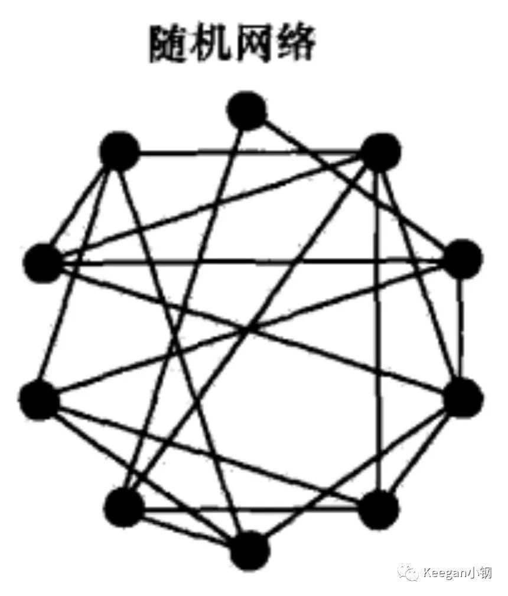

再来看看第三种路由结构：**混合式**。混合式其实就是混合了集中式和分布式结构，如下图所示，网络中存在多个**超级节点**组成分布式网络，而每个超级节点则有多个**普通节点**与它组成局部的集中式网络。一个新的普通节点加入，则先选择一个超级节点进行通信，该超级节点再推送其他超级节点列表给新加入节点，加入节点再根据列表中的超级节点状态决定选择哪个具体的超级节点作为父节点。这种结构的泛洪广播就只是发生在超级节点之间，就可以避免大规模泛洪存在的问题。在实际应用中，混合式结构是相对灵活并且比较有效的组网架构，实现难度也相对较小，因此目前较多系统基于混合式结构进行开发实现。其实，比特币网络如今也是这种结构，后面再细说。

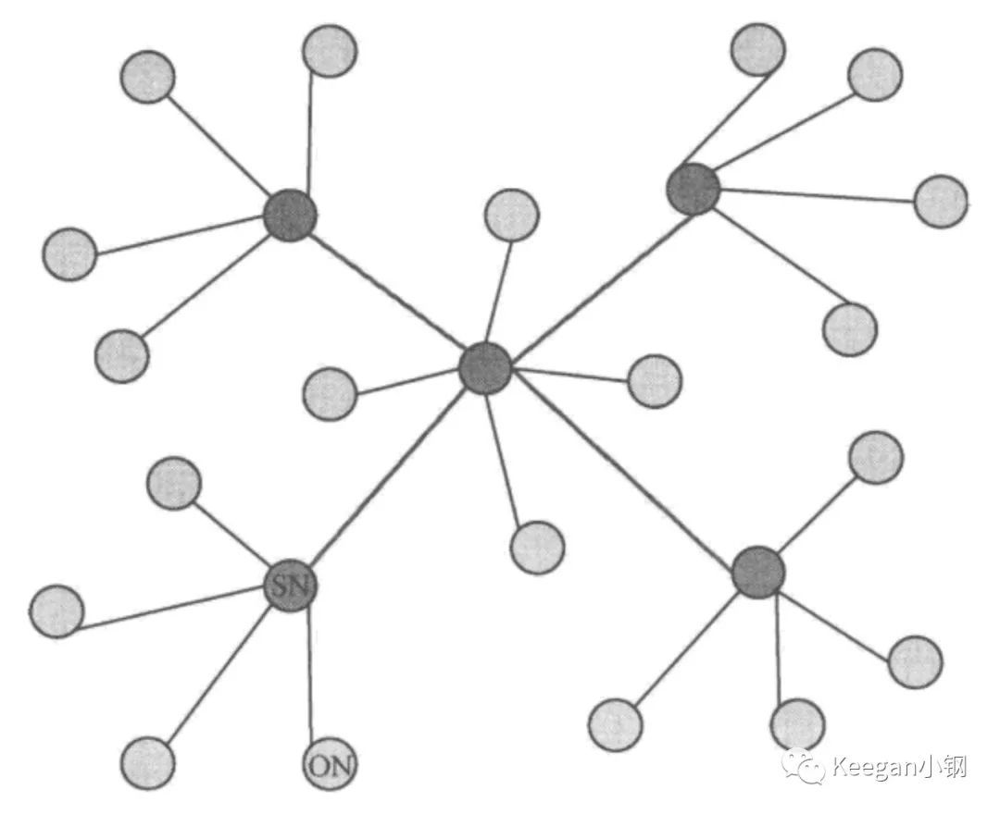

最后一种网络则是**结构化 P2P 网络**，它也是一种分布式网络结构，但与纯分布式结构不同。纯分布式网络就是一个随机网络，而结构化网络则将所有节点按照某种结构进行有序组织，比如形成一个环状网络或树状网络。而结构化网络的具体实现上，普遍都是基于 **DHT(Distributed Hash Table，分布式哈希表)** 算法思想。DHT 只是提出一种网络模型，并不涉及具体实现，主要想解决如何在分布式环境下快速而又准确地路由、定位数据的问题。具体的实现方案有 Chord、Pastry、CAN、Kademlia 等算法，其中 **Kademlia**也是以太坊网络的实现算法，很多常用的 P2P 应用如 BitTorrent、电驴等也是使用 Kademlia。因为篇幅有限，就不展开讲这些算法的具体原理了。目前，我们主要理解 DHT 的核心思想即可。

在 P2P 网络中，可以抽象出两种空间：**资源空间**和节点空间。资源空间就是所有节点保存的资源集合，节点空间就是所有节点的集合。对所有资源和节点分别进行编号，如把资源名称或内容用 Hash 函数变成一个数值（这也是 DHT 常用的一种方法），这样，每个资源就有对应的一个 ID，每个节点也有一个 ID，资源 ID 和节点 ID 之间建立起一种映射关系，比如，将资源 n 的所有索引信息存放到节点 n 上，那要搜索资源 n 时，只要找到节点 n 即可，从而就可以避免泛洪广播，能更快速而又准确地路由和定位数据。当然，在实际应用中，资源 ID 和节点 ID 之间是无法做到一一对应的，但因为 ID 都是数字，就存在大小关系或偏序关系等，基于这些关系就能建立两者的映射关系。这就是 DHT 的核心思想。DHT 算法在资源编号和节点编号上就是使用了分布式哈希表，使得资源空间和节点空间的编号有唯一性、均匀分布式等较好的性质，能够适合结构化分布式网络的要求。

综上，这就是 P2P 网络的一点理论基础，不同的区块链可能会使用不一样的网络模型，但基本原理是一样的。后面分别讲解下最有代表性的两个区块链的网络：比特币网络和以太坊网络。

### 4.2.2 比特币网络

首先，比特币网络中的节点主要有四大功能：**钱包、挖矿、区块链数据库、网络路由**。每个节点都会具备路由功能，但其他功能不一定都具备，不同类型的节点可能只包含部分功能，一般只有**比特币核心(bitcoin core)**节点才会包含所有四大功能。

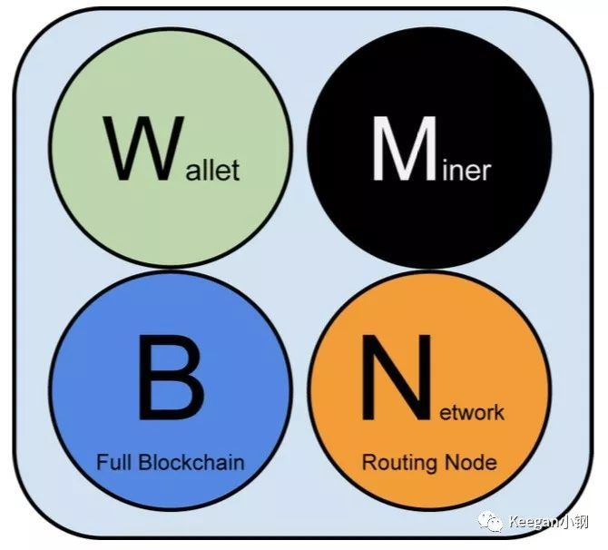

所有节点都会参与校验和广播交易及区块信息，且会发现和维持与其他节点的连接。有些节点会包含完整的区块链数据库，包括所有交易数据，这种节点也称为**全节点(Full Node)**。另外一些节点只存储了区块链数据库的一部分，一般只存储区块头而不存储交易数据，它们会通过“**简化交易验证(SPV)**”的方式完成交易校验，这样的节点也称为 **SPV节点**或**轻节点(Lightweight Node)**。钱包一般是 PC 或手机客户端的功能，用户通过钱包查看自己的账户金额、管理钱包地址和私钥、发起交易等。除了比特币核心钱包是全节点之外，大部分钱包都是**轻节点**。挖矿节点则通过解决**工作量证明(PoW)**算法问题，与其他挖矿节点相互竞争创建新区块。有些挖矿节点同时也是**全节点**，即也存储了完整的区块链数据库，这种节点一般都是**独立矿工(Solo Miner)**。还有一些挖矿节点不是独立挖矿的，而是和其他节点一起连接到**矿池**，参与集体挖矿，这种节点一般也称为**矿池矿工(Pool Miner)**。这会形成一个局部的集中式矿池网络，中心节点是一个**矿池服务器**，其他挖矿节点全部连接到矿池服务器。**矿池矿工**和矿池服务器**之间的通信也不是采用标准的**比特币协议**，而是使用**矿池挖矿协议**，而矿池服务器作为一个**全节点**再与其他比特币节点使用主网络的**比特币协议进行通信。

在整个比特币网络中，除了不同节点间使用**比特币协议**作为通信协议的主网络，也存在很多扩展网络，包括上面提到的**矿池网络**。不同的矿池网络可能还会使用不同的矿池挖矿协议，目前主流的具体矿池协议应该是 **Stratum协议**，该协议除了支持挖矿节点，也支持**瘦客户端钱包**。一个包含了比特币协议主网络各种节点和 Stratum 网络，以及其他矿池网络的扩展比特币网络大概如下图所示：

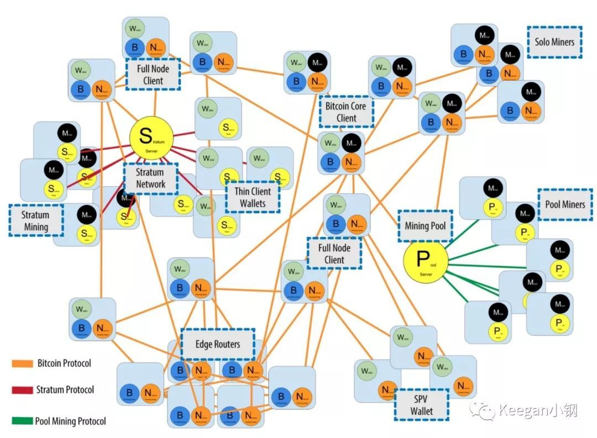

另外，挖矿这块还有特殊需求。我们知道，矿工创建新区块后，是需要广播给全网所有节点的，当全网都接受了该区块，给矿工的挖矿奖励才算是有效的，这之后才好开始下一个区块 Hash 的计算。所以矿工必须最大限度缩短新区块的广播和下一个区块 Hash 计算之间的时间。如果矿工之间传播区块只采用上图所示的比特币协议网络，那无疑会有很高的网络延迟，所以，需要一个专门的传播网络用来加快新区块在矿工之间的同步传播，这个专门网络也叫**比特币传播网络**或比特币中继网络(Bitcoin Relay Network)。

### 4.2.3 以太坊网络

和比特币一样，以太坊的节点也具备**钱包、挖矿、区块链数据库、网络路由**四大功能，也同样存在很多不同类型的节点，除了主网络之外也同样存在很多扩展网络。但与比特币不同的，比特币主网的 P2P 网络是无结构的，但以太坊的 P2P 网络是有结构的。前面我们已经提过，以太坊的 P2P 网络主要采用了 **Kademlia(简称 Kad)**算法实现，Kad 是一种**分布式哈希表(DHT)**技术，使用该技术，可以实现在分布式环境下快速而又准确地路由、定位数据的问题。所以，下面主要讲解下以太坊的 Kad 网络。

在 Kad 网络中，每个节点都具有一个唯一的节点 ID。另外，也会计算不同节点之间的距离，但这个距离不是物理上的距离，而是逻辑上的距离，是通过对两个节点 ID 进行 **异或(符号为^)**计算得到的，即 A、B 两节点之间的距离的计算公式为：**D(A,B) = A.ID^B.ID**。异或有一个重要的性质：假设 a、b、c 为任意三个数，如果 a^b = a^c 成立，那就一定 b = c。因此，如果给定一个结点 a 和距离 L，那就有且仅有一个结点 b, 会使得 D(a,b) = L。通过这种方式，就能有效度量 Kad 网络中不同节点之间的逻辑距离。

在异或距离度量的基础上，Kad 还可以将整个网络拓扑组织成如下图所示的一个**二叉前缀树**，每个 NodeID 会映射到二叉树上的某个叶子。

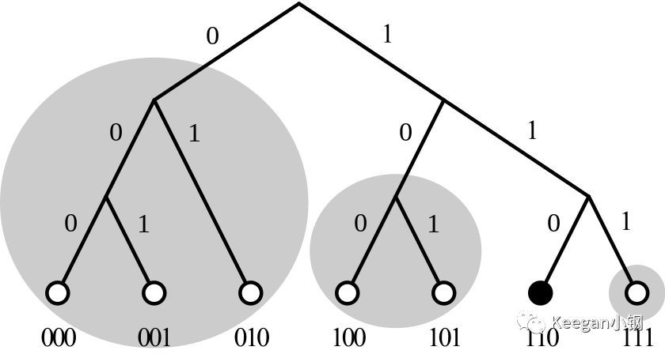

映射规则主要是：

1. 将 NodeID 以二进制形式表示，然后从高到低对每一位的 0 或 1 依次处理；
2. 二进制的第 n 位就对应了二叉树的第 n 层；
3. 如果该位是 0，进入左子树，是 1 则进入右子树（反过来也可以）；
4. 全部位都处理完后，这个 NodeID 就对应了二叉树上的某个叶子。

在这种二叉树结构下，对每个节点来说，离它越近的节点异或距离也是越近的。接着，可以按照离自己异或距离的远近，对整颗二叉树进行拆分。拆分规则是：从根节点开始，将不包括自己的那颗子树拆分出来，然后在包含自己的子树中，把不包括自己的下一层子树再拆分出来，以此类推，直到只剩下自己。以上图的 110 节点为例，从根节点开始，由于 110 节点在右子树，所以将左边的整颗子树拆分出来，即包含 000、001、010 这三个节点的这颗子树；接着，到第二层子树，将不包含 110 节点的左子树再拆分出来，即包含 100 和 101 这两个节点的子树；最后，再将 111 拆分出来。这样，就将 110 节点之外的整个二叉树拆分出了三颗子树。

完成子树拆分后，只要知道每个子树里面的其中一个节点，就可以进行递归路由实现整颗二叉树所有节点的遍历。但在实际场景下，由于节点是动态变化的，所以一般不会只知道每个子树的一个节点，而是需要知道多个节点。因此，Kad 中有一个叫 **K-桶(K-bucket)**的概念，每个桶会记录每颗子树里所知道的多个节点。其实，一个**K-桶**就是一张**路由表**，如果拆分出来有 m 颗子树，那对应节点就需要维护 m 个路由表。每个节点都会各自维护自己的 m 个 K-桶，每个 K-桶里记录的节点信息一般会包括 NodeID、IP、Endpoint、与 Target 节点（即维护该 K-桶的节点）的异或距离等信息。以太坊中，每个节点维护的 K-桶数量为 256 个，这 256 个 K-桶会根据与 Target 节点的异或距离进行排序，每个 K-桶保存的节点数量上限是 16。

在以太坊的 Kad 网络中，节点之间的通信是基于 UDP 的，另外设置了 4 个主要的通信协议：

1. Ping：用于探测一个节点是否在线
2. Pong：用于响应 Ping 命令
3. FindNode：用于查找与 Target 节点异或距离最近的其他节点
4. Neighbours：用于响应 FindNode 命令，会返回一或多个节点

通过以上 4 个命令，就可以实现新节点的加入、K-桶的刷新等机制。具体的实现流程就不细讲了，留给大伙自己去思考。

总结

不同结构的 P2P 网络，会有不同的优点和缺点。比特币网络的结构明显容易理解，实现起来也相对容易得多，而以太坊网络引入了异或距离、二叉前缀树、K-桶等，结构上复杂不少，但在节点路由上的确会比比特币快很多。另外，不管是比特币还是以太坊，其实都只是一种或多种协议的集合，不同节点其实可以用不同的具体实现，比如，比特币就有用 C++ 实现的 Bitcoin Core，还有用 Java 实现的 BitcoinJ；以太坊也有用 Go 语言实现的 go-ethereum，也有用 C++ 实现的 go-ethereum，还有用 Java 实现的 Ethereum(J)。

在以太坊的 Kad 网络中，新节点的加入和 K-桶的刷新流程是怎样的？比特币的新节点加入流程又是怎样的？哈希表有哪些实现方式？


## 4.3 分布式系统技术概要

现在互联网应用，尤其是大型互联网公司的应用已经发展为大规模或超大规模的分布式的，集群化的应用。而中小规模的分布式应用也已广泛出现在各个领域。未来，随着云计算向社会生活的方方面面去渗透，分布式应用将更加地普及。所以，任何一个要从事服务器端应用开发的人员，都有具备对分布式应用的基本认识。

本文将简要介绍分布式应用的各基本领域的相关技术。这些技术在一个分布式应用中都会有或多或少的设计，即便暂时没有涉及到，设计人员也要有所考虑，保证系统有进一步发展的空间。

### 4.3.1. 集群管理

**关键字：**Apache Zookeeper、Paxos 算法、Etcd、Raft、Apache Curator

在一个分布式系统中，存在着一些和系统运行，以及重要业务紧密相关的数据，如节点相关的数据、应用服务和数据服务相关的数据等，这些数据对集群的正常运行至关重要。

- **服务器节点相关数据：**服务器的地址、状态
- **服务相关数据：**服务的IP、端口、版本、协议、状态、主备节点信息
- **数据库相关数据：**路由规则、分库分表规则

这些重要的数据在分布式系统中存在着多份拷贝，以保证高可用性。但这产生了另外一个问题，就是如何保证这些数据的一致性。因为这些数据是如此重要，不一致的数据会产生严重甚至致命的错误。在一个小规模的分布式系统中，因为可以用一两台服务器去做集群管理，所以数据的一致性容易实现。但是对于一个大规模的分布式系统，一两台集群配置管理服务器无法支撑整个集群所带来的大量并发读写操作，所以要使用几台、十几台，甚至更多的服务器去支撑这些请求。此时，就需要一个保持这些服务器中集群配置数据的一致性的方案了。

这众多方案中，Paxos 算法算是最佳方案之一。关于 Paxos 算法的内容，不在这里详述了。简单描述就是集群中各节点相互以提议的方式通信（对一项数据的修改），提议中带有不断增加的 ID 号，节点永远同意当前 ID 号最大的提议，并拒绝其它提议。当有半数以上节点同意一项提议之后，这个提议便被整个节点所接受并采纳。

#### 4.3.1.1. Apache Zookeeper

Paxos 算法的语言表述看上去不难，但是其中的技术难点并不少。好在现在已经有了很多的解决方案，其中最为著名的便是 Apache Zookeeper。Zookeeper 不仅可以用来存储配置数据，还可以用来实现集群 Master 选举、分布式锁等场景。Apache Curator 是 Zookeeper 的客户端，可以简化对 Zookeeper 的使用，实现各式的场景。

Zookeeper 是一个分布式的服务管理框架。Zookeeper 的典型的应用场景包括配置文件的管理、集群管理、分布式锁、Leader 选举、队列管理等。Zookeeper 可工作在集群模式下，`zoo.cfg` 中记录着集群中所有 Zookeeper 服务器的地址，每个服务器有自己唯一的 ID。同时，每个服务器在自己的 `dataDir` 目录下还要有一个 `myid` 文件，以标示自己的 ID。在 Zookeeper 中，数据以树状的结构存储，类似于 LDAP 数据库。

现在类似 Zookeeper 的项目还有使用 go 语言实现的 Etcd。

**1.2. 参考：**

- [Paxos算法](http://zh.wikipedia.org/wiki/Paxos算法)
- [zookeeper节点数与watch的性能测试](http://codemacro.com/2014/09/21/zk-watch-benchmark/)
- [etcd：从应用场景到实现原理的全方位解读](http://www.infoq.com/cn/articles/etcd-interpretation-application-scenario-implement-principle)
- [etcd v2.1 benchmarks](https://github.com/coreos/etcd/blob/master/Documentation/benchmarks/etcd-2-1-0-benchmarks.md)
- [分布式配置服务etcd VS 分布式协调服务zookeeper](http://www.51gocloud.com/?p=766)

### 4.3.2. 远程调用

**关键字：** NIO、Netty、epoll、Thrift、Protobuf

分布式系统中，模块间的调用通常需要用远程调用来实现。而且随着微服务架构模式的流行，使用远程调用的比例会越来越高。其实远程调用这种方式很早以前就出现了，早年的技术有诸如 COBRA、EJB、SOAP 等，但这些技术存在着用法复杂、性能差等缺点。这些缺点限制着远程调用的普及。这些年，随着异步 IO 技术、序列化技术的发展进步，以及像 Zookeeper 这样的集群管理服务的出现普及，妨碍远程调用普及的技术障碍逐渐被打破。

使用 HTTP + JSON 的方式同样可以实现模块之间的远程调用，但这种方式通常用来实现 Public API。在系统内部，远程调用要求更快的速度，更小的延迟，还有还有异步调用的需求，所以 HTTP + JSON 通常无法满足这样的要求。远程调用有两个重要的技术点，一个是 IO 技术、一个是序列化技术。另外，远程调用还引出来另两个问题：1. 服务注册、发现、路由的问题。这个问题的需要结合例如 Zookeeper 服务去解决；2. 如何简化远程调用的使用，使其如同本地调用一样简单。这个问题需要结合 AOP 之类的技术。这两个问题的具体解决不在本节讨论范围之内。

#### 4.3.2.1序列化技术

序列化技术是远程调用的通信协议中的重要一部分，它定义了编程语言中的数据结构和数据传输协议中的数据结构之间如何相互转化。序列化技术的性能的好坏会影响到对远程调用性能的好坏在序列化方面。序列化技术性能的好坏主要包含两方面的含义：一个是序列化时占用的资源（CPU、内存、所需时间）；另一个是序列化之后数据的大小。SOAP WebService 和 REST WebService 通常会把数据序列化成 XML 格式或者 JSON 格式。这两种格式因为都是文本格式，所以有着良好的可读性，但是对于需要频繁使用的远程调用来说，它们的体积偏大。所以边有了性能更好的序列化解决方案，被大家所熟知的有 Protocol Buffers 和 Apache Arvo。此外，Apache Thrift 的序列化的性能也很好，但是 Thrift 无法被当做一个单独的序列化技术被使用，而是一个完整的远程调用解决方案。其序列化部分不太容易被剥离出来，没有完整的 API 被开放使用。这里列出了常见的序列化技术的[性能比较](https://code.google.com/p/thrift-protobuf-compare/wiki/Benchmarking)

#### 4.3.2.2 Apache Thrift

Thrift 由 Facebook 贡献，它是一个高性能、跨语言的 RPC 服务框架，适合用来实现内部服务的 RPC 调用。Thrift 采用通过 IDL 接口描述语言定义并生成服务接口，再结合其提供的服务端和客户端调用栈实现 RPC 功能。

Thrift IDL 定义示例（来自 Thrift 官网，[完整示例](https://git1-us-west.apache.org/repos/asf?p=thrift.git;a=blob;f=tutorial/tutorial.thrift;hb=HEAD)）

```
service Calculator extends shared.SharedService {
 
  /**
   * A method definition looks like C code. It has a return type, arguments,
   * and optionally a list of exceptions that it may throw. Note that argument
   * lists and exception lists are specified using the exact same syntax as
   * field lists in struct or exception definitions.
   */
 
   void ping(),
 
   i32 add(1:i32 num1, 2:i32 num2),
 
   i32 calculate(1:i32 logid, 2:Work w) throws (1:InvalidOperation ouch),
 
   /**
    * This method has a oneway modifier. That means the client only makes
    * a request and does not listen for any response at all. Oneway methods
    * must be void.
    */
   oneway void zip()
}
```

Thrift 提供了工具，根据 IDL 文件，为各种编程语言（C++, Java, Python, PHP, Ruby 等）生成相应的接口和数据结构。Thrift 不仅提供了传统的 Request/Response 方式的接口调用，也有单向的调用方式（用关键字 oneway 修饰）。

Thrift 的序列化部分和整个框架结合紧密，并没有直接提供序列化和反序列化的接口，所以不容易和其它传输协议配合使用。

#### 示例与解释

[这里](https://github.com/yanglifan/learn/tree/master/framework/src/main/java/yanglifan/learn/framework/thrift)提供了一个 Thrift 的简单使用的示例。其中除了 `ThriftClient`、`ThriftServer` 和 `CalculatorHandler` 三个类，剩下的类都是从 *.thrift 文件，即 Thrift 的 IDL 文件生成的。Thrift 的 IDL 支持 namespace（即包空间）、继承等语法。

以 Java 为例，Thrift IDL 中的 `service` 将生成接口、服务器端栈和客户端栈，这三部分又都有同步和异步两种类型。即一个 IDL 文件将生成6个内部类。客户端通过这个调用栈，在配置了传输协议、地址信息和序列化协议之后，就可以调用服务器端了。

服务器端的实现也不复杂。当然开发人员需要实现相应的业务类，这个业务类要实现至少一种由 IDL 生成的接口，同步接口或异步接口，也可两者都实现。

基于 IDL 进行开发是使用 Thrift 这样 RPC 框架的一种方式。这种方式对于新开发的、需要被远程访问的服务、并且有多重语言的客户端的场景来说是很合适的。但是对于已有的业务方法，如果要让其可以被远程访问的话，那这种方式就显得不方便了。所以 Facebook 有提供了另一个项目 —— Swift（不是苹果的 Swift）。这个项目可以通过在 Java 代码上添加 Annotation，使得普通的 Java 方法调用转变成 Thrift 的远程调用。这种方式类似于 JAX-RS 或其它许多 REST 框架所提供的功能。这种方式对主要使用 Java 或其它一些 JVM 语言，如 Scala 和 Groovy 开发的项目来说是很合适的。使用了 Thrift 的远程调用的同时，还降低了引入 IDL 所导致的复杂度的提高和可读性的下降。[**Thrift Swift 示例**](https://github.com/yanglifan/learn/tree/master/framework/src/main/java/yanglifan/learn/framework/thrift/swift)

#### 4.3.2.3 Protocol Buffers

Protobuf 是一个高性能序列化解决方案，有完善的文档，可以和例如 HTTP 这样的协议搭配使用。


**2.5. 参考**

- [序列化和反序列化](http://www.infoq.com/cn/articles/serialization-and-deserialization)
- [Netty系列之Netty高性能之道](http://www.infoq.com/cn/articles/netty-high-performance)
- [Netty系列之Netty线程模型](http://www.infoq.com/cn/articles/netty-threading-model)
- [Netty系列之Netty并发编程分析](http://www.infoq.com/cn/articles/netty-concurrent-programming-analysis)

### 4.3.3 消息中间件

**关键字：**Kafka、RabbitMQ 在分布式系统中，消息中间件的重要性越来越明显。消息中间件可以解耦模块、提供异步调用功能、消息持久化、消息削峰。已有的如 Apache ActiveMQ 无法满足新的需要，于是出现了如 RabbitMQ、Apache Kafka 等新型的消息中间件产品。

#### 4.3.3.1 Apache Kafka

Apache Kafka 充分利用了机械磁盘顺序读写速度快的特点，在接受消息之后同步地写入到磁盘中，保证数据可靠性的同时，也保证了非常快的速度。每个 Kafka 集群上都有多个 Topic，Topic 相当于一个 category，消费者可以订阅一个或多个 Topic。每个 Topic 由多个 Partition 组成。消息被顺序的添加到 Partition 中，每条消息有一个唯一的、有序的 ID，这个 ID 被称为 Offset。Consumer 需要维护自己消费到的消息的位置 (Offset)。

Apache Kafka 不同于传统的消息中间件，它采用“拉”消息模式，而不是传统的“推”消息模式。即客户端需要主动从消息中间件获取消息，好处是客户端可以更好地控制请求量。

**Queue 模式和 Topic 模式**

传统消息队列服务中有队列模式和发布订阅模式两种模式，前者一条消息只会被一个消费者消费；后者一条消息会发布给所有的订阅这个 Topic 的消费者。在 Kafka 中，这两种模式是使用一种方式 —— 消费者组来实现的。在同一个消费者组中的不同消费者不会受到相同的消息。如果想实现发布订阅模式，消费者必须处于不同的消费者组中。

#### [4.3.3.2 RabbitMQ](https://www.rabbitmq.com/tutorials/tutorial-one-java.html)

RabbitMQ 是一个使用 Erlang 开发的 AMQP (Advanced Message Queue Protocol) 实现。现在 RabbitMQ 是由 VMware 旗下的 SpringSource 负责开发。AMQP 是一个语言无关的消息队列协议。在 RabbitMQ 中，有三个概念：Exchange、Queue 和 Route key。Exchange 用来标示生产者，Queue 用来标示消费者，而 Route key 用来关联这两者。RabbitMQ 中这种方式提供了更灵活的应用模式。

### 4.3.4 分布式文件系统

#### 4.3.4.1 块存储与对象存储

块存储是将一块裸盘提供给客户使用，但是这块裸盘可能是来自一块物理硬盘，也有可能是多块，或是来自不同服务器上的硬盘。对象存储提供了更高级的接口，通过这些接口可以读写文件以及相关的元数据。其中的元数据包含了文件每一个块的存储信息。通过文件元数据，文件可以被并行地操作。

#### 4.3.4.2 分布式文件系统的高可用

为了保证数据的安全，分布式文件系统通常会将文件复制为三份。这三份数据会位于不同的服务器上，对应要求更高的系统，比如公有云存储。其中的一份数据会放置在另一个机房中，以保证即便整个机房出现故障，整个文件系统仍是可用的。

**Ceph**

Ceph 目前是 OpenStack 的一个组件，提供了块存储和对象存储的功能。

**GridFS**

GridFS 是 MongoDB 的一部分。用来存储超过 BSON 大小限制（16MB）的文件。GridFS 将文件分成一个个部分，分开存储。

**FastDFS**

FastDFS 是一个轻量的分布式文件系统，适合存储中小文件（对象存储）。FastDFS 的跟踪服务器不负责记录文件的元信息。文件的具体存储位置等信息包含在返回给用户的 File ID 中。

### 4.3.5 分布式内存

> 内存是新的硬盘，硬盘是新的磁带 -- Jim Gray

#### 4.3.5.1 Hazelcast

Hazelcast 是一个面向 Java 的分布式内存解决方案，提供了丰富的功能特性。实现了诸如分布式 Java 集合类、分布式锁、分布式 ExecutorService 实现等等。但现实往往是残酷的，Hazelcast 在实际应用中存在大量的缺陷。详见 [“hazelcast的坑爹事”](http://blog.csdn.net/hengyunabc/article/details/18514563)

#### 4.3.5.2  Memcached

Memcached 是老牌的“分布式”缓存解决方案。分布式之所以加引号，是因为 Memcached 服务器端本身并不支持分布式，服务器端每个节点之间并不会相互通信。分布式的支持需要客户端来实现。早期的内存分布式是通过节点之间复制来实现的，但这种方式却限制了可伸缩性。这也是因为诸如 Terrecotta 这样的内存分布式解决方案没有成为主流的原因。

#### 4.3.5.3  Redis

#### 4.3.5.4 Gemfire

### 4.3.6 分布式数据库

#### 4.3.6.1 关系型数据库

在大规模的分布式应用中，单库或者简单的读写分离已经无法满足要求，因此必须对数据库进行水平和垂直的划分和分库分表。在对数据库进行分库分表之后，应用对数据库的访问便不再是一件简单的事情了。应用在进行一次数据库操作时，其所对应的数据库的地址和表名必须通过某种逻辑运算才能得到。例如，ID从1到1,000,000的User数据是数据库1的User_1表中，ID从1,000,001到2,000,000的User数据在数据库1的User_2表中，而其它的User数据又会在不同的数据库的不同的表中。同时，还要考虑主从数据库，读写分离的问题。这样的数据库使用方式会使数据操作变得极为复杂，也会增加数据迁移，增容扩容时的难度。

对于这样复杂的问题，靠应用自己解决显然是不合适的。所以各家分布式应用的使用大户——互联网厂商，都自己实现了相应的解决方案。这些解决方案可分为中间间方式和框架方式，前者作为数据库访问的代理，使得分布式的数据库对应用是透明的。后者作为一个框架嵌入到应用中，也能起到类似的作用。这两种方式各有优劣，分别适合不同的场合。

搜狗 Compass，阿里 TDDL、Cobar

#### 4.3.6.2 NoSQL

大部分 NoSQL 虽然对分布式的支持是友好的，但这并不意味着使用这些 NoSQL 数据库就可以轻轻松松地实现一个集群。例如著名的 Key/Value 数据库 Redis。它 3.0 之前一直没有官方的集群方案，所以各个大规模使用 Redis 都需要自己实现分布式方案，例如 Twitter 的 Twemproxy、豌豆荚的 Codis 等等。

在实现数据的分布式解决方案的时候，有一个算法是最常被使用的 —— 一致性哈希算法，这里只是简单提一下，不做进一步介绍。

### 4.3.7 虚拟化技术

**关键字：**OpenStack、Docker、容器技术 虚拟化技术是提高硬件利用率的重要手段。虚拟化技术是实现云计算的重要技术。虚拟化技术的最底层是各种硬件的虚拟化，如 CPU 虚拟化、内存虚拟化、存储虚拟化、网络虚拟化等等。然后再基于这些技术，构建出各种虚拟机技术。然后各个厂商又基于虚拟机技术和其它虚拟化技术构建出 IaaS、PaaS 和 SaaS 等平台和软件产品。

#### 4.3.7.1 OpenStack

OpenStack 这个开源项目包含了一系列用于 IaaS 平台搭建的组件的合称。这些组件包含用于网络虚拟化的 Neutron、提供存储虚拟化的 Ceph 和 Swift、以及提供例如镜像管理、控制面板等功能的诸多组件。OpenStack 本身并不提供虚拟化技术，而是通过支持诸多现有的虚拟化技术，例如 KVM，并在此之上提供一系列构建 IaaS 解决方案的技术。OpenStack 中的组件可以灵活搭配使用，并且因为开源的原因，使用者可以对其进行自定义或二次开发。但是也是因为这个原因，任何厂商想要成功使用 OpenStack 必须有一个强大的技术团队做后盾。这也是目前 OpenStack 技术发展遇到的最大困难。

#### 4.3.7.2 Docker

严格说来 Docker 并不是一个虚拟化技术，但是因为 Docker 能够提供给使用者一种轻量化的虚拟机的使用体验，所以也将 Docker 列在这里。Docker 是一个容器技术，它通过 Linux 内核的支持，使不同的进程可以相互隔离并做到资源的限制，从而实现了部分的虚拟机资源隔离的需要。Docker 相比较虚拟机的优势在于轻量和系统资源使用效率接近于实体机。因为现在随着需求的发展和技术的进步，服务器端应用向着一种轻量化和越来越分布式的方向发展。虚拟机这样重量级的技术对于小而多的应用来说便不再合适，这也是 Docker 这样的容器技术近些年迅速发展并呈现火热状态的重要原因。

Docker 和前面提到的 OpenStack 是两个不同层面的技术，两者并不冲突。现在 OpenStack 和 Docker 社区正在紧密合作（[容器不会取代OpenStack，但二者如何深度整合？](http://www.csdn.net/article/2015-05-20/2824734)）。

### 4.3.8 分布式系统之负载均衡

#### 4.3.8.1 HAProxy

HAProxy 是一个高性能的 TCP 和 HTTP 反向代理代理和负载均衡服务器。可用反向代理和负载均衡还有 Nginx。Niginx 更偏向于 HTTP 协议。另外 Varnish 和 Squid 可以作为前端的代理，但是它们更偏重缓存功能


# 第二篇 Hyperledger Fabric分布式账本技术架构篇


# 第三篇 Hyperledger Fabric分布式账本关键技术篇


# 第四篇 Hyperledger Fabric分布式账本技术案例篇


# 第五篇 Hyperledger Fabric分布式账本技术实战篇

# 第10章 基于 Fabric-SDK-Go 的Web项目环境部署

## 10.1 项目引言

**目标**

1. 明确项目的所需环境及实现目的
2. 构建基于 Fabric-SDK-Go 项目的所需环境

### 10.1.1 引言

此项目是一个使用 `Hyperledger Fabric` 平台作为网络环境底层，在业务层利用 fabric-sdk-go 相关API实现对链码的调用，并且使用GoWeb实现的一个Web应用示例程序。为了提高应用程序的可扩展性及可维护性，我们使用了基于 `MVC` 的架构模式，对项目进行分层设计。此应用示例是为了帮助读者能够快速掌握基于 `fabric-sdk-go` 的开发方式与技巧，所以我们的链码业务只是简单的实现了对分类账本状态的读写操作。

#### 10.1.1.1 说明

在之前的内容中，我们详细的介绍了 `Hyperledger Fabric` 的系统架构及相关的组件。包括 Fabric 网络环境搭建，链码开发及测试及分布式账本数据的存储方式。所以我们不会在此项目详细解释 Hyperledger Fabric 的工作原理。在学习本项目之前，您应该通过要本书的前几章或通过Hyperledger Fabric [官网](https://hyperledger-fabric.readthedocs.io/en/release-1.2/whatis.html) 或其它渠道学习并掌握 Hyperledger Fabric 的一些知识，以具备 Hyperledger Fabric 操作基础。

本应用实现是在基于 **Ubuntu 16.04（推荐）** 系统的基础上完成的，但 Hyperledger Fabric 与Mac OS X、Windows和其他Linux发行版相兼容。

#### 10.1.1.2 所需环境及工具

现在我们重新安装一个干净的 **Ubuntu 16.04** 操作系统（如果之前有备份，直接恢复为系统刚安装时的状态即可），实现从零到壹的 Hyperledger Fabric 网络环境搭建、SDK-Go 的应用、链码开发及最后的Web应用体验。

- **Ubuntu 16.04**
- **vim、git**
- **docker 17.03.0-ce+**
- **docker-compose 1.8**+
- **Golang 1.10.x+**

### 10.1.2 先决条件

如下环境及工具如果在系统没有安装，请按照步骤进行安装，如果系统中已成功安装且符合相应的版本要求，则无须重复执行。如果已安装版本低于指定要求的版本，请报载之后重新安装符合要求的版本。

#### 10.1.2.1 安装 vim、git

```shell
$ sudo apt install vim
$ sudo apt install git
```

#### 10.1.2.2 安装docker

**需要Docker版本17.03.0-ce或更高版本。**

```shell
$ docker version 
$ sudo apt install docker.io
```

安装完成后执行版本查询命令

```shell
$ sudo docker version
```


#### 10.1.2.3 安装docker-compose

**docker-compose 1.8或更高版本是必需的。**

我们目前无法一次性轻松管理多个容器。 为了解决这个问题，需要**docker-compose** 。

```shell
$ docker-compose version 
$ sudo apt install docker-compose
```

安装完成后查询：

```shell
$ docker-compose version
```


将当前用户添加到 docker 组

```shell
$ sudo usermod -aG docker kevin
```

添加成功后**必须注销/退出并重新登录**(退出终端重新连接即可)

> 如果没有将当前用户添加到 docker 组中，在后期执行make命令时会造成错误: `ERROR: Couldn't connect to Docker daemon at http+docker://localunixsocket - is it running?`

#### 10.1.2.4 安装Golang

**需要版本1.10.x或更高。**如果您使用的是 Hyperledger Fabric 1.1.x 版本，那么 Golang 版本在 1.9.x 以上

```shell
 $ go version 
 $ wget https://dl.google.com/go/go1.10.3.linux-amd64.tar.gz
```

> 下载受网络环境影响，如果您本地有相应的 tar 包，则直接解压到指定的路径下即可。

使用 tar 命令将下载后的压缩包文件解压到指定的 /usr/local/ 路径下

```shell
$ sudo tar -zxvf go1.10.3.linux-amd64.tar.gz -C /usr/local/
```

设置GOPATH & GOROOT环境变量, 通过 `go env` 查看GOPATH路径

```shell
$ sudo vim /etc/profile
```

> 如果只想让当前登录用户使用Golang， 其它用户不能使用， 则编辑当前用户$HOME目录下的 .bashrc 或 .profile 文件， 在该文件中添加相应的环境变量即可。

在profile文件最后添加如下内容:

```shell
export GOPATH=$HOME/go
export GOROOT=/usr/local/go
export PATH=$GOROOT/bin:$PATH
```

使用 source 命令，使刚刚添加的配置信息生效：

```shell
$ source /etc/profile
```

通过 go version命令验证是否成功：

```shell
$ go version
```


未经授权禁止转载、改编，转载请注明出处！

本文地址: https://www.chaindesk.cn/witbook/11/212

## 10.2 网络环境

**目标**

1. 使用提供的 Crypto 构建项目所需的网络环境
2. 确保网络启动成功

### 10.2.1 网络环境

#### 10.2.1.1 网络环境准备

Hyperledger Fabric 处理交易时需要大量的证书来确保在整个端到端流程（TSL，身份验证，签名块......）期间进行加密。 为了直接了解问题的核心，我们已经在 github 上为您的网络环境准备了所有相关的内容， 不在此教程中讲解。

> Crypto 材料已使用 Hyperledger Fabric 中的 **cryptogen** 工具生成，并保存在 hf-fixtures/crypto-config 目录中。有关 **cryptogen** 工具的更多详细信息，请 [点击此处](https://hyperledger-fabric.readthedocs.io/en/latest/commands/cryptogen.html)。
>
> 初始区块（genesis.block）和通道配置事务（channel.tx）已使用 Hyperledger Fabric中 的 **configtxgen** 工具生成，并保存在 hf-fixtures/artifacts 目录中。有关 **configtxgen** 工具的更多详细信息，请 [点击此处](https://hyperledger-fabric.readthedocs.io/en/latest/commands/configtxgen.html)。

在`GOPATH`的`src`文件夹中新建一个目录如下：

```shell
$ mkdir -p $GOPATH/src/github.com/kongyixueyuan.com/kongyixueyuan 
$ cd $GOPATH/src/github.com/kongyixueyuan.com/kongyixueyuan
```

使用 `git` 命令克隆 hf-fixtures 目录当前路径

```shell
$ git clone https://github.com/kevin-hf/hf-fixtures.git
```

将 hf-fixtures 文件夹重命名为 fixtures

```shell
$ mv hf-fixtures/ fixtures
```

修改`fixtures` 文件夹的所属关系为当前用户

```shell
$ sudo chown -R kevin:kevin ./fixtures
```

> 提示： kevin 为安装 Ubuntu 16.04 系统时创建的用户

进入 `fixtures` 目录

```shell
$ cd fixtures
```

为了构建区块链网络，使用 `docker` 构建处理不同角色的虚拟计算机。 在这里我们将尽可能保持简单。如果确定您的系统中已经存在相关的所需容器，或可以使用其它方式获取，则无需执行如下命令。否则请将 `fixtures` 目录下的 `pull_images.sh` 文件添加可执行权限后直接执行。

```shell
$ chmod 777 ./pull_images.sh
$ ./pull_images.sh
```

> 提示：`pull_images.sh` 文件是下载 Fabric 环境所需容器的一个可执行脚本，下载过程需要一段时间（视网速情况而定），请耐心等待。另：请确定您的系统支持虚拟技术。

#### 10.2.1.2 配置docker-compose.yml文件

在 `fixtures` 目录下创建一个 `docker-compose.yml` 文件并编辑

```shell
$ vim docker-compose.yml
```

1. 将 `network下的basic` 修改为 `default`

   ```yaml
   version: '2'
   
   networks:
     default:
   
   services:
   ```

2. 编辑 orderer 部分

   ```yaml
     orderer.kevin.kongyixueyuan.com:
       image: hyperledger/fabric-orderer
       container_name: orderer.kevin.kongyixueyuan.com
       environment:
         - ORDERER_GENERAL_LOGLEVEL=debug
         - ORDERER_GENERAL_LISTENADDRESS=0.0.0.0
         - ORDERER_GENERAL_LISTENPORT=7050
         - ORDERER_GENERAL_GENESISPROFILE=kongyixueyuan
         - ORDERER_GENERAL_GENESISMETHOD=file
         - ORDERER_GENERAL_GENESISFILE=/var/hyperledger/orderer/genesis.block
         - ORDERER_GENERAL_LOCALMSPID=kevin.kongyixueyuan.com
         - ORDERER_GENERAL_LOCALMSPDIR=/var/hyperledger/orderer/msp
         - ORDERER_GENERAL_TLS_ENABLED=true
         - ORDERER_GENERAL_TLS_PRIVATEKEY=/var/hyperledger/orderer/tls/server.key
         - ORDERER_GENERAL_TLS_CERTIFICATE=/var/hyperledger/orderer/tls/server.crt
         - ORDERER_GENERAL_TLS_ROOTCAS=[/var/hyperledger/orderer/tls/ca.crt]
       working_dir: /opt/gopath/src/github.com/hyperledger/fabric
       command: orderer
       volumes:
         - ./artifacts/genesis.block:/var/hyperledger/orderer/genesis.block
         - ./crypto-config/ordererOrganizations/kevin.kongyixueyuan.com/orderers/orderer.kevin.kongyixueyuan.com/msp:/var/hyperledger/orderer/msp
         - ./crypto-config/ordererOrganizations/kevin.kongyixueyuan.com/orderers/orderer.kevin.kongyixueyuan.com/tls:/var/hyperledger/orderer/tls
       ports:
         - 7050:7050
       networks:
         default:
           aliases:
             - orderer.kevin.kongyixueyuan.com
   ```

3. 编辑 ca 部分

   ```yaml
     ca.org1.kevin.kongyixueyuan.com:
       image: hyperledger/fabric-ca
       container_name: ca.org1.kevin.kongyixueyuan.com
       environment:
         - FABRIC_CA_HOME=/etc/hyperledger/fabric-ca-server
         - FABRIC_CA_SERVER_CA_NAME=ca.org1.kevin.kongyixueyuan.com
         - FABRIC_CA_SERVER_CA_CERTFILE=/etc/hyperledger/fabric-ca-server-config/ca.org1.kevin.kongyixueyuan.com-cert.pem
         - FABRIC_CA_SERVER_CA_KEYFILE=/etc/hyperledger/fabric-ca-server-config/727e69ed4a01a204cd53bf4a97c2c1cb947419504f82851f6ae563c3c96dea3a_sk
         - FABRIC_CA_SERVER_TLS_ENABLED=true
         - FABRIC_CA_SERVER_TLS_CERTFILE=/etc/hyperledger/fabric-ca-server-config/ca.org1.kevin.kongyixueyuan.com-cert.pem
         - FABRIC_CA_SERVER_TLS_KEYFILE=/etc/hyperledger/fabric-ca-server-config/727e69ed4a01a204cd53bf4a97c2c1cb947419504f82851f6ae563c3c96dea3a_sk
       ports:
         - 7054:7054
       command: sh -c 'fabric-ca-server start -b admin:adminpw -d'
       volumes:
         - ./crypto-config/peerOrganizations/org1.kevin.kongyixueyuan.com/ca/:/etc/hyperledger/fabric-ca-server-config
       networks:
         default:
           aliases:
             - ca.org1.kevin.kongyixueyuan.com
   ```

4. 编辑Peer部分

   1. `peer0.org1.example.com` 内容如下

      ```yaml
        peer0.org1.kevin.kongyixueyuan.com:
          image: hyperledger/fabric-peer
          container_name: peer0.org1.kevin.kongyixueyuan.com
          environment:
            - CORE_VM_ENDPOINT=unix:///host/var/run/docker.sock
            - CORE_VM_DOCKER_ATTACHSTDOUT=true
            - CORE_LOGGING_LEVEL=DEBUG
            - CORE_PEER_NETWORKID=kongyixueyuan
            - CORE_PEER_PROFILE_ENABLED=true
            - CORE_PEER_TLS_ENABLED=true
            - CORE_PEER_TLS_CERT_FILE=/var/hyperledger/tls/server.crt
            - CORE_PEER_TLS_KEY_FILE=/var/hyperledger/tls/server.key
            - CORE_PEER_TLS_ROOTCERT_FILE=/var/hyperledger/tls/ca.crt
            - CORE_PEER_ID=peer0.org1.kevin.kongyixueyuan.com
            - CORE_PEER_ADDRESSAUTODETECT=true
            - CORE_PEER_ADDRESS=peer0.org1.kevin.kongyixueyuan.com:7051
            - CORE_PEER_GOSSIP_EXTERNALENDPOINT=peer0.org1.kevin.kongyixueyuan.com:7051
            - CORE_PEER_GOSSIP_USELEADERELECTION=true
            - CORE_PEER_GOSSIP_ORGLEADER=false
            - CORE_PEER_GOSSIP_SKIPHANDSHAKE=true
            - CORE_PEER_LOCALMSPID=org1.kevin.kongyixueyuan.com
            - CORE_PEER_MSPCONFIGPATH=/var/hyperledger/msp
            - CORE_PEER_TLS_SERVERHOSTOVERRIDE=peer0.org1.kevin.kongyixueyuan.com
          working_dir: /opt/gopath/src/github.com/hyperledger/fabric/peer
          command: peer node start
          volumes:
            - /var/run/:/host/var/run/
            - ./crypto-config/peerOrganizations/org1.kevin.kongyixueyuan.com/peers/peer0.org1.kevin.kongyixueyuan.com/msp:/var/hyperledger/msp
            - ./crypto-config/peerOrganizations/org1.kevin.kongyixueyuan.com/peers/peer0.org1.kevin.kongyixueyuan.com/tls:/var/hyperledger/tls
          ports:
            - 7051:7051
            - 7053:7053
          depends_on:
            - orderer.kevin.kongyixueyuan.com
          networks:
            default:
              aliases:
                - peer0.org1.kevin.kongyixueyuan.com
      ```

   2. peer1.org1.example.com 内容如下

      ```yaml
        peer1.org1.kevin.kongyixueyuan.com:
          image: hyperledger/fabric-peer
          container_name: peer1.org1.kevin.kongyixueyuan.com
          environment:
            - CORE_VM_ENDPOINT=unix:///host/var/run/docker.sock
            - CORE_VM_DOCKER_ATTACHSTDOUT=true
            - CORE_LOGGING_LEVEL=DEBUG
            - CORE_PEER_NETWORKID=kongyixueyuan
            - CORE_PEER_PROFILE_ENABLED=true
            - CORE_PEER_TLS_ENABLED=true
            - CORE_PEER_TLS_CERT_FILE=/var/hyperledger/tls/server.crt
            - CORE_PEER_TLS_KEY_FILE=/var/hyperledger/tls/server.key
            - CORE_PEER_TLS_ROOTCERT_FILE=/var/hyperledger/tls/ca.crt
            - CORE_PEER_ID=peer1.org1.kevin.kongyixueyuan.com
            - CORE_PEER_ADDRESSAUTODETECT=true
            - CORE_PEER_ADDRESS=peer1.org1.kevin.kongyixueyuan.com:7051
            - CORE_PEER_GOSSIP_EXTERNALENDPOINT=peer1.org1.kevin.kongyixueyuan.com:7051
            - CORE_PEER_GOSSIP_USELEADERELECTION=true
            - CORE_PEER_GOSSIP_ORGLEADER=false
            - CORE_PEER_GOSSIP_SKIPHANDSHAKE=true
            - CORE_PEER_LOCALMSPID=org1.kevin.kongyixueyuan.com
            - CORE_PEER_MSPCONFIGPATH=/var/hyperledger/msp
            - CORE_PEER_TLS_SERVERHOSTOVERRIDE=peer1.org1.kevin.kongyixueyuan.com
          working_dir: /opt/gopath/src/github.com/hyperledger/fabric/peer
          command: peer node start
          volumes:
            - /var/run/:/host/var/run/
            - ./crypto-config/peerOrganizations/org1.kevin.kongyixueyuan.com/peers/peer1.org1.kevin.kongyixueyuan.com/msp:/var/hyperledger/msp
            - ./crypto-config/peerOrganizations/org1.kevin.kongyixueyuan.com/peers/peer1.org1.kevin.kongyixueyuan.com/tls:/var/hyperledger/tls
          ports:
            - 7151:7051
            - 7153:7053
          depends_on:
            - orderer.kevin.kongyixueyuan.com
          networks:
            default:
              aliases:
                - peer1.org1.kevin.kongyixueyuan.com
      ```

5. 其余可根据实际情况进行添加

### 10.2.2 测试网络环境

为了检查网络是否正常工作，使用`docker-compose`同时启动或停止所有容器。 进入`fixtures`文件夹，运行：

```shell
$ cd $GOPATH/src/github.com/kongyixueyuan.com/kongyixueyuan/fixtures
$ docker-compose up
```

如果在您的系统中没有相关的容器，那么会自动下载docker镜像。下载完毕后自动启动，控制台会输出很多不同颜色的日志（红色不等于错误）


打开一个新终端并运行：

```shell
 $ docker ps
```


将看到：两个peer，一个orderer和一个CA容器。 代表已成功创建了一个新的网络，可以随SDK一起使用。 要停止网络，请返回到上一个终端，按`Ctrl+C`并等待所有容器都停止。

> **提示** ：当网络成功启动后，所有处于活动中的容器都可以访问。 也可以查看指定容器的详细日志内容。 如果想删除这些容器，需要使用`docker rm $(docker ps -aq)`将其删除 ，但在删除容器之前需要确定其在网络环境中已不再使用。
>
> 如果在网络环境启动过程中不想看到大量的日志信息，请在该启动命令中添加参数 `-d` ，如下所示： `docker-compose up -d` 。 如果要停止网络，请务必在 `docker-compose.yaml` 所在的文件夹中运行命令： `docker-compose stop` （或 使用`docker-compose down` 进行清理停止所有容器）。

最后在终端2中执行如下命令关闭网络：

```shell
$ cd $GOPATH/src/github.com/kongyixueyuan.com/kongyixueyuan/fixtures
$ docker-compose down
```


终端1窗口中输出如下：


未经授权禁止转载、改编，转载请注明出处！

本文地址: https://www.chaindesk.cn/witbook/11/213


# 第11章 Web项目实战－使用Fabric-SDK-Go

## 11.1 配置Fabric－SDK

**目标**

1. 明确SDK-GO的相关配置
2. 使用SDK提供的相关API创建通道并通过测试

**任务实现**

Hyperledger Fabric 提供了许多 SDK 来支持各种不同的编程语言，但是因为 Hyperledger Fabric 是使用 Golang 构建的，所以我们将使用 Go 语言来设计应用程序，包括链码（智能合约）。如果您想使用其它 SDK，如 Fabric-SDK-Java，Fabric-SDK-Node等等，这些都可以通过在线文档进行学习，我们不在这里讨论。

### 11.1.1 配置Fabric－SDK

确认 Hyperledger Fabric 基础网络环境运行没有问题后，现在我们通过创建一个新的 config.yaml 配置文件给应用程序所使用的 Fabric-SDK-Go 配置相关参数及 Fabric 组件的通信地址

进入项目的根目录中创建一个 `config.yaml` 文件并编辑

```shell
$ cd $GOPATH/src/github.com/kongyixueyuan.com/kongyixueyuan
$ vim config.yaml
```

config.yaml 文件完整内容如下:

```yaml
name: "kongyixueyuan-network"
#
# Schema version of the content. Used by the SDK to apply the corresponding parsing rules.
#
version: 1.0.0

#
# The client section used by GO SDK.
#
client:

  # Which organization does this application instance belong to? The value must be the name of an org
  # defined under "organizations"
  organization: Org1

  logging:
    level: info

  # Global configuration for peer, event service and orderer timeouts
  # if this this section is omitted, then default values will be used (same values as below)
#  peer:
#    timeout:
#      connection: 10s
#      response: 180s
#      discovery:
#        # Expiry period for discovery service greylist filter
#        # The channel client will greylist peers that are found to be offline
#        # to prevent re-selecting them in subsequent retries.
#        # This interval will define how long a peer is greylisted
#        greylistExpiry: 10s
#  eventService:
#    # Event service type (optional). If not specified then the type is automatically
#    # determined from channel capabilities.
#    type: (deliver|eventhub)
    # the below timeouts are commented out to use the default values that are found in
    # "pkg/fab/endpointconfig.go"
    # the client is free to override the default values by uncommenting and resetting
    # the values as they see fit in their config file
#    timeout:
#      connection: 15s
#      registrationResponse: 15s
#  orderer:
#    timeout:
#      connection: 15s
#      response: 15s
#  global:
#    timeout:
#      query: 180s
#      execute: 180s
#      resmgmt: 180s
#    cache:
#      connectionIdle: 30s
#      eventServiceIdle: 2m
#      channelConfig: 30m
#      channelMembership: 30s
#      discovery: 10s
#      selection: 10m

  # Root of the MSP directories with keys and certs.
  cryptoconfig:
    path: ${GOPATH}/src/github.com/kongyixueyuan.com/kongyixueyuan/fixtures/crypto-config

  # Some SDKs support pluggable KV stores, the properties under "credentialStore"
  # are implementation specific
  credentialStore:
    path: /tmp/kongyixueyuan-store

    # [Optional]. Specific to the CryptoSuite implementation used by GO SDK. Software-based implementations
    # requiring a key store. PKCS#11 based implementations does not.
    cryptoStore:
      path: /tmp/kongyixueyuan-msp

   # BCCSP config for the client. Used by GO SDK.
  BCCSP:
    security:
     enabled: true
     default:
      provider: "SW"
     hashAlgorithm: "SHA2"
     softVerify: true
     level: 256

  tlsCerts:
    # [Optional]. Use system certificate pool when connecting to peers, orderers (for negotiating TLS) Default: false
    systemCertPool: false

    # [Optional]. Client key and cert for TLS handshake with peers and orderers
    client:
      key:
        path:
      cert:
        path:

#
# [Optional]. But most apps would have this section so that channel objects can be constructed
# based on the content below. If an app is creating channels, then it likely will not need this
# section.
#
channels:
  # name of the channel
  kevinkongyixueyuan:
    # Required. list of orderers designated by the application to use for transactions on this
    # channel. This list can be a result of access control ("org1" can only access "ordererA"), or
    # operational decisions to share loads from applications among the orderers.  The values must
    # be "names" of orgs defined under "organizations/peers"
    # deprecated: not recommended, to override any orderer configuration items, entity matchers should be used.
    # orderers:
    #  - orderer.kevin.kongyixueyuan.com

    # Required. list of peers from participating orgs
    peers:
      peer0.org1.kevin.kongyixueyuan.com:
        # [Optional]. will this peer be sent transaction proposals for endorsement? The peer must
        # have the chaincode installed. The app can also use this property to decide which peers
        # to send the chaincode install request. Default: true
        endorsingPeer: true

        # [Optional]. will this peer be sent query proposals? The peer must have the chaincode
        # installed. The app can also use this property to decide which peers to send the
        # chaincode install request. Default: true
        chaincodeQuery: true

        # [Optional]. will this peer be sent query proposals that do not require chaincodes, like
        # queryBlock(), queryTransaction(), etc. Default: true
        ledgerQuery: true

        # [Optional]. will this peer be the target of the SDK's listener registration? All peers can
        # produce events but the app typically only needs to connect to one to listen to events.
        # Default: true
        eventSource: true

      peer1.org1.kevin.kongyixueyuan.com:
        endorsingPeer: true
        chaincodeQuery: true
        ledgerQuery: true
        eventSource: true

    policies:
      #[Optional] options for retrieving channel configuration blocks
      queryChannelConfig:
        #[Optional] min number of success responses (from targets/peers)
        minResponses: 1
        #[Optional] channel config will be retrieved for these number of random targets
        maxTargets: 1
        #[Optional] retry options for query config block
        retryOpts:
          #[Optional] number of retry attempts
          attempts: 5
          #[Optional] the back off interval for the first retry attempt
          initialBackoff: 500ms
          #[Optional] the maximum back off interval for any retry attempt
          maxBackoff: 5s
          #[Optional] he factor by which the initial back off period is exponentially incremented
          backoffFactor: 2.0
      #[Optional] options for retrieving discovery info
      discovery:
        #[Optional] discovery info will be retrieved for these number of random targets
        maxTargets: 2
        #[Optional] retry options for retrieving discovery info
        retryOpts:
          #[Optional] number of retry attempts
          attempts: 4
          #[Optional] the back off interval for the first retry attempt
          initialBackoff: 500ms
          #[Optional] the maximum back off interval for any retry attempt
          maxBackoff: 5s
          #[Optional] he factor by which the initial back off period is exponentially incremented
          backoffFactor: 2.0
      #[Optional] options for the event service
      eventService:
        # [Optional] resolverStrategy specifies the peer resolver strategy to use when connecting to a peer
        # Possible values: [PreferOrg (default), MinBlockHeight, Balanced]
        #
        # PreferOrg:
        #   Determines which peers are suitable based on block height lag threshold, although will prefer the peers in the
        #   current org (as long as their block height is above a configured threshold). If none of the peers from the current org
        #   are suitable then a peer from another org is chosen.
        # MinBlockHeight:
        #   Chooses the best peer according to a block height lag threshold. The maximum block height of all peers is
        #   determined and the peers whose block heights are under the maximum height but above a provided "lag" threshold are load
        #   balanced. The other peers are not considered.
        # Balanced:
        #   Chooses peers using the configured balancer.
        resolverStrategy: PreferOrg
        # [Optional] balancer is the balancer to use when choosing a peer to connect to
        # Possible values: [Random (default), RoundRobin]
        balancer: Random
        # [Optional] blockHeightLagThreshold sets the block height lag threshold. This value is used for choosing a peer
        # to connect to. If a peer is lagging behind the most up-to-date peer by more than the given number of
        # blocks then it will be excluded from selection.
        # If set to 0 then only the most up-to-date peers are considered.
        # If set to -1 then all peers (regardless of block height) are considered for selection.
        # Default: 5
        blockHeightLagThreshold: 5
        # [Optional] reconnectBlockHeightLagThreshold - if >0 then the event client will disconnect from the peer if the peer's
        # block height falls behind the specified number of blocks and will reconnect to a better performing peer.
        # If set to 0 then this feature is disabled.
        # Default: 10
        # NOTES:
        #   - peerMonitorPeriod must be >0 to enable this feature
        #   - Setting this value too low may cause the event client to disconnect/reconnect too frequently, thereby
        #     affecting performance.
        reconnectBlockHeightLagThreshold: 10
        # [Optional] peerMonitorPeriod is the period in which the connected peer is monitored to see if
        # the event client should disconnect from it and reconnect to another peer.
        # Default: 0 (disabled)
        peerMonitorPeriod: 5s

#
# list of participating organizations in this network
#
organizations:
  Org1:
    mspid: org1.kevin.kongyixueyuan.com
    cryptoPath: peerOrganizations/org1.kevin.kongyixueyuan.com/users/{userName}@org1.kevin.kongyixueyuan.com/msp
    peers:
      - peer0.org1.kevin.kongyixueyuan.com
      - peer1.org1.kevin.kongyixueyuan.com

    # [Optional]. Certificate Authorities issue certificates for identification purposes in a Fabric based
    # network. Typically certificates provisioning is done in a separate process outside of the
    # runtime network. Fabric-CA is a special certificate authority that provides a REST APIs for
    # dynamic certificate management (enroll, revoke, re-enroll). The following section is only for
    # Fabric-CA servers.
    certificateAuthorities:
      - ca.org1.kevin.kongyixueyuan.com

#
# List of orderers to send transaction and channel create/update requests to. For the time
# being only one orderer is needed. If more than one is defined, which one get used by the
# SDK is implementation specific. Consult each SDK's documentation for its handling of orderers.
#
orderers:
  orderer.kevin.kongyixueyuan.com:
    url: localhost:7050

    # these are standard properties defined by the gRPC library
    # they will be passed in as-is to gRPC client constructor
    grpcOptions:
      ssl-target-name-override: orderer.kevin.kongyixueyuan.com
      # These parameters should be set in coordination with the keepalive policy on the server,
      # as incompatible settings can result in closing of connection.
      # When duration of the 'keep-alive-time' is set to 0 or less the keep alive client parameters are disabled
      keep-alive-time: 0s
      keep-alive-timeout: 20s
      keep-alive-permit: false
      fail-fast: false
      # allow-insecure will be taken into consideration if address has no protocol defined, if true then grpc or else grpcs
      allow-insecure: false

    tlsCACerts:
      # Certificate location absolute path
      path: ${GOPATH}/src/github.com/kongyixueyuan.com/kongyixueyuan/fixtures/crypto-config/ordererOrganizations/kevin.kongyixueyuan.com/tlsca/tlsca.kevin.kongyixueyuan.com-cert.pem

#
# List of peers to send various requests to, including endorsement, query
# and event listener registration.
#
peers:
  peer0.org1.kevin.kongyixueyuan.com:
    # this URL is used to send endorsement and query requests
    url: localhost:7051
    # eventUrl is only needed when using eventhub (default is delivery service)
    eventUrl: localhost:7053

    grpcOptions:
      ssl-target-name-override: peer0.org1.kevin.kongyixueyuan.com
      # These parameters should be set in coordination with the keepalive policy on the server,
      # as incompatible settings can result in closing of connection.
      # When duration of the 'keep-alive-time' is set to 0 or less the keep alive client parameters are disabled
      keep-alive-time: 0s
      keep-alive-timeout: 20s
      keep-alive-permit: false
      fail-fast: false
      # allow-insecure will be taken into consideration if address has no protocol defined, if true then grpc or else grpcs
      allow-insecure: false

    tlsCACerts:
      # Certificate location absolute path
      path: ${GOPATH}/src/github.com/kongyixueyuan.com/kongyixueyuan/fixtures/crypto-config/peerOrganizations/org1.kevin.kongyixueyuan.com/tlsca/tlsca.org1.kevin.kongyixueyuan.com-cert.pem

  peer1.org1.kevin.kongyixueyuan.com:
    # this URL is used to send endorsement and query requests
    url: localhost:7151
    # eventUrl is only needed when using eventhub (default is delivery service)
    eventUrl: localhost:7153

    grpcOptions:
      ssl-target-name-override: peer1.org1.kevin.kongyixueyuan.com
      # These parameters should be set in coordination with the keepalive policy on the server,
      # as incompatible settings can result in closing of connection.
      # When duration of the 'keep-alive-time' is set to 0 or less the keep alive client parameters are disabled
      keep-alive-time: 0s
      keep-alive-timeout: 20s
      keep-alive-permit: false
      fail-fast: false
      # allow-insecure will be taken into consideration if address has no protocol defined, if true then grpc or else grpcs
      allow-insecure: false

    tlsCACerts:
      # Certificate location absolute path
      path: ${GOPATH}/src/github.com/kongyixueyuan.com/kongyixueyuan/fixtures/crypto-config/peerOrganizations/org1.kevin.kongyixueyuan.com/tlsca/tlsca.org1.kevin.kongyixueyuan.com-cert.pem

#
# Fabric-CA is a special kind of Certificate Authority provided by Hyperledger Fabric which allows
# certificate management to be done via REST APIs. Application may choose to use a standard
# Certificate Authority instead of Fabric-CA, in which case this section would not be specified.
#
certificateAuthorities:
  ca.org1.kevin.kongyixueyuan.com:
    url: http://localhost:7054
    tlsCACerts:
      # Certificate location absolute path
      path: ${GOPATH}/src/github.com/kongyixueyuan.com/kongyixueyuan/fixtures/crypto-config/peerOrganizations/org1.kevin.kongyixueyuan.com/ca/ca.org1.kevin.kongyixueyuan.com-cert.pem

    # Fabric-CA supports dynamic user enrollment via REST APIs. A "root" user, a.k.a registrar, is
    # needed to enroll and invoke new users.
    registrar:
      enrollId: admin
      enrollSecret: adminpw
    # [Optional] The optional name of the CA.
    caName: ca.org1.kevin.kongyixueyuan.com

entityMatchers:
  peer:
    - pattern: (\w*)peer0.org1.kevin.kongyixueyuan.com(\w*)
      urlSubstitutionExp: localhost:7051
      eventUrlSubstitutionExp: localhost:7053
      sslTargetOverrideUrlSubstitutionExp: peer0.org1.kevin.kongyixueyuan.com
      mappedHost: peer0.org1.kevin.kongyixueyuan.com

    - pattern: (\w*)peer1.org1.kevin.kongyixueyuan.com(\w*)
      urlSubstitutionExp: localhost:7151
      eventUrlSubstitutionExp: localhost:7153
      sslTargetOverrideUrlSubstitutionExp: peer1.org1.kevin.kongyixueyuan.com
      mappedHost: peer1.org1.kevin.kongyixueyuan.com

  orderer:
    - pattern: (\w*)orderer.kevin.kongyixueyuan.com(\w*)
      urlSubstitutionExp: localhost:7050
      sslTargetOverrideUrlSubstitutionExp: orderer.kevin.kongyixueyuan.com
      mappedHost: orderer.kevin.kongyixueyuan.com

  certificateAuthorities:
    - pattern: (\w*)ca.org1.kevin.kongyixueyuan.com(\w*)
      urlSubstitutionExp: http://localhost:7054
      mappedHost: ca.org1.kevin.kongyixueyuan.com
```

### 11.1.2 定义所需结构体

配置文件完成指定的配置信息之后，我们开始编写代码。

在项目的根目录下添加一个名为 `sdkInit` 的新目录，我们将在这个文件夹中创建 SDK，并根据配置信息创建应用通道

```shell
$ mkdir sdkInit
```

为了方便管理 Hyperledger Fabric 网络环境，我们将在 `sdkInit` 目录中创建一个 `fabricInitInfo.go` 的源代码文件，用于定义一个结构体，包括 Fabric SDK 所需的各项相关信息

```shell
$ vim sdkInit/fabricInitInfo.go
```

`fabricInitInfo.go` 源代码如下：

```go
/**
  author: hanxiaodong
  QQ群（专业Fabric交流群）：862733552
 */
package sdkInit

import (
    "github.com/hyperledger/fabric-sdk-go/pkg/client/resmgmt"
)

type InitInfo struct {
    ChannelID     string
    ChannelConfig string
    OrgName      string
    OrgAdmin       string
    OrdererOrgName    string
    OrgResMgmt *resmgmt.Client
}
```

结构体中包含成员解释如下：

- **ChannelID：**通道名称
- **ChannelConfig：**通道交易配置文件所在路径
- **OrgName：**组织名称
- **OrgAdmin：**组织管理员名称
- **OrdererOrgName：**Orderer名称
- **OrgResMgmt：**资源管理端实例

声明好结构体中的相应成员之后，就可以使用 `fabric-sdk-go` 相关的API来创建SDK实例，并使用该SDK实例进行一系列的操作，如：

- 创建通道
- 将组织中的peers加入已创建的通道中
- 安装链码
- 实例化链码
- 创建客户端实例

### 11.1.3 创建SDK

首先，我们先来完成SDK的创建及通道的创建，通道创建完成之后，就可以将peers加入到该通道中。

在 `sdkInit` 目录下新创建一个名为 `start.go` 的源代码文件利用 vim 编辑器进行编辑：

```shell
$ vim sdkInit/start.go
```

`start.go` 的完整代码如下

```go
/**
  author: hanxiaodong
 */

package sdkInit

import (
    "github.com/hyperledger/fabric-sdk-go/pkg/fabsdk"
    "github.com/hyperledger/fabric-sdk-go/pkg/core/config"
    "fmt"
    "github.com/hyperledger/fabric-sdk-go/pkg/client/resmgmt"
    mspclient "github.com/hyperledger/fabric-sdk-go/pkg/client/msp"
    "github.com/hyperledger/fabric-sdk-go/pkg/common/providers/msp"
    "github.com/hyperledger/fabric-sdk-go/pkg/common/errors/retry"

)

const ChaincodeVersion  = "1.0"

func SetupSDK(ConfigFile string, initialized bool) (*fabsdk.FabricSDK, error) {

    if initialized {
        return nil, fmt.Errorf("Fabric SDK已被实例化")
    }

    sdk, err := fabsdk.New(config.FromFile(ConfigFile))
    if err != nil {
        return nil, fmt.Errorf("实例化Fabric SDK失败: %v", err)
    }

    fmt.Println("Fabric SDK初始化成功")
    return sdk, nil
}

func CreateChannel(sdk *fabsdk.FabricSDK, info *InitInfo) error {

    clientContext := sdk.Context(fabsdk.WithUser(info.OrgAdmin), fabsdk.WithOrg(info.OrgName))
    if clientContext == nil {
        return fmt.Errorf("根据指定的组织名称与管理员创建资源管理客户端Context失败")
    }

    // New returns a resource management client instance.
    resMgmtClient, err := resmgmt.New(clientContext)
    if err != nil {
        return fmt.Errorf("根据指定的资源管理客户端Context创建通道管理客户端失败: %v", err)
    }

    // New creates a new Client instance
    mspClient, err := mspclient.New(sdk.Context(), mspclient.WithOrg(info.OrgName))
    if err != nil {
        return fmt.Errorf("根据指定的 OrgName 创建 Org MSP 客户端实例失败: %v", err)
    }

    //  Returns: signing identity
    adminIdentity, err := mspClient.GetSigningIdentity(info.OrgAdmin)
    if err != nil {
        return fmt.Errorf("获取指定id的签名标识失败: %v", err)
    }

    // SaveChannelRequest holds parameters for save channel request
    channelReq := resmgmt.SaveChannelRequest{ChannelID:info.ChannelID, ChannelConfigPath:info.ChannelConfig, SigningIdentities:[]msp.SigningIdentity{adminIdentity}}
    // save channel response with transaction ID
     _, err = resMgmtClient.SaveChannel(channelReq, resmgmt.WithRetry(retry.DefaultResMgmtOpts), resmgmt.WithOrdererEndpoint(info.OrdererOrgName))
    if err != nil {
        return fmt.Errorf("创建应用通道失败: %v", err)
    }

    fmt.Println("通道已成功创建，")

    info.OrgResMgmt = resMgmtClient

    // allows for peers to join existing channel with optional custom options (specific peers, filtered peers). If peer(s) are not specified in options it will default to all peers that belong to client's MSP.
    err = info.OrgResMgmt.JoinChannel(info.ChannelID, resmgmt.WithRetry(retry.DefaultResMgmtOpts), resmgmt.WithOrdererEndpoint(info.OrdererOrgName))
    if err != nil {
        return fmt.Errorf("Peers加入通道失败: %v", err)
    }

    fmt.Println("peers 已成功加入通道.")
    return nil
}
```

### 11.1.4 编写测试代码

为了确保客户端能够初始化所有组件，将在启动网络的情况下进行简单的测试。 为了做到这一点，我们需要编写 Go 代码，在项目根目录下新创建一个 `main.go` 的主文件并编辑内容

```shell
$ cd $GOPATH/src/github.com/kongyixueyuan.com/kongyixueyuan
$ vim main.go
```

`main.go` 文件完整源代码如下：

```go
/**
  author: hanxiaodong
  QQ群（专业Fabric交流群）：862733552
 */
package main

import (
    "os"
    "fmt"
    "github.com/kongyixueyuan.com/kongyixueyuan/sdkInit"
)

const (
    configFile = "config.yaml"
    initialized = false
    SimpleCC = "simplecc"
)

func main() {

    initInfo := &sdkInit.InitInfo{

        ChannelID: "kevinkongyixueyuan",
        ChannelConfig: os.Getenv("GOPATH") + "/src/github.com/kongyixueyuan.com/kongyixueyuan/fixtures/artifacts/channel.tx",

        OrgAdmin:"Admin",
        OrgName:"Org1",
        OrdererOrgName: "orderer.kevin.kongyixueyuan.com",

    }

    sdk, err := sdkInit.SetupSDK(configFile, initialized)
    if err != nil {
        fmt.Printf(err.Error())
        return
    }

    defer sdk.Close()

    err = sdkInit.CreateChannel(sdk, initInfo)
    if err != nil {
        fmt.Println(err.Error())
        return
    }

}
```

未经授权禁止转载、改编，转载请注明出处！

本文地址: https://www.chaindesk.cn/witbook/11/214


## 11.2 满足依赖

**目标**

1. 根据项目要求满足所需依赖
2. 使用Makefiel简化项目测试

**任务实现**

### 11.2.1 安装dep工具

在运行应用程序之前，需要将 Go 源代码时行编译，但在开始编译之前，我们需要使用一个 `vendor` 目录来包含应用中所需的所有的依赖关系。 在我们的GOPATH中，我们有Fabric SDK Go和其他项目。 在尝试编译应用程序时，Golang 会在 GOPATH 中搜索依赖项，但首先会检查项目中是否存在`vendor` 文件夹。 如果项目中包含一个叫vendor的目录，Golang 将会从这个目录搜索依赖的包，就不会去检查 GOPATH 或 GOROOT。

Golang官方最初只提供了包管理的 `go get` 工具，它将下载的第三方包放到GOPATH的src目录下。但是项目一般由许多来源不同的第三包构成，所以在Golang1.5版本增加了一个新的发现包的方法，通过使用像[`dep`](https://translate.googleusercontent.com/translate_c?depth=1&hl=zh-CN&rurl=translate.google.com&sl=en&sp=nmt4&tl=zh-CN&u=https://github.com/golang/dep&xid=25657,15700002,15700019,15700124,15700149,15700168,15700186,15700201&usg=ALkJrhgelyRl7D3pIJRpuA8cynagkWYHXg)这样的工具在`vendor`目录中来处理这些依赖关系。

将如下环境变量设置到用户的环境文件中(.bashrc)中

```shell
$ vim ~/.bashrc

export PATH=$PATH:$GOPATH/bin
```

执行 `source` 命令

```shell
$ source ~/.bashrc
```

在Golang的新版本中没有自动加入 `dep` 工具，所以需要开发人员自行安装该工具。

安装 dep 工具

```shell
$ go get -u github.com/golang/dep/cmd/dep
```

### 11.2.2 下载所需依赖

`dep` 工具安装好之后我们来安装应用所需要的依赖

使用 `dep` 命令需要一个名为 `Gopkg.toml` 的配置文件指定依赖信息

创建一个名为`Gopkg.toml`的文件并编辑：

```shell
$ vim Gopkg.toml
```

`Gopkg.toml`文件中添加如下内容：

```toml
ignored = ["github.com/kongyixueyuan.com/kongyixueyuan/chaincode"]

[[constraint]]
  # Release v1.0.0-alpha4
  name = "github.com/hyperledger/fabric-sdk-go"
  revision = "a906355f73d060d7bf95874a9e90dc17589edbb3"
```

使用`dep`限制在 vendor 中指定希望SDK的特定版本。

保存该文件，然后执行 `dep ensure` 命令，该命令会自动将项目所需的依赖下载至当前的 `vendor` 目录中（下载依赖可能需要一段时间）：

```shell
$ dep ensure
```

> 提醒：`dep ensure` 命令执行由于时间比较长，所以执行一次后即可，在后面的Makefile中可注释`@dep ensure`命令。

### 11.2.3 测试Fabric-SDK

所在依赖下载安装完成后，我们就可以进行测试

首先启动网络：

```shell
$ cd fixtures
$ docker-compose up -d
```

然后编译并运行：

```shell
$ cd ..
$ go build
$ ./kongyixueyuan
```

命令执行后输出结果如下图所示：


如果出现上图的输出结果，则说明执行成功，否则需要根据出现的错误提示进行相应的处理。

### 11.2.4 关闭网络并清理环境

测试成功之后即可以关闭Hypledger Fabric网络，但是我们在Fabric-SDK的配置文件config.yaml中指定了生成的密钥、证书的存储路径，关闭网络之后需要将其进行清理。

1）首先关闭处于启动状态的网络环境：

```shell
$ cd $GOPATH/src/github.com/kongyixueyuan.com/kongyixueyuan/fixtures 
$ docker-compose down
```

2）然后删除证书存储（由config.yaml配置文件中的client.credentialStore定义）：

```shell
$ rm -rf /tmp/kongyixueyuan-*
```

3）最后删除一些不是由docker-compose命令生成的docker容器和docker镜像：

```shell
$ docker rm -f -v `docker ps -a --no-trunc | grep "kongyixueyuan" | cut -d ' ' -f 1` 2>/dev/null
$ docker rmi `docker images --no-trunc | grep "kongyixueyuan" | cut -d ' ' -f 1` 2>/dev/null
```

### 11.2.5 利用Makefile简化步骤

由上面的步骤大家可以看出，启动网络及关闭并清理环境需要执行很多的命令（如进入目录、启动网络、构建、关闭网络、清理环境等等），为了方便测试，用一种方式来简化每次操作时的步骤，我们可以使用一个名为make的工具来实现，该工具的命令可以在一个步骤中自动完成所有的操作执行任务。具体实现方式如下：

创建一个Makefile 文件。 首先，确保你的系统中已经安装了 make 工具。使用如下命令检测是否已安装make工具：

```shell
$ make --version
```

> 如果没有 `make` 工具（Ubuntu），则需要先安装 `make` ：
>
> ```shell
> $ sudo apt install make
> ```

然后进入到项目的根目录下并创建一个名为 `Makefile` 的文件进行编辑：

```shell
$ cd $GOPATH/src/github.com/kongyixueyuan.com/kongyixueyuan
$ vim Makefile
```

在创建的 `Makefile` 文件中添加如下内容：

```makefile
.PHONY: all dev clean build env-up env-down run

all: clean build env-up run

dev: build run

##### BUILD
build:
    @echo "Build ..."
    @dep ensure
    @go build
    @echo "Build done"

##### ENV
env-up:
    @echo "Start environment ..."
    @cd fixtures && docker-compose up --force-recreate -d
    @echo "Environment up"

env-down:
    @echo "Stop environment ..."
    @cd fixtures && docker-compose down
    @echo "Environment down"

##### RUN
run:
    @echo "Start app ..."
    @./kongyixueyuan

##### CLEAN
clean: env-down
    @echo "Clean up ..."
    @rm -rf /tmp/kongyixueyuan-* kongyixueyuan
    @docker rm -f -v `docker ps -a --no-trunc | grep "kongyixueyuan" | cut -d ' ' -f 1` 2>/dev/null || true
    @docker rmi `docker images --no-trunc | grep "kongyixueyuan" | cut -d ' ' -f 1` 2>/dev/null || true
    @echo "Clean up done"
```

定义的Makefile文件可以执行完成如下步骤的任务：

1）使用make clean命令将关闭并清理Hyperledger Fabric整个网络环境；

2）使用make build命令将编译Golang应用程序；

3）使用make env-up命令将启动 Hyperledger Fabric网络环境；

4）使用make clean命令将启动应用程序并运行。

如果想直接启动项目，则可以使用 make 命令。该 make 命令执行顺序如上面的步骤所示。

**FAQ**

1. Gopkg.toml 到底是一个什么文件？

   Gopkg.toml 文件是 dep 工具的文件，它包含了dep 的几种类型限制规则，详情请参见：

   https://github.com/golang/dep/blob/master/docs/Gopkg.toml.md

2. Makefile文件起什么作用？

   有的项目/系统在编写好源代码之后，编译、启动之前需要做大量的前期工作，而这些工作如果使用手动方式来实现，效率非常低下，这时就可以考虑使用 Linux 操作系统中的 make 命令来实现，只需要将其内容写在一个名为Mackfile的文件中，就可以实现自动化操作，提高开发及测试效率。Makefile可以看作是一个 Shell 脚本，主要用于指定整个项目的编译、启动规则（顺序），在编译之前先做什么事情，编译之后启动之前做什么。

未经授权禁止转载、改编，转载请注明出处！

本文地址: https://www.chaindesk.cn/witbook/11/215


## 11.3 链码实现

**目标**

1. 实现链代码

**任务实现**

为了便于测试及简化代码，我们实现一个简单的链码功能，能够实现对分类账本中的数据进行设置（PutState（k，v））及相应的查询（GetState（k））功能即可。

### 11.3.1 编写链码

在当前项目根目录中创建一个存放链码文件的 `chaincode` 目录，然后在该目录下创建一个 `main.go` 的文件并对其进行编辑

```shell
$ mkdir chaincode
$ vim chaincode/main.go
```

编写链码必须遵守链码开发的相关规定（详见第五章链码开发的相关内容），为此我们在链码文件中声明5个函数，如下：

- **Init(stub shim.ChaincodeStubInterface) ：**初始化链码或升级链码时被调用的函数
- **Invoke(stub shim.ChaincodeStubInterface)：**查询或更新操作分类账本状态时被调用的函数
- **set(stub shim.ChaincodeStubInterface, args []string)：**根据用户指定的Key与Value更新分类账本中的状态
- **get(stub shim.ChaincodeStubInterface, args []string)：**根据用户指定的Key从分类账本中查询状态
- **main()：**启动链码的主函数

`main.go` 文件内容如下：

```go
/**
  author: hanxiaodong
  QQ群（专业Fabric交流群）：862733552
 */
package main

import (
    "github.com/hyperledger/fabric/core/chaincode/shim"
    "github.com/hyperledger/fabric/protos/peer"
    "fmt"
)

type SimpleChaincode struct {

} 

func (t *SimpleChaincode) Init(stub shim.ChaincodeStubInterface) peer.Response{

    return shim.Success(nil)
}

func (t *SimpleChaincode) Invoke(stub shim.ChaincodeStubInterface) peer.Response{
    fun, args := stub.GetFunctionAndParameters()

    var result string
    var err error
    if fun == "set"{
        result, err = set(stub, args)
    }else{
        result, err = get(stub, args)
    }
    if err != nil{
        return shim.Error(err.Error())
    }
    return shim.Success([]byte(result))
}

func set(stub shim.ChaincodeStubInterface, args []string)(string, error){

    if len(args) != 3{
        return "", fmt.Errorf("给定的参数错误")
    }

    err := stub.PutState(args[0], []byte(args[1]))
    if err != nil{
        return "", fmt.Errorf(err.Error())
    }

    err = stub.SetEvent(args[2], []byte{})
    if err != nil {
        return "", fmt.Errorf(err.Error())
    }

    return string(args[0]), nil

}

func get(stub shim.ChaincodeStubInterface, args []string)(string, error){
    if len(args) != 1{
        return "", fmt.Errorf("给定的参数错误")
    }
    result, err := stub.GetState(args[0])
    if err != nil{
        return "", fmt.Errorf("获取数据发生错误")
    }
    if result == nil{
        return "", fmt.Errorf("根据 %s 没有获取到相应的数据", args[0])
    }
    return string(result), nil

}

func main(){
    err := shim.Start(new(SimpleChaincode))
    if err != nil{
        fmt.Printf("启动SimpleChaincode时发生错误: %s", err)
    }
}
```

链码编写好以后，我们需要使用 Fabric-SDK-Go 提供的相关 API 来实现对链码的安装及实例化操作，而无需在命令提示符中输入烦锁的相关操作命令。

未经授权禁止转载、改编，转载请注明出处！

本文地址: https://www.chaindesk.cn/witbook/11/216


## 11.4 使用Fabric－SDK实现链码的自动部署

**目标**

1. 使用SDK相关的API实现对链码的安装及实例化
2. 通过测试

**任务实现**

### 11.4.1 链码安装及实例化

#### 11.4.1.1 编辑结构体

新建一个结构体，声明在 `sdkInit/fabricInitInfo.go` 文件中

```shell
$ vim sdkInit/fabricInitInfo.go
```

`fabricInitInfo.go` 文件完整内容如下：

```go
/**
  author: hanxiaodong
  QQ群（专业Fabric交流群）：862733552
 */
package sdkInit

import (
    "github.com/hyperledger/fabric-sdk-go/pkg/client/resmgmt"
)

type InitInfo struct {
    ChannelID     string
    ChannelConfig string
    OrgAdmin      string
    OrgName       string
    OrdererOrgName    string
    OrgResMgmt *resmgmt.Client

    ChaincodeID    string
    ChaincodeGoPath    string
    ChaincodePath    string
    UserName    string
}
```

可以从上面的源代码中看到，在这个结构体中，我们新增加了与链码相关的如下成员：

- **ChaincodeID：**链码ID（即链码名称）
- **ChaincodeGoPath：**系统GOPATH路径
- **ChaincodePath：**链 码源代码所在路径
- **UserName：**组织用户名称

### 11.4.2 使用Fabric-SDK安装及实例化链码

编辑 `sdkInit/start.go` 文件，利用Fabric-SDK提供的接口，对链码进行安装及实例化

```shell
$ vim sdkInit/start.go
```

在 `start.go` 文件中声明一个 `InstallAndInstantiateCC` 函数，该函数的主要功能有三项：

1. **安装链码**
2. **实例化链码**
3. **创建客户端实例**

在 `start.go` 文件中添加如下`InstallAndInstantiateCC` 函数内容并导入相应的package：

```go
import (
    [......]

    "github.com/hyperledger/fabric-sdk-go/pkg/fab/ccpackager/gopackager"
    "github.com/hyperledger/fabric-sdk-go/third_party/github.com/hyperledger/fabric/common/cauthdsl"
    "github.com/hyperledger/fabric-sdk-go/pkg/client/channel"
)

// hanxiaodong
// QQ群（专业Fabric交流群）：862733552
func InstallAndInstantiateCC(sdk *fabsdk.FabricSDK, info *InitInfo) (*channel.Client, error) {
    fmt.Println("开始安装链码......")
    // creates new go lang chaincode package
    ccPkg, err := gopackager.NewCCPackage(info.ChaincodePath, info.ChaincodeGoPath)
    if err != nil {
        return nil, fmt.Errorf("创建链码包失败: %v", err)
    }

    // contains install chaincode request parameters
    installCCReq := resmgmt.InstallCCRequest{Name: info.ChaincodeID, Path: info.ChaincodePath, Version: ChaincodeVersion, Package: ccPkg}
    // allows administrators to install chaincode onto the filesystem of a peer
    _, err = info.OrgResMgmt.InstallCC(installCCReq, resmgmt.WithRetry(retry.DefaultResMgmtOpts))
    if err != nil {
        return nil, fmt.Errorf("安装链码失败: %v", err)
    }

    fmt.Println("指定的链码安装成功")
    fmt.Println("开始实例化链码......")

    //  returns a policy that requires one valid
    ccPolicy := cauthdsl.SignedByAnyMember([]string{"org1.kevin.kongyixueyuan.com"})

    instantiateCCReq := resmgmt.InstantiateCCRequest{Name: info.ChaincodeID, Path: info.ChaincodePath, Version: ChaincodeVersion, Args: [][]byte{[]byte("init")}, Policy: ccPolicy}
    // instantiates chaincode with optional custom options (specific peers, filtered peers, timeout). If peer(s) are not specified
    _, err = info.OrgResMgmt.InstantiateCC(info.ChannelID, instantiateCCReq, resmgmt.WithRetry(retry.DefaultResMgmtOpts))
    if err != nil {
        return nil, fmt.Errorf("实例化链码失败: %v", err)
    }

    fmt.Println("链码实例化成功")

    clientChannelContext := sdk.ChannelContext(info.ChannelID, fabsdk.WithUser(info.UserName), fabsdk.WithOrg(info.OrgName))
    // returns a Client instance. Channel client can query chaincode, execute chaincode and register/unregister for chaincode events on specific channel.
    channelClient, err := channel.New(clientChannelContext)
    if err != nil {
        return nil, fmt.Errorf("创建应用通道客户端失败: %v", err)
    }

    fmt.Println("通道客户端创建成功，可以利用此客户端调用链码进行查询或执行事务.")

    return channelClient, nil
}
```

### 11.4.3 在main中调用

编辑 `main.go` 文件

```shell
$ vim main.go
```

`main.go` 完整内容如下：

```go
/**
  author: hanxiaodong
  QQ群（专业Fabric交流群）：862733552
 */
package main

import (
    "os"
    "fmt"
    "github.com/kongyixueyuan.com/kongyixueyuan/sdkInit"
)

const (
    configFile = "config.yaml"
    initialized = false
    SimpleCC = "simplecc"
)

func main() {

    initInfo := &sdkInit.InitInfo{

        ChannelID: "kevinkongyixueyuan",
        ChannelConfig: os.Getenv("GOPATH") + "/src/github.com/kongyixueyuan.com/kongyixueyuan/fixtures/artifacts/channel.tx",

        OrgAdmin:"Admin",
        OrgName:"Org1",
        OrdererOrgName: "orderer.kevin.kongyixueyuan.com",

        ChaincodeID: SimpleCC,
        ChaincodeGoPath: os.Getenv("GOPATH"),
        ChaincodePath: "github.com/kongyixueyuan.com/kongyixueyuan/chaincode/",
        UserName:"User1",
    }

    sdk, err := sdkInit.SetupSDK(configFile, initialized)
    if err != nil {
        fmt.Printf(err.Error())
        return
    }

    defer sdk.Close()

    err = sdkInit.CreateChannel(sdk, initInfo)
    if err != nil {
        fmt.Println(err.Error())
        return
    }

    channelClient, err := sdkInit.InstallAndInstantiateCC(sdk, initInfo)
    if err != nil {
        fmt.Println(err.Error())
        return
    }
    fmt.Println(channelClient)

}
```

### 11.4.4 测试

执行 `make` 命令

```shell
$ make
```

输出如下：


在此，我们已经成功搭建了 Hyperledger Fabric 的网络环境，并通过 `fabric-sdk-go` 创建了应用通道，将peers加入通道，并在peer上安装、实例化了链码。那么如何在真正的应用程序中实现链码的调用，对分类账本中的状态进行操作，具体实现请参见下一章的内容。

**FAQ**

1. 创建应用通道客户端有什么作用？

   应用通道客户端其实就是一个客户端实例。通过该实例，可以使用 fabric-sdk-go 相应的 API 查询链码，执行链码，对特定通道上的链码事件进行注册/注销。

未经授权禁止转载、改编，转载请注明出处！

本文地址: https://www.chaindesk.cn/witbook/11/217


# 第12章 Web项目实战－Fabric-SDK-Go 的应用实现

**目标**

1. 理解 MVC 架构的概念
2. 能够在项目中应用 MVC 架构模式

**任务实现**

## 12.1 MVC

应用程序开发人员在工作中都需要考虑一些问题，如：

- 如何简化开发
- 如何降低应用程序的耦合性
- 如何提高代码的重用性
- 如何提高应用程序的可扩展性及维护性
- ......

1979年，由 Trygve Reenskaug 在 Smalltalk-80 系统上首次提出了 MVC 的概念，主要核心就是由专业的人做专业的事。MVC 模式代表 Model（模型）－View（视图）－Controller（控制器）模式。这种模式主要应用于应用程序的分层开发。将应用程序中显示什么数据、数据由谁处理、怎么处理进行分离，可以由不同的开发人员专注于自己的领域，而无需关注其它。

### 12.1.1 MVC架构概念

MVC将应用程序划分为三种组件，并明确定义了它们之间的相互作用：

- **模型（Model）：**用于封装与应用程序的业务逻辑相关的数据以及对数据的处理法。"Model"有对数据直接访问的权力，例如对数据库的访问。"Model"不依赖"View"和"Controller"，也就是说， Model 不关心它会被如何显示或是如何被操作。但是 Model 中数据的变化一般会通过一种刷新机制被公布。为了实现这种机制，那些用于监视此 Model 的 View 必须事先在此 Model 上注册，从而，View 可以了解在数据 Model 上发生的改变
- **视图（View）：**能够实现数据有目的的显示。在 View 中一般没有程序上的逻辑。为了实现 View 上的刷新功能，View 需要访问它监视的数据模型（Model），因此应该事先在被它监视的数据那里注册
- **控制器（Controller）：**可以将控制器理解为一个桥梁，处理事件并作出响应。负责从视图读取数据，控制用户输入，并向模型发送数据

### 12.1.2 MVC架构优缺点

不论是什么技术，使用什么理念，尤其是能够经过长时间的应用实践，都有其显著的优点，有优点，也必然存在一些缺点，下面我们来看一下 MVC 模式的优缺点。

**优点**

- 高内聚性 － MVC可以在控制器上对相关操作进行逻辑分组。特定模型的视图也可以组合在一起。
- 耦合性低 － MVC框架的本质是模型，视图或控制器之间的耦合较低
- 重用性高 －允许使用各种不同样式的视图来访问同一个服务器端的代码；将数据和业务规则从表示层分开，可以最大化的重用代码。模型也有状态管理和数据持久性处理的功能
- 提高可扩展性与可维护性 － 由于分离视图层和业务逻辑层也使得WEB应用更易于维护和修改
- 利于项目的管理 － 由于不同的层各司其职，每一层不同的应用具有某些相同的特征，有利于通过工程化、工具化管理程序代码。控制器也提供了一个好处，就是可以使用控制器来联接不同的模型和视图去完成用户的需求
- 简化了分组开发－不同的开发人员可同步开发应用项目中的视图、控制器逻辑和业务逻辑

**缺点**

- 增加系统结构及代码量－对于简单的界面，严格遵循MVC，使模型、视图与控制器分离，会增加结构的复杂性及相应的代码量
- 不适用于中小型应用项目 － 将MVC应用到规模并不是很大的应用程序通常会降低开发效率，增加开发成本
- 显著的学习曲线 － 关于掌握多种技术的知识成为常态。使用MVC的开发人员需要熟练掌握多种技术

### 12.1.3 MVC架构的实际应用

MVC 不是一种技术，而是一种理念。下面是一个通过 JavaScript 所实现的基于 MVC 模型，在这个简短的代码中就写成了一个具有完整 MVC 架构模式概念的示例。

```javascript
/** 模拟 Model, View, Controller */
var M = {}, V = {}, C = {};

/** Model 负责存储数据 */
M.data = "hello world";

/** View 负责将数据显示在屏幕上 */
V.render = (M) => { alert(M.data); }

/** Controller 作为一个 M 和 V 的桥梁 */
C.handleOnload = () => { V.render(M); }

/** 在网页加载时调用 Controller */
window.onload = C.handleOnload;
```

未经授权禁止转载、改编，转载请注明出处！

本文地址: https://www.chaindesk.cn/witbook/11/218


## 12.2 调用链码－设计业务层

**目标**

1. 实现应用业务层
2. 掌握SDK调用链码的相关API

**任务实现**

`fabric-sdk` 不仅提供了相应的强大功能，而且还给开发人员设计提供了相应的API 接口，以方便开发人员随时调用。做为开发设计人员，我们不仅要考虑用户操作的方便性及可交互性，还需要考虑应用程序后期的可扩展性及维护性，为此我们将为应用增加一个业务层，所有的客户请求都由业务层发送给链码，通过对链码的调用，进而实现对分类账本状态的操作。

### 12.2.1 事件处理

在项目根目录下创建一个 `service` 目录作为业务层，在业务层中，我们使用 `Fabric-SDK-Go` 提供的接口对象调用相应的 API 以实现对链码的访问，最终实现对分类账本中的状态进行操作。

```shell
$ cd $GOPATH/src/github.com/kongyixueyuan.com/kongyixueyuan
$ mkdir service
```

在 `service` 目录下创建 `domain.go` 文件并进行编辑， 声明一个结构体及对事件相关而封装的源代码

```shell
$ vim service/domain.go
```

`domain.go` 文件完整内容如下：

```go
/**
  author: hanxiaodong
  QQ群（专业Fabric交流群）：862733552
 */

package service

import (
    "github.com/hyperledger/fabric-sdk-go/pkg/client/channel"
    "fmt"
    "time"
    "github.com/hyperledger/fabric-sdk-go/pkg/common/providers/fab"
)

type ServiceSetup struct {
    ChaincodeID    string
    Client    *channel.Client
}

func regitserEvent(client *channel.Client, chaincodeID, eventID string) (fab.Registration, <-chan *fab.CCEvent) {

    reg, notifier, err := client.RegisterChaincodeEvent(chaincodeID, eventID)
    if err != nil {
        fmt.Println("注册链码事件失败: %s", err)
    }
    return reg, notifier
}

func eventResult(notifier <-chan *fab.CCEvent, eventID string) error {
    select {
    case ccEvent := <-notifier:
        fmt.Printf("接收到链码事件: %v\n", ccEvent)
    case <-time.After(time.Second * 20):
        return fmt.Errorf("不能根据指定的事件ID接收到相应的链码事件(%s)", eventID)
    }
    return nil
}
```

### 12.2.2 调用链码添加状态

在 `service` 目录下创建 `SimpleService.go` 文件

```shell
$ vim service/SimpleService.go
```

在 `SimpleService.go` 文件中编写内容如下，通过一个 `SetInfo` 函数实现链码的调用，向分类账本中添加状态的功能：

```go
/**
  author: hanxiaodong
  QQ群（专业Fabric交流群）：862733552
 */
package service

import (
    "github.com/hyperledger/fabric-sdk-go/pkg/client/channel"
)

func (t *ServiceSetup) SetInfo(name, num string) (string, error) {

    eventID := "eventSetInfo"
    reg, notifier := regitserEvent(t.Client, t.ChaincodeID, eventID)
    defer t.Client.UnregisterChaincodeEvent(reg)

    req := channel.Request{ChaincodeID: t.ChaincodeID, Fcn: "set", Args: [][]byte{[]byte(name), []byte(num), []byte(eventID)}}
    respone, err := t.Client.Execute(req)
    if err != nil {
        return "", err
    }

    err = eventResult(notifier, eventID)
    if err != nil {
        return "", err
    }

    return string(respone.TransactionID), nil
}
```

**测试添加状态**

编辑 `main.go` 文件

```shell
$ vim main.go
```

`main.go` 中创建一个对象，并调用 `SetInfo` 函数，内容如下：

```go
/**
  author: hanxiaodong
 */

package main

import (
    [......]
    "github.com/kongyixueyuan.com/kongyixueyuan/service"
)

[......]
    //===========================================//

    serviceSetup := service.ServiceSetup{
        ChaincodeID:SimpleCC,
        Client:channelClient,
    }

    msg, err := serviceSetup.SetInfo("hanxiaodong", "kongyixueyuan")
    if err != nil {
        fmt.Println(err)
    } else {
        fmt.Println(msg)
    }

    //===========================================//

}
```

执行 `make` 命令运行应用程序

```shell
$ make
```

执行后如下图所示：


### 12.2.3 调用链码查询状态

通过上面的 `setInfo(name, num string)` 函数，实现了向分类账本中添加状态，那么我们还需要实现从该分类账本中根据指定的 key 查询出相应的状态，编辑 `service/SimpleService.go` 文件，向该文件中添加实现查询状态的相应代码。

```shell
$ vim service/SimpleService.go
```

定义一个 `GetInfo` 函数，接收一个字符串类型的参数，该函数实现通过调用链码而查询状态的功能，该函数完整代码如下：

```go
[......]

func (t *ServiceSetup) GetInfo(name string) (string, error){

    req := channel.Request{ChaincodeID: t.ChaincodeID, Fcn: "get", Args: [][]byte{[]byte(name)}}
    respone, err := t.Client.Query(req)
    if err != nil {
        return "", err
    }

    return string(respone.Payload), nil
}
```

**测试查询状态**

编辑 `main.go` 文件

```shell
$ vim main.go
```

在 `main.go` 文件中添加调用代码如下内容：

```go
[......]

    msg, err = serviceSetup.GetInfo("hanxiaodong")
    if err != nil {
        fmt.Println(err)
    } else {
        fmt.Println(msg)
    }

    //===========================================//

}
```

执行 `make` 命令运行应用程序

```shell
$ make
```

执行后如下图所示：


未经授权禁止转载、改编，转载请注明出处！

本文地址: https://www.chaindesk.cn/witbook/11/219


## 12.3 MVC架构应用实现

**目标**

1. 完成Web应用
2. 理解Goweb应用开发重点

**任务实现**

### 12.3.1 目录结构

通过业务层已经实现了利用 `fabric-sdk-go` 调用链码查询或操作分类账本状态，但是开发人员的工作不可能就此而止，需要考虑用户该如何使用此应用程序，一般情况下，交给用户使用的应用程序有以下两种方式：

1. 桌面应用：传统实现方式，将应用程序打包成为一个可执行的安装程序之后，由用户安装在本地然后运行（可能需要特定的环境），进而进行相关操作。
2. Web浏览器应用：此方式相对于用户而言，非常方便，用户只需要在本地的浏览器中就可以使用应用程序的相关功能。

为了方便用户的操作使用，我们使用第二种方式来实现。以便于让用户通过浏览器就可以实现对分类账的操作。同样我们需要考虑应用程序后期的可扩展性及维护性，为此我们将应用程序进行了分层管理，设计增加了控制层及视图层。

视图层提供用户的可视界面与交互，控制层接收用户的请求，由控制层访问业务层，进而调用链码对分类账进行操作，之后将操作结果响应给客户端浏览器。

Go 语言本身提供了一个 Web 服务器来处理 HTTP 请求，并为 HTML 页面提供模板。下面我们来实现 Web 应用程序。

新建web目录，包含三个其他目录的目录。将使用 MVC（Model（模型）－View（视图） - Controller（控制器））模式使其更具可读性及扩展性、维护性。模型将是区块链部分，视图是模板，控制器由`controllers`目录中的功能提供。

- `web/tpl`：包含所有的HTML页面
- `web/static`：包含所有静态CSS，Javascript，图片等文件
- `web/controllers` ：包含将呈现模板的所有函数

```shell
$ cd $GOPATH/src/github.com/kongyixueyuan.com/kongyixueyuan
```

创建相应的目录：

```shell
$ mkdir -p web/controller
$ mkdir -p web/static/css
$ mkdir -p web/static/img
$ mkdir -p web/tpl
```

> 提示：可以直接使用 `git clone https://github.com/kevin-hf/hfsdkgoweb.git` 命令克隆完整的内容到项目的根目录中，然后将文件夹重命名： `mv hfsdkgoweb/ web` ，重新命名后直接跳至 8.6 步骤执行。

**`web/controller` 目录**

`controller/controllerHandler.go` ： 用于接收并处理各种客户端请求的源代码文件

`controller/controllerResponse`：用于编写响应客户端请求的源代码文件

**`web/static`目录下包括三个子目录，分别为：**

`web/static/css` ：用于存放页面布局及显示样式所需的 `CSS` 文件

`web/static/js` ：用于存放编写的与用户交互的 `JavaScript` 源码文件

`web/static/img`：用户存放页面显示所需的所有图片文件

**`web/tpl` 目录下包括三个静态 HTML 页面文件，分别为：**

`web/tpl/index.html`： 用户访问的首页面

`web/tpl/queryReq.html`： 用于显示显示查询结果的页面

`web/tpl/setInfo.html`： 用户设置/修改状态的页面

**`web/webServer.go`**：用于指定启动Web服务及相应的路由信息

具体目录结构如下图所示：


### 12.3.2 指定响应处理文件

在 `web/controller` 目录下创建 `controllerResponse.go` 文件，用于响应客户端的请求

```shell
$ vim web/controller/controllerResponse.go
```

`controllerResponse.go` 内容参见：

- [web/controller/controllerResponse.go](https://github.com/kevin-hf/hfsdkgoweb/blob/master/controller/controllerResponse.go)

### 12.3.3 请求处理控制器

在 `web/controller` 目录下添加 `controllerHandler.go` 文件，用于接收客户端请求并做出相应的处理

```shell
$ vim web/controller/controllerHandler.go
```

`controllerHandler.go` 文件中添加内容参见：

- [web/controller/controllerHandler.go](https://github.com/kevin-hf/hfsdkgoweb/blob/master/controller/controllerHandler.go)

### 12.3.4 编写页面

页面详细内容参见：

- [web/tpl/index.html](https://github.com/kevin-hf/hfsdkgoweb/blob/master/tpl/index.html)
- [web/tpl/queryReq.html](https://github.com/kevin-hf/hfsdkgoweb/blob/master/tpl/queryReq.html)
- [web/tpl/setInfo.html](https://github.com/kevin-hf/hfsdkgoweb/blob/master/tpl/setInfo.html)

### 12.3.5 添加路由信息

在 `web` 目录中添加 `webServer.go` 文件

```shell
$ vim web/webServer.go
```

编辑 `webServer.go` 文件，内容参见：

- [web/webServer.go](https://github.com/kevin-hf/hfsdkgoweb/blob/master/webServer.go)

### 12.3.6 启动Web服务

最后编辑 `main.go` ，以便启动Web界面实现Web应用程序

```shell
$ vim main.go
```

添加如下内容:

```go
import(
    [......]
    "github.com/kongyixueyuan.com/kongyixueyuan/web"
    "github.com/kongyixueyuan.com/kongyixueyuan/web/controller"
)

func main(){}
    [......]

    app := controller.Application{
        Fabric: &serviceSetup,
    }
    web.WebStart(&app)
}
```

执行 `make` 命令启动Web应用：


### 12.3.7 页面访问

打开浏览器访问: [htt://localhost:9000/](http://localhost:9000/)

因为我们这是一个简单的 Web 应用示例，所以页面不会要求达到多么美观的地步，只是能够实现相应的功能即可。根据访问的地址，首先进入 `index.html` 页面，该 `index.html` 页面提供了两个链接（也可以通过页面顶部的菜单中访问），用于实现在在分类账本中进行状态查询或对分类账本中的状态进行修改的操作（在此不实现添加状态的操作）。


因为我们在业务层中测试过一次，通过调用业务层向分类账中添加了一条状态， 所以现在分类帐中有一个 `key 为 Hanxiaodong`，`value 为 Kongyixueyuan` 的键值对数据，可以点击 `查询信息` 的链接实现查询


点击页面中的 `设置/修改` 链接后进入一个表单页面，该页面提供了一个更改状态的表单，表单中的 key 为固定值，用户需要输入对应的 Val，之后点击提交按钮发送请求。


在 Val 输入框中输入一个值，如 `ChainDesk` 后点击提交按钮，表单被提交到服务器，服务器处理完毕将返回操作成功的交易ID并将其显示在页面中。


我们可以通过点击页面中的 `查询信息` 链接来查看状态是否更改成功


**FAQ**

1. 为什么要将客户端请求与响应的代码分开写在不同的文件中？

   一个文件中的编写的代码不宜过多，如果合理设计，分开写在不同的文件中有利于提高代码的可读性还可以提高应用程序的可维护性与可扩展性。

2. 路由指的是什么意思？

   路由其实就是设定客户端不同的请求访问地址。

未经授权禁止转载、改编，转载请注明出处！

本文地址: https://www.chaindesk.cn/witbook/11/220


# 第13章 学历信息征信系统

## 13.1 需求分析

### 13.1.1 需求分析

现在是一个信息化的高科技时代，许许多多的企业必须紧跟时代步伐，不断创新，才能发展壮大；而企业的发展必然离不开人才队伍的建设，也可以说创新是企业发展的动力，而人才却是企业发展的根本，所以现在各企业对于人才队伍建设十分看重，而对于人才的素质及受教育情况的要求更是重中之重。

对学历信息的查询，要么成本较高，要么比较麻烦，甚至还有一些假冒网站让人防不胜防；传统应用是将数据保存在数据库中来实现，但是现在出现的数据库由于故障或者被删、被黑造成的数据丢失的情况更是屡见不鲜，所以传统数据库并不能真正意义上确保数据的完整性及安全性。

基于这些情况，我们设计并开发了一个 `基于区块链技术的实现的学历信息征信系统`，实现了在线对学历信息的查询功能，由于区块链技术本身的特点，无须考虑数据被破坏的问题，而且杜绝了对于信息造假的情况，保证了学历信息的真实性。由于篇幅原因，我们对学历信息征信系统的应用场景进行修改及简化，实现的业务逻辑包括添加信息、修改信息、查询信息、查询详情信息等操作，实际情况下的的业务逻辑需要根据实际需求场景做出相应的调整。

由于系统需要保证人才受教育情况真实性，所以对于系统的用户而言，不可能由用户自己添加相应的学历信息，而是由具有一定权限的用户来完成添加或修改的功能。但普通用户可以通过系统溯源功能来确定信息的真伪。所以我们将系统用户的使用角色分为两种：

- [ ] 普通用户
- [ ] 管理员用户

普通用户具有对数据的查询功能 ，但实现查询之前必须经过登录认证：

- 用户登录：系统只针对合法用户进行授权使用，所以用户必须先进行登录才能完成相应的功能。
- 查询实现：查询分为两种方式实现
  - [ ] 根据证书编号与姓名查询：根据用户输入的证书编号与姓名进行查询。
  - [ ] 根据身份证号码查询：根据用户输入指定的身份证号码进行查询，此功能可以实现溯源。

管理员用户除具有普通用户的功能之外，额外添加了两个功能：

- 添加信息：可以向系统中添加新的学历信息。
- 修改信息：针对已存在的学历信息进行修改。

### 13.1.2 架构设计

我们在本书的第十、十一、十二章中已经完成了一个完整的基于 `fabric-sdk-go` 的应用示例，所以我们现在使用之前的应用架构，不同的是在此应用中需要编写实现完整的链码并通过业务层调用链码中的各个函数，以实现对数据状态的操作。界面为了方便用户操作使用，仍然使用Web浏览器的方式实现。而且在此应用中我们将 `Hyperledger Fabric` 默认的状态数据库由 `LevelDB` 替换为 `CouchDB` 来实现


对于 `Fabric Network`结构如下图所示：


### 13.1.3 数据模型设计

由于需要向分类账本中保存数据，所以必须设计相关的结构体用于声明要保存的数据结构，用于方便的在应用中处理数据。

`Education` 结构体设计如下表所示：

| 名称           | 数据类型      | 说明                             |
| :------------- | :------------ | :------------------------------- |
| ObjectType     | string        |                                  |
| Name           | string        | 姓名                             |
| Gender         | string        | 性别                             |
| Nation         | string        | 民族                             |
| EntityID       | string        | 身份证号（记录的Key）            |
| Place          | string        | 籍贯                             |
| BirthDay       | string        | 出生日期                         |
| Photo          | string        | 照片                             |
| EnrollDate     | string        | 入学日期                         |
| GraduationDate | string        | 毕（结）业日期                   |
| SchoolName     | string        | 所读学校名称                     |
| Major          | string        | 所读专业                         |
| QuaType        | string        | 学历类别（普通、成考等）         |
| Length         | string        | 学制（两年、三年、四年、五年）   |
| Mode           | string        | 学习形式（普通全日制）           |
| Level          | string        | 层次（专科、本科、研究生、博士） |
| Graduation     | string        | 毕（结）业（毕业、结业）         |
| CertNo         | string        | 证书编号                         |
| Historys       | []HistoryItem | 当前edu的详细历史记录            |

为了能够从当前的分类状态中查询出详细的历史操作记录，我们在 `Education` 中设计了一个类型为`HistoryItem` 数组的 `Historys` 成员，表示当前状态的历史记录集。

`HistoryItem` 结构体设计如下表所示：

| 名称      | 数据类型  | 说明                   |
| :-------- | :-------- | :--------------------- |
| TxId      | string    | 交易编号               |
| Education | Education | 本次历史记录的详细信息 |

### 13.1.4 网络环境

#### 13.1.4.1 设置环境

我们在第十章中说明了如何构建fabric网络环境，现在我们要重新完成一个新的应用，所以网络环境可以使用之前的内容，但是因为**状态数据库使用 `CouchDB` 来实现**，所以需要做出部分修改，新增与 `CouchDB` 相关的内容。为了方便读者起见，我们重新搭建一个应用所需的网络环境。

在`GOPATH`的`src`文件夹中新建一个目录如下：

```shell
$ mkdir -p $GOPATH/src/github.com/kongyixueyuan.com/education 
$ cd $GOPATH/src/github.com/kongyixueyuan.com/education
```

使用 `git` 命令克隆 hf-fixtures 目录当前路径

```shell
$ git clone https://github.com/kevin-hf/hf-fixtures.git
```

将 hf-fixtures 文件夹重命名为 fixtures

```shell
$ mv hf-fixtures fixtures
```

修改`fixtures` 文件夹的所属关系为当前用户

```shell
$ sudo chown -R magpie:magpie ./fixtures
```

> 提示： magpie 为安装 Ubuntu 16.04 系统时创建的用户

进入 `fixtures` 目录

```shell
$ cd fixtures
```

为了构建区块链网络，使用 `docker` 构建处理不同角色的虚拟计算机。 在这里我们将尽可能保持简单。如果确定您的系统中已经存在相关的所需容器，或可以使用其它方式获取，则无需执行如下命令。否则请将 `fixtures` 目录下的 `pull_images.sh` 文件添加可执行权限后直接执行。

```shell
$ chmod 777 ./pull_images.sh
$ ./pull_images.sh
```

> 提示：`pull_images.sh` 文件是下载 Fabric 环境所需容器的一个可执行脚本，下载过程需要一段时间（视网速情况而定），请耐心等待。另：请确定您的系统支持虚拟技术。

#### 13.1.4.2 配置docker-compose.yml文件

在 `fixtures` 目录下创建一个 `docker-compose.yml` 文件并编辑

```shell
$ vim docker-compose.yml
```

1. 将 `network下的basic` 修改为 `default`

   ```yaml
   version: '2'
   
   networks:
     default:
   
   services:
   ```

2. 编辑 orderer 部分

   ```yaml
     orderer.kevin.kongyixueyuan.com:
       image: hyperledger/fabric-orderer
       container_name: orderer.kevin.kongyixueyuan.com
       environment:
         - ORDERER_GENERAL_LOGLEVEL=debug
         - ORDERER_GENERAL_LISTENADDRESS=0.0.0.0
         - ORDERER_GENERAL_LISTENPORT=7050
         - ORDERER_GENERAL_GENESISPROFILE=kongyixueyuan
         - ORDERER_GENERAL_GENESISMETHOD=file
         - ORDERER_GENERAL_GENESISFILE=/var/hyperledger/orderer/genesis.block
         - ORDERER_GENERAL_LOCALMSPID=kevin.kongyixueyuan.com
         - ORDERER_GENERAL_LOCALMSPDIR=/var/hyperledger/orderer/msp
         - ORDERER_GENERAL_TLS_ENABLED=true
         - ORDERER_GENERAL_TLS_PRIVATEKEY=/var/hyperledger/orderer/tls/server.key
         - ORDERER_GENERAL_TLS_CERTIFICATE=/var/hyperledger/orderer/tls/server.crt
         - ORDERER_GENERAL_TLS_ROOTCAS=[/var/hyperledger/orderer/tls/ca.crt]
       working_dir: /opt/gopath/src/github.com/hyperledger/fabric
       command: orderer
       volumes:
         - ./artifacts/genesis.block:/var/hyperledger/orderer/genesis.block
         - ./crypto-config/ordererOrganizations/kevin.kongyixueyuan.com/orderers/orderer.kevin.kongyixueyuan.com/msp:/var/hyperledger/orderer/msp
         - ./crypto-config/ordererOrganizations/kevin.kongyixueyuan.com/orderers/orderer.kevin.kongyixueyuan.com/tls:/var/hyperledger/orderer/tls
       ports:
         - 7050:7050
       networks:
         default:
           aliases:
             - orderer.kevin.kongyixueyuan.com
   ```

3. 编辑 ca 部分

   ```yaml
     ca.org1.kevin.kongyixueyuan.com:
       image: hyperledger/fabric-ca
       container_name: ca.org1.kevin.kongyixueyuan.com
       environment:
         - FABRIC_CA_HOME=/etc/hyperledger/fabric-ca-server
         - FABRIC_CA_SERVER_CA_NAME=ca.org1.kevin.kongyixueyuan.com
         - FABRIC_CA_SERVER_CA_CERTFILE=/etc/hyperledger/fabric-ca-server-config/ca.org1.kevin.kongyixueyuan.com-cert.pem
         - FABRIC_CA_SERVER_CA_KEYFILE=/etc/hyperledger/fabric-ca-server-config/727e69ed4a01a204cd53bf4a97c2c1cb947419504f82851f6ae563c3c96dea3a_sk
         - FABRIC_CA_SERVER_TLS_ENABLED=true
         - FABRIC_CA_SERVER_TLS_CERTFILE=/etc/hyperledger/fabric-ca-server-config/ca.org1.kevin.kongyixueyuan.com-cert.pem
         - FABRIC_CA_SERVER_TLS_KEYFILE=/etc/hyperledger/fabric-ca-server-config/727e69ed4a01a204cd53bf4a97c2c1cb947419504f82851f6ae563c3c96dea3a_sk
       ports:
         - 7054:7054
       command: sh -c 'fabric-ca-server start -b admin:adminpw -d'
       volumes:
         - ./crypto-config/peerOrganizations/org1.kevin.kongyixueyuan.com/ca/:/etc/hyperledger/fabric-ca-server-config
       networks:
         default:
           aliases:
             - ca.org1.kevin.kongyixueyuan.com
   ```

4. 声明 CouchDB 部分：

   ```yaml
     couchdb:
       container_name: couchdb
       image: hyperledger/fabric-couchdb
       # Populate the COUCHDB_USER and COUCHDB_PASSWORD to set an admin user and password
       # for CouchDB.  This will prevent CouchDB from operating in an "Admin Party" mode.
       environment:
         - COUCHDB_USER=
         - COUCHDB_PASSWORD=
       # Comment/Uncomment the port mapping if you want to hide/expose the CouchDB service,
       # for example map it to utilize Fauxton User Interface in dev environments.
       ports:
         - "5984:5984"
   ```

5. 编辑Peer部分

   1. `peer0.org1.example.com` 内容如下

      ```yaml
        peer0.org1.kevin.kongyixueyuan.com:
          image: hyperledger/fabric-peer
          container_name: peer0.org1.kevin.kongyixueyuan.com
          environment:
            - CORE_VM_ENDPOINT=unix:///host/var/run/docker.sock
            - CORE_VM_DOCKER_ATTACHSTDOUT=true
            - CORE_LOGGING_LEVEL=DEBUG
            - CORE_PEER_NETWORKID=kongyixueyuan
            - CORE_PEER_PROFILE_ENABLED=true
            - CORE_PEER_TLS_ENABLED=true
            - CORE_PEER_TLS_CERT_FILE=/var/hyperledger/tls/server.crt
            - CORE_PEER_TLS_KEY_FILE=/var/hyperledger/tls/server.key
            - CORE_PEER_TLS_ROOTCERT_FILE=/var/hyperledger/tls/ca.crt
            - CORE_PEER_ID=peer0.org1.kevin.kongyixueyuan.com
            - CORE_PEER_ADDRESSAUTODETECT=true
            - CORE_PEER_ADDRESS=peer0.org1.kevin.kongyixueyuan.com:7051
            - CORE_PEER_GOSSIP_EXTERNALENDPOINT=peer0.org1.kevin.kongyixueyuan.com:7051
            - CORE_PEER_GOSSIP_USELEADERELECTION=true
            - CORE_PEER_GOSSIP_ORGLEADER=false
            - CORE_PEER_GOSSIP_SKIPHANDSHAKE=true
            - CORE_PEER_LOCALMSPID=org1.kevin.kongyixueyuan.com
            - CORE_PEER_MSPCONFIGPATH=/var/hyperledger/msp
            - CORE_PEER_TLS_SERVERHOSTOVERRIDE=peer0.org1.kevin.kongyixueyuan.com
            - CORE_LEDGER_STATE_STATEDATABASE=CouchDB
            - CORE_LEDGER_STATE_COUCHDBCONFIG_COUCHDBADDRESS=couchdb:5984
            - CORE_LEDGER_STATE_COUCHDBCONFIG_USERNAME=
            - CORE_LEDGER_STATE_COUCHDBCONFIG_PASSWORD=
          working_dir: /opt/gopath/src/github.com/hyperledger/fabric/peer
          command: peer node start
          volumes:
            - /var/run/:/host/var/run/
            - ./crypto-config/peerOrganizations/org1.kevin.kongyixueyuan.com/peers/peer0.org1.kevin.kongyixueyuan.com/msp:/var/hyperledger/msp
            - ./crypto-config/peerOrganizations/org1.kevin.kongyixueyuan.com/peers/peer0.org1.kevin.kongyixueyuan.com/tls:/var/hyperledger/tls
          ports:
            - 7051:7051
            - 7053:7053
          depends_on:
            - orderer.kevin.kongyixueyuan.com
            - couchdb
          networks:
            default:
              aliases:
                - peer0.org1.kevin.kongyixueyuan.com
      ```

   2. peer1.org1.example.com 内容如下

      ```yaml
        peer1.org1.kevin.kongyixueyuan.com:
          image: hyperledger/fabric-peer
          container_name: peer1.org1.kevin.kongyixueyuan.com
          environment:
            - CORE_VM_ENDPOINT=unix:///host/var/run/docker.sock
            - CORE_VM_DOCKER_ATTACHSTDOUT=true
            - CORE_LOGGING_LEVEL=DEBUG
            - CORE_PEER_NETWORKID=kongyixueyuan
            - CORE_PEER_PROFILE_ENABLED=true
            - CORE_PEER_TLS_ENABLED=true
            - CORE_PEER_TLS_CERT_FILE=/var/hyperledger/tls/server.crt
            - CORE_PEER_TLS_KEY_FILE=/var/hyperledger/tls/server.key
            - CORE_PEER_TLS_ROOTCERT_FILE=/var/hyperledger/tls/ca.crt
            - CORE_PEER_ID=peer1.org1.kevin.kongyixueyuan.com
            - CORE_PEER_ADDRESSAUTODETECT=true
            - CORE_PEER_ADDRESS=peer1.org1.kevin.kongyixueyuan.com:7051
            - CORE_PEER_GOSSIP_EXTERNALENDPOINT=peer1.org1.kevin.kongyixueyuan.com:7051
            - CORE_PEER_GOSSIP_USELEADERELECTION=true
            - CORE_PEER_GOSSIP_ORGLEADER=false
            - CORE_PEER_GOSSIP_SKIPHANDSHAKE=true
            - CORE_PEER_LOCALMSPID=org1.kevin.kongyixueyuan.com
            - CORE_PEER_MSPCONFIGPATH=/var/hyperledger/msp
            - CORE_PEER_TLS_SERVERHOSTOVERRIDE=peer1.org1.kevin.kongyixueyuan.com
            - CORE_LEDGER_STATE_STATEDATABASE=CouchDB
            - CORE_LEDGER_STATE_COUCHDBCONFIG_COUCHDBADDRESS=couchdb:5984
            - CORE_LEDGER_STATE_COUCHDBCONFIG_USERNAME=
            - CORE_LEDGER_STATE_COUCHDBCONFIG_PASSWORD=
          working_dir: /opt/gopath/src/github.com/hyperledger/fabric/peer
          command: peer node start
          volumes:
            - /var/run/:/host/var/run/
            - ./crypto-config/peerOrganizations/org1.kevin.kongyixueyuan.com/peers/peer1.org1.kevin.kongyixueyuan.com/msp:/var/hyperledger/msp
            - ./crypto-config/peerOrganizations/org1.kevin.kongyixueyuan.com/peers/peer1.org1.kevin.kongyixueyuan.com/tls:/var/hyperledger/tls
          ports:
            - 7151:7051
            - 7153:7053
          depends_on:
            - orderer.kevin.kongyixueyuan.com
            - couchdb
          networks:
            default:
              aliases:
                - peer1.org1.kevin.kongyixueyuan.com
      ```

### 13.1.5 测试网络环境

为了检查网络是否正常工作，使用`docker-compose`同时启动或停止所有容器。 进入`fixtures`文件夹，运行：

```shell
$ cd $GOPATH/src/github.com/kongyixueyuan.com/education/fixtures
$ docker-compose up
```

如果在您的系统中没有相关的容器，那么会自动下载docker镜像。下载完毕后自动启动，控制台会输出很多不同颜色的日志（红色不等于错误）


打开一个新终端并运行：

```shell
 $ docker ps
```


将看到：两个peer，一个orderer和一个CA容器，还有一个 CouchDB 容器。 代表已成功创建了一个新的网络，可以随SDK一起使用。 要停止网络，请返回到上一个终端，按`Ctrl+C`并等待所有容器都停止。

> **提示** ：当网络成功启动后，所有处于活动中的容器都可以访问。 也可以查看指定容器的详细日志内容。 如果想删除这些容器，需要使用`docker rm $(docker ps -aq)`将其删除 ，但在删除容器之前需要确定其在网络环境中已不再使用。
>
> 如果在网络环境启动过程中不想看到大量的日志信息，请在该启动命令中添加参数 `-d` ，如下所示： `docker-compose up -d` 。 如果要停止网络，请务必在 `docker-compose.yaml` 所在的文件夹中运行命令： `docker-compose stop` （或 使用`docker-compose down` 进行清理停止所有容器）。

最后在终端2中执行如下命令关闭网络：

```shell
$ cd $GOPATH/src/github.com/kongyixueyuan.com/education/fixtures
$ docker-compose down
```


终端1窗口中输出如下：


未经授权禁止转载、改编，转载请注明出处！

本文地址: https://www.chaindesk.cn/witbook/11/221

## 13.2 SDK与链码的实现

### 13.2.1 创建 `config.yaml` 文件

确认 Hyperledger Fabric 基础网络环境运行没有问题后，现在我们通过创建一个新的 config.yaml 配置文件给应用程序所使用的 Fabric-SDK-Go 配置相关参数及 Fabric 组件的通信地址

进入项目的根目录中创建一个 `config.yaml` 文件并编辑

```shell
$ cd $GOPATH/src/github.com/kongyixueyuan.com/education
$ vim config.yaml
```

config.yaml 配置文件完整内容如下:

```yaml
name: "kongyixueyuan-network"
#
# Schema version of the content. Used by the SDK to apply the corresponding parsing rules.
#
version: 1.0.0

#
# The client section used by GO SDK.
#
client:

  # Which organization does this application instance belong to? The value must be the name of an org
  # defined under "organizations"
  organization: Org1

  logging:
    level: info

  # Global configuration for peer, event service and orderer timeouts
  # if this this section is omitted, then default values will be used (same values as below)
#  peer:
#    timeout:
#      connection: 10s
#      response: 180s
#      discovery:
#        # Expiry period for discovery service greylist filter
#        # The channel client will greylist peers that are found to be offline
#        # to prevent re-selecting them in subsequent retries.
#        # This interval will define how long a peer is greylisted
#        greylistExpiry: 10s
#  eventService:
#    # Event service type (optional). If not specified then the type is automatically
#    # determined from channel capabilities.
#    type: (deliver|eventhub)
    # the below timeouts are commented out to use the default values that are found in
    # "pkg/fab/endpointconfig.go"
    # the client is free to override the default values by uncommenting and resetting
    # the values as they see fit in their config file
#    timeout:
#      connection: 15s
#      registrationResponse: 15s
#  orderer:
#    timeout:
#      connection: 15s
#      response: 15s
#  global:
#    timeout:
#      query: 180s
#      execute: 180s
#      resmgmt: 180s
#    cache:
#      connectionIdle: 30s
#      eventServiceIdle: 2m
#      channelConfig: 30m
#      channelMembership: 30s
#      discovery: 10s
#      selection: 10m

  # Root of the MSP directories with keys and certs.
  cryptoconfig:
    path: ${GOPATH}/src/github.com/kongyixueyuan.com/education/fixtures/crypto-config

  # Some SDKs support pluggable KV stores, the properties under "credentialStore"
  # are implementation specific
  credentialStore:
    path: /tmp/kongyixueyuan-store

    # [Optional]. Specific to the CryptoSuite implementation used by GO SDK. Software-based implementations
    # requiring a key store. PKCS#11 based implementations does not.
    cryptoStore:
      path: /tmp/kongyixueyuan-msp

   # BCCSP config for the client. Used by GO SDK.
  BCCSP:
    security:
     enabled: true
     default:
      provider: "SW"
     hashAlgorithm: "SHA2"
     softVerify: true
     level: 256

  tlsCerts:
    # [Optional]. Use system certificate pool when connecting to peers, orderers (for negotiating TLS) Default: false
    systemCertPool: false

    # [Optional]. Client key and cert for TLS handshake with peers and orderers
    client:
      key:
        path:
      cert:
        path:

#
# [Optional]. But most apps would have this section so that channel objects can be constructed
# based on the content below. If an app is creating channels, then it likely will not need this
# section.
#
channels:
  # name of the channel
  kevinkongyixueyuan:
    # Required. list of orderers designated by the application to use for transactions on this
    # channel. This list can be a result of access control ("org1" can only access "ordererA"), or
    # operational decisions to share loads from applications among the orderers.  The values must
    # be "names" of orgs defined under "organizations/peers"
    # deprecated: not recommended, to override any orderer configuration items, entity matchers should be used.
    # orderers:
    #  - orderer.kevin.kongyixueyuan.com

    # Required. list of peers from participating orgs
    peers:
      peer0.org1.kevin.kongyixueyuan.com:
        # [Optional]. will this peer be sent transaction proposals for endorsement? The peer must
        # have the chaincode installed. The app can also use this property to decide which peers
        # to send the chaincode install request. Default: true
        endorsingPeer: true

        # [Optional]. will this peer be sent query proposals? The peer must have the chaincode
        # installed. The app can also use this property to decide which peers to send the
        # chaincode install request. Default: true
        chaincodeQuery: true

        # [Optional]. will this peer be sent query proposals that do not require chaincodes, like
        # queryBlock(), queryTransaction(), etc. Default: true
        ledgerQuery: true

        # [Optional]. will this peer be the target of the SDK's listener registration? All peers can
        # produce events but the app typically only needs to connect to one to listen to events.
        # Default: true
        eventSource: true

      peer1.org1.kevin.kongyixueyuan.com:
        endorsingPeer: true
        chaincodeQuery: true
        ledgerQuery: true
        eventSource: true

    policies:
      #[Optional] options for retrieving channel configuration blocks
      queryChannelConfig:
        #[Optional] min number of success responses (from targets/peers)
        minResponses: 1
        #[Optional] channel config will be retrieved for these number of random targets
        maxTargets: 1
        #[Optional] retry options for query config block
        retryOpts:
          #[Optional] number of retry attempts
          attempts: 5
          #[Optional] the back off interval for the first retry attempt
          initialBackoff: 500ms
          #[Optional] the maximum back off interval for any retry attempt
          maxBackoff: 5s
          #[Optional] he factor by which the initial back off period is exponentially incremented
          backoffFactor: 2.0
      #[Optional] options for retrieving discovery info
      discovery:
        #[Optional] discovery info will be retrieved for these number of random targets
        maxTargets: 2
        #[Optional] retry options for retrieving discovery info
        retryOpts:
          #[Optional] number of retry attempts
          attempts: 4
          #[Optional] the back off interval for the first retry attempt
          initialBackoff: 500ms
          #[Optional] the maximum back off interval for any retry attempt
          maxBackoff: 5s
          #[Optional] he factor by which the initial back off period is exponentially incremented
          backoffFactor: 2.0
      #[Optional] options for the event service
      eventService:
        # [Optional] resolverStrategy specifies the peer resolver strategy to use when connecting to a peer
        # Possible values: [PreferOrg (default), MinBlockHeight, Balanced]
        #
        # PreferOrg:
        #   Determines which peers are suitable based on block height lag threshold, although will prefer the peers in the
        #   current org (as long as their block height is above a configured threshold). If none of the peers from the current org
        #   are suitable then a peer from another org is chosen.
        # MinBlockHeight:
        #   Chooses the best peer according to a block height lag threshold. The maximum block height of all peers is
        #   determined and the peers whose block heights are under the maximum height but above a provided "lag" threshold are load
        #   balanced. The other peers are not considered.
        # Balanced:
        #   Chooses peers using the configured balancer.
        resolverStrategy: PreferOrg
        # [Optional] balancer is the balancer to use when choosing a peer to connect to
        # Possible values: [Random (default), RoundRobin]
        balancer: Random
        # [Optional] blockHeightLagThreshold sets the block height lag threshold. This value is used for choosing a peer
        # to connect to. If a peer is lagging behind the most up-to-date peer by more than the given number of
        # blocks then it will be excluded from selection.
        # If set to 0 then only the most up-to-date peers are considered.
        # If set to -1 then all peers (regardless of block height) are considered for selection.
        # Default: 5
        blockHeightLagThreshold: 5
        # [Optional] reconnectBlockHeightLagThreshold - if >0 then the event client will disconnect from the peer if the peer's
        # block height falls behind the specified number of blocks and will reconnect to a better performing peer.
        # If set to 0 then this feature is disabled.
        # Default: 10
        # NOTES:
        #   - peerMonitorPeriod must be >0 to enable this feature
        #   - Setting this value too low may cause the event client to disconnect/reconnect too frequently, thereby
        #     affecting performance.
        reconnectBlockHeightLagThreshold: 10
        # [Optional] peerMonitorPeriod is the period in which the connected peer is monitored to see if
        # the event client should disconnect from it and reconnect to another peer.
        # Default: 0 (disabled)
        peerMonitorPeriod: 5s

#
# list of participating organizations in this network
#
organizations:
  Org1:
    mspid: org1.kevin.kongyixueyuan.com
    cryptoPath: peerOrganizations/org1.kevin.kongyixueyuan.com/users/{userName}@org1.kevin.kongyixueyuan.com/msp
    peers:
      - peer0.org1.kevin.kongyixueyuan.com
      - peer1.org1.kevin.kongyixueyuan.com

    # [Optional]. Certificate Authorities issue certificates for identification purposes in a Fabric based
    # network. Typically certificates provisioning is done in a separate process outside of the
    # runtime network. Fabric-CA is a special certificate authority that provides a REST APIs for
    # dynamic certificate management (enroll, revoke, re-enroll). The following section is only for
    # Fabric-CA servers.
    certificateAuthorities:
      - ca.org1.kevin.kongyixueyuan.com

#
# List of orderers to send transaction and channel create/update requests to. For the time
# being only one orderer is needed. If more than one is defined, which one get used by the
# SDK is implementation specific. Consult each SDK's documentation for its handling of orderers.
#
orderers:
  orderer.kevin.kongyixueyuan.com:
    url: localhost:7050

    # these are standard properties defined by the gRPC library
    # they will be passed in as-is to gRPC client constructor
    grpcOptions:
      ssl-target-name-override: orderer.kevin.kongyixueyuan.com
      # These parameters should be set in coordination with the keepalive policy on the server,
      # as incompatible settings can result in closing of connection.
      # When duration of the 'keep-alive-time' is set to 0 or less the keep alive client parameters are disabled
      keep-alive-time: 0s
      keep-alive-timeout: 20s
      keep-alive-permit: false
      fail-fast: false
      # allow-insecure will be taken into consideration if address has no protocol defined, if true then grpc or else grpcs
      allow-insecure: false

    tlsCACerts:
      # Certificate location absolute path
      path: ${GOPATH}/src/github.com/kongyixueyuan.com/education/fixtures/crypto-config/ordererOrganizations/kevin.kongyixueyuan.com/tlsca/tlsca.kevin.kongyixueyuan.com-cert.pem

#
# List of peers to send various requests to, including endorsement, query
# and event listener registration.
#
peers:
  peer0.org1.kevin.kongyixueyuan.com:
    # this URL is used to send endorsement and query requests
    url: localhost:7051
    # eventUrl is only needed when using eventhub (default is delivery service)
    eventUrl: localhost:7053

    grpcOptions:
      ssl-target-name-override: peer0.org1.kevin.kongyixueyuan.com
      # These parameters should be set in coordination with the keepalive policy on the server,
      # as incompatible settings can result in closing of connection.
      # When duration of the 'keep-alive-time' is set to 0 or less the keep alive client parameters are disabled
      keep-alive-time: 0s
      keep-alive-timeout: 20s
      keep-alive-permit: false
      fail-fast: false
      # allow-insecure will be taken into consideration if address has no protocol defined, if true then grpc or else grpcs
      allow-insecure: false

    tlsCACerts:
      # Certificate location absolute path
      path: ${GOPATH}/src/github.com/kongyixueyuan.com/education/fixtures/crypto-config/peerOrganizations/org1.kevin.kongyixueyuan.com/tlsca/tlsca.org1.kevin.kongyixueyuan.com-cert.pem

  peer1.org1.kevin.kongyixueyuan.com:
    # this URL is used to send endorsement and query requests
    url: localhost:7151
    # eventUrl is only needed when using eventhub (default is delivery service)
    eventUrl: localhost:7153

    grpcOptions:
      ssl-target-name-override: peer1.org1.kevin.kongyixueyuan.com
      # These parameters should be set in coordination with the keepalive policy on the server,
      # as incompatible settings can result in closing of connection.
      # When duration of the 'keep-alive-time' is set to 0 or less the keep alive client parameters are disabled
      keep-alive-time: 0s
      keep-alive-timeout: 20s
      keep-alive-permit: false
      fail-fast: false
      # allow-insecure will be taken into consideration if address has no protocol defined, if true then grpc or else grpcs
      allow-insecure: false

    tlsCACerts:
      # Certificate location absolute path
      path: ${GOPATH}/src/github.com/kongyixueyuan.com/education/fixtures/crypto-config/peerOrganizations/org1.kevin.kongyixueyuan.com/tlsca/tlsca.org1.kevin.kongyixueyuan.com-cert.pem

#
# Fabric-CA is a special kind of Certificate Authority provided by Hyperledger Fabric which allows
# certificate management to be done via REST APIs. Application may choose to use a standard
# Certificate Authority instead of Fabric-CA, in which case this section would not be specified.
#
certificateAuthorities:
  ca.org1.kevin.kongyixueyuan.com:
    url: http://localhost:7054
    tlsCACerts:
      # Certificate location absolute path
      path: ${GOPATH}/src/github.com/kongyixueyuan.com/education/fixtures/crypto-config/peerOrganizations/org1.kevin.kongyixueyuan.com/ca/ca.org1.kevin.kongyixueyuan.com-cert.pem

    # Fabric-CA supports dynamic user enrollment via REST APIs. A "root" user, a.k.a registrar, is
    # needed to enroll and invoke new users.
    registrar:
      enrollId: admin
      enrollSecret: adminpw
    # [Optional] The optional name of the CA.
    caName: ca.org1.kevin.kongyixueyuan.com

entityMatchers:
  peer:
    - pattern: (\w*)peer0.org1.kevin.kongyixueyuan.com(\w*)
      urlSubstitutionExp: localhost:7051
      eventUrlSubstitutionExp: localhost:7053
      sslTargetOverrideUrlSubstitutionExp: peer0.org1.kevin.kongyixueyuan.com
      mappedHost: peer0.org1.kevin.kongyixueyuan.com

    - pattern: (\w*)peer1.org1.kevin.kongyixueyuan.com(\w*)
      urlSubstitutionExp: localhost:7151
      eventUrlSubstitutionExp: localhost:7153
      sslTargetOverrideUrlSubstitutionExp: peer1.org1.kevin.kongyixueyuan.com
      mappedHost: peer1.org1.kevin.kongyixueyuan.com

  orderer:
    - pattern: (\w*)orderer.kevin.kongyixueyuan.com(\w*)
      urlSubstitutionExp: localhost:7050
      sslTargetOverrideUrlSubstitutionExp: orderer.kevin.kongyixueyuan.com
      mappedHost: orderer.kevin.kongyixueyuan.com

  certificateAuthorities:
    - pattern: (\w*)ca.org1.kevin.kongyixueyuan.com(\w*)
      urlSubstitutionExp: http://localhost:7054
      mappedHost: ca.org1.kevin.kongyixueyuan.com
```

### 13.2.2 声明结构体

在当前项目根目录中创建一个存放链码文件的 `chaincode` 目录，然后在该目录下创建一个 `eduStruct.go` 的文件并对其进行编辑

```shell
$ mkdir chaincode
$ vim chaincode/eduStruct.go
```

`eduStruct.go` 文件主要声明一个结构体，用于将多个数据包装成为一个对象，然后进行进一步的处理。该文件完整代码如下：

```go
/**
  @Author : hanxiaodong
*/
package main

type Education struct {
    ObjectType    string    `json:"docType"`
    Name    string    `json:"Name"`        // 姓名
    Gender    string    `json:"Gender"`        // 性别
    Nation    string    `json:"Nation"`        // 民族
    EntityID    string    `json:"EntityID"`        // 身份证号
    Place    string    `json:"Place"`        // 籍贯
    BirthDay    string    `json:"BirthDay"`        // 出生日期

    EnrollDate    string    `json:"EnrollDate"`        // 入学日期
    GraduationDate    string    `json:"GraduationDate"`    // 毕（结）业日期
    SchoolName    string    `json:"SchoolName"`    // 学校名称
    Major    string    `json:"Major"`    // 专业
    QuaType    string    `json:"QuaType"`    // 学历类别
    Length    string    `json:"Length"`    // 学制
    Mode    string    `json:"Mode"`    // 学习形式
    Level    string    `json:"Level"`    // 层次
    Graduation    string    `json:"Graduation"`    // 毕（结）业
    CertNo    string    `json:"CertNo"`    // 证书编号

    Photo    string    `json:"Photo"`    // 照片

    Historys    []HistoryItem    // 当前edu的历史记录
}

type HistoryItem struct {
    TxId    string
    Education    Education
}
```

### 13.2.3 编写链码

在 `chaincode` 目录下创建一个 `main.go` 的文件并对其进行编辑

```shell
$ vim chaincode/main.go
```

`main.go` 文件作为链码的主文件，主要声明 `Init(stub shim.ChaincodeStubInterface)、Invoke(stub shim.ChaincodeStubInterface)` 函数，完成对链码初始化及调用的相关实现，完整代码如下：

```go
/**
  @Author : hanxiaodong
*/
package main

import (
    "github.com/hyperledger/fabric/core/chaincode/shim"
    "fmt"
    "github.com/hyperledger/fabric/protos/peer"
)

type EducationChaincode struct {

}

func (t *EducationChaincode) Init(stub shim.ChaincodeStubInterface) peer.Response{

    return shim.Success(nil)
}

func (t *EducationChaincode) Invoke(stub shim.ChaincodeStubInterface) peer.Response{
    // 获取用户意图
    fun, args := stub.GetFunctionAndParameters()

    if fun == "addEdu"{
        return t.addEdu(stub, args)        // 添加信息
    }else if fun == "queryEduByCertNoAndName" {
        return t.queryEduByCertNoAndName(stub, args)        // 根据证书编号及姓名查询信息
    }else if fun == "queryEduInfoByEntityID" {
        return t.queryEduInfoByEntityID(stub, args)    // 根据身份证号码及姓名查询详情
    }else if fun == "updateEdu" {
        return t.updateEdu(stub, args)        // 根据证书编号更新信息
    }else if fun == "delEdu"{
        return t.delEdu(stub, args)    // 根据证书编号删除信息
    }

    return shim.Error("指定的函数名称错误")

}

func main(){
    err := shim.Start(new(EducationChaincode))
    if err != nil{
        fmt.Printf("启动EducationChaincode时发生错误: %s", err)
    }
}
```

创建 `eduCC.go` 文件，该文件实现了使用链码相关的API对分类账本状态进行具体操作的各个函数：

- **PutEdu：**实现将指定的对象序列化后保存至分类账本中
- **GetEduInfo：**根据指定的Key（身份证号码）查询对应的状态，反序列后将对象返回
- **getEduByQueryString：**根据指定的查询字符串从 `CouchDB` 中查询状态
- **addEdu：**接收对象并调用 `PutEdu` 函数实现保存状态的功能
- **queryEduByCertNoAndName：**根据指定的证书编号与姓名查询状态
- **queryEduInfoByEntityID：**根据指定的身份证号码（Key）查询状态
- **updateEdu：**实现对状态进行编辑功能
- **delEdu：**从分类账本中删除状态，此功能暂不提供

`eduCC.go` 文件完整内容如下：

```go
/**
  @Author : hanxiaodong
*/

package main

import (
    "github.com/hyperledger/fabric/core/chaincode/shim"
    "github.com/hyperledger/fabric/protos/peer"
    "encoding/json"
    "fmt"
    "bytes"
)

const DOC_TYPE = "eduObj"

// 保存edu
// args: education
func PutEdu(stub shim.ChaincodeStubInterface, edu Education) ([]byte, bool) {

    edu.ObjectType = DOC_TYPE

    b, err := json.Marshal(edu)
    if err != nil {
        return nil, false
    }

    // 保存edu状态
    err = stub.PutState(edu.EntityID, b)
    if err != nil {
        return nil, false
    }

    return b, true
}

// 根据身份证号码查询信息状态
// args: entityID
func GetEduInfo(stub shim.ChaincodeStubInterface, entityID string) (Education, bool)  {
    var edu Education
    // 根据身份证号码查询信息状态
    b, err := stub.GetState(entityID)
    if err != nil {
        return edu, false
    }

    if b == nil {
        return edu, false
    }

    // 对查询到的状态进行反序列化
    err = json.Unmarshal(b, &edu)
    if err != nil {
        return edu, false
    }

    // 返回结果
    return edu, true
}

// 根据指定的查询字符串实现富查询
func getEduByQueryString(stub shim.ChaincodeStubInterface, queryString string) ([]byte, error) {

    resultsIterator, err := stub.GetQueryResult(queryString)
    if err != nil {
        return nil, err
    }
    defer  resultsIterator.Close()

    // buffer is a JSON array containing QueryRecords
    var buffer bytes.Buffer

    bArrayMemberAlreadyWritten := false
    for resultsIterator.HasNext() {
        queryResponse, err := resultsIterator.Next()
        if err != nil {
            return nil, err
        }
        // Add a comma before array members, suppress it for the first array member
        if bArrayMemberAlreadyWritten == true {
            buffer.WriteString(",")
        }

        // Record is a JSON object, so we write as-is
        buffer.WriteString(string(queryResponse.Value))
        bArrayMemberAlreadyWritten = true
    }

    fmt.Printf("- getQueryResultForQueryString queryResult:\n%s\n", buffer.String())

    return buffer.Bytes(), nil

}

// 添加信息
// args: educationObject
// 身份证号为 key, Education 为 value
func (t *EducationChaincode) addEdu(stub shim.ChaincodeStubInterface, args []string) peer.Response {

    if len(args) != 2{
        return shim.Error("给定的参数个数不符合要求")
    }

    var edu Education
    err := json.Unmarshal([]byte(args[0]), &edu)
    if err != nil {
        return shim.Error("反序列化信息时发生错误")
    }

    // 查重: 身份证号码必须唯一
    _, exist := GetEduInfo(stub, edu.EntityID)
    if exist {
        return shim.Error("要添加的身份证号码已存在")
    }

    _, bl := PutEdu(stub, edu)
    if !bl {
        return shim.Error("保存信息时发生错误")
    }

    err = stub.SetEvent(args[1], []byte{})
    if err != nil {
        return shim.Error(err.Error())
    }

    return shim.Success([]byte("信息添加成功"))
}

// 根据证书编号及姓名查询信息
// args: CertNo, name
func (t *EducationChaincode) queryEduByCertNoAndName(stub shim.ChaincodeStubInterface, args []string) peer.Response {

    if len(args) != 2 {
        return shim.Error("给定的参数个数不符合要求")
    }
    CertNo := args[0]
    name := args[1]

    // 拼装CouchDB所需要的查询字符串(是标准的一个JSON串)
    // queryString := fmt.Sprintf("{\"selector\":{\"docType\":\"eduObj\", \"CertNo\":\"%s\"}}", CertNo)
    queryString := fmt.Sprintf("{\"selector\":{\"docType\":\"%s\", \"CertNo\":\"%s\", \"Name\":\"%s\"}}", DOC_TYPE, CertNo, name)

    // 查询数据
    result, err := getEduByQueryString(stub, queryString)
    if err != nil {
        return shim.Error("根据证书编号及姓名查询信息时发生错误")
    }
    if result == nil {
        return shim.Error("根据指定的证书编号及姓名没有查询到相关的信息")
    }
    return shim.Success(result)
}

// 根据身份证号码查询详情（溯源）
// args: entityID
func (t *EducationChaincode) queryEduInfoByEntityID(stub shim.ChaincodeStubInterface, args []string) peer.Response {
    if len(args) != 1 {
        return shim.Error("给定的参数个数不符合要求")
    }

    // 根据身份证号码查询edu状态
    b, err := stub.GetState(args[0])
    if err != nil {
        return shim.Error("根据身份证号码查询信息失败")
    }

    if b == nil {
        return shim.Error("根据身份证号码没有查询到相关的信息")
    }

    // 对查询到的状态进行反序列化
    var edu Education
    err = json.Unmarshal(b, &edu)
    if err != nil {
        return  shim.Error("反序列化edu信息失败")
    }

    // 获取历史变更数据
    iterator, err := stub.GetHistoryForKey(edu.EntityID)
    if err != nil {
        return shim.Error("根据指定的身份证号码查询对应的历史变更数据失败")
    }
    defer iterator.Close()

    // 迭代处理
    var historys []HistoryItem
    var hisEdu Education
    for iterator.HasNext() {
        hisData, err := iterator.Next()
        if err != nil {
            return shim.Error("获取edu的历史变更数据失败")
        }

        var historyItem HistoryItem
        historyItem.TxId = hisData.TxId
        json.Unmarshal(hisData.Value, &hisEdu)

        if hisData.Value == nil {
            var empty Education
            historyItem.Education = empty
        }else {
            historyItem.Education = hisEdu
        }

        historys = append(historys, historyItem)

    }

    edu.Historys = historys

    // 返回
    result, err := json.Marshal(edu)
    if err != nil {
        return shim.Error("序列化edu信息时发生错误")
    }
    return shim.Success(result)
}

// 根据身份证号更新信息
// args: educationObject
func (t *EducationChaincode) updateEdu(stub shim.ChaincodeStubInterface, args []string) peer.Response {
    if len(args) != 2{
        return shim.Error("给定的参数个数不符合要求")
    }

    var info Education
    err := json.Unmarshal([]byte(args[0]), &info)
    if err != nil {
        return  shim.Error("反序列化edu信息失败")
    }

    // 根据身份证号码查询信息
    result, bl := GetEduInfo(stub, info.EntityID)
    if !bl{
        return shim.Error("根据身份证号码查询信息时发生错误")
    }

    result.EnrollDate = info.EnrollDate
    result.GraduationDate = info.GraduationDate
    result.SchoolName = info.SchoolName
    result.Major = info.Major
    result.QuaType = info.QuaType
    result.Length = info.Length
    result.Mode = info.Mode
    result.Level = info.Level
    result.Graduation = info.Graduation
    result.CertNo = info.CertNo;

    _, bl = PutEdu(stub, result)
    if !bl {
        return shim.Error("保存信息信息时发生错误")
    }

    err = stub.SetEvent(args[1], []byte{})
    if err != nil {
        return shim.Error(err.Error())
    }

    return shim.Success([]byte("信息更新成功"))
}

// 根据身份证号删除信息（暂不对外提供）
// args: entityID
func (t *EducationChaincode) delEdu(stub shim.ChaincodeStubInterface, args []string) peer.Response {
    if len(args) != 2{
        return shim.Error("给定的参数个数不符合要求")
    }

    /*var edu Education
    result, bl := GetEduInfo(stub, info.EntityID)
    err := json.Unmarshal(result, &edu)
    if err != nil {
        return shim.Error("反序列化信息时发生错误")
    }*/

    err := stub.DelState(args[0])
    if err != nil {
        return shim.Error("删除信息时发生错误")
    }

    err = stub.SetEvent(args[1], []byte{})
    if err != nil {
        return shim.Error(err.Error())
    }

    return shim.Success([]byte("信息删除成功"))
}
```

链码编写好以后，我们需要使用 Fabric-SDK-Go 提供的相关 API 来实现对链码的安装及实例化操作，而无需在命令提示符中输入烦锁的相关操作命令。接下来依次完成如下步骤：

- 安装依赖：相关内容及代码请参见第十一章第二节中的内容。
- 链码自动布署：相关内容代码请参见第十一章第四节中的内容。

未经授权禁止转载、改编，转载请注明出处！

本文地址: https://www.chaindesk.cn/witbook/11/222

## 13.3 业务层实现

### 13.3.1 事件处理

在项目根目录下创建一个 `service` 目录作为业务层，在业务层中，我们使用 `Fabric-SDK-Go` 提供的接口对象调用相应的 API 以实现对链码的访问，最终实现对分类账本中的状态进行操作。

```shell
$ cd $GOPATH/src/github.com/kongyixueyuan.com/education
$ mkdir service
```

在 `service` 目录下创建 `domain.go` 文件并进行编辑， 声明一个结构体及对事件相关而封装的源代码

```shell
$ vim service/domain.go
```

`domain.go` 文件完整内容如下：

```go
/**
  @Author : hanxiaodong
*/
package service

import (
    "github.com/hyperledger/fabric-sdk-go/pkg/client/channel"
    "fmt"
    "time"
    "github.com/hyperledger/fabric-sdk-go/pkg/common/providers/fab"
)

type Education struct {
    ObjectType    string    `json:"docType"`
    Name    string    `json:"Name"`        // 姓名
    Gender    string    `json:"Gender"`        // 性别
    Nation    string    `json:"Nation"`        // 民族
    EntityID    string    `json:"EntityID"`        // 身份证号
    Place    string    `json:"Place"`        // 籍贯
    BirthDay    string    `json:"BirthDay"`        // 出生日期
    EnrollDate    string    `json:"EnrollDate"`        // 入学日期
    GraduationDate    string    `json:"GraduationDate"`    // 毕（结）业日期
    SchoolName    string    `json:"SchoolName"`    // 学校名称
    Major    string    `json:"Major"`    // 专业
    QuaType    string    `json:"QuaType"`    // 学历类别
    Length    string    `json:"Length"`    // 学制
    Mode    string    `json:"Mode"`    // 学习形式
    Level    string    `json:"Level"`    // 层次
    Graduation    string    `json:"Graduation"`    // 毕（结）业
    CertNo    string    `json:"CertNo"`    // 证书编号

    Photo    string    `json:"Photo"`    // 照片

    Historys    []HistoryItem    // 当前edu的历史记录
}

type HistoryItem struct {
    TxId    string
    Education    Education
}

type ServiceSetup struct {
    ChaincodeID    string
    Client    *channel.Client
}

func regitserEvent(client *channel.Client, chaincodeID, eventID string) (fab.Registration, <-chan *fab.CCEvent) {

    reg, notifier, err := client.RegisterChaincodeEvent(chaincodeID, eventID)
    if err != nil {
        fmt.Println("注册链码事件失败: %s", err)
    }
    return reg, notifier
}

func eventResult(notifier <-chan *fab.CCEvent, eventID string) error {
    select {
    case ccEvent := <-notifier:
        fmt.Printf("接收到链码事件: %v\n", ccEvent)
    case <-time.After(time.Second * 20):
        return fmt.Errorf("不能根据指定的事件ID接收到相应的链码事件(%s)", eventID)
    }
    return nil
}
```

### 13.3.2 业务层调用链码实现添加状态

在 `service` 目录下创建 `eduService.go` 文件

```shell
$ vim service/eduService.go
```

在 `eduService.go` 文件中编写内容如下，通过一个 `SaveEdu` 函数实现链码的调用，向分类账本中添加状态的功能：

```go
/**
  author: hanxiaodong
  QQ群（专业Fabric交流群）：862733552
 */
package service

import (
    "github.com/hyperledger/fabric-sdk-go/pkg/client/channel"
    "encoding/json"
)

func (t *ServiceSetup) SaveEdu(edu Education) (string, error) {

    eventID := "eventAddEdu"
    reg, notifier := regitserEvent(t.Client, t.ChaincodeID, eventID)
    defer t.Client.UnregisterChaincodeEvent(reg)

    // 将edu对象序列化成为字节数组
    b, err := json.Marshal(edu)
    if err != nil {
        return "", fmt.Errorf("指定的edu对象序列化时发生错误")
    }

    req := channel.Request{ChaincodeID: t.ChaincodeID, Fcn: "addEdu", Args: [][]byte{b, []byte(eventID)}}
    respone, err := t.Client.Execute(req)
    if err != nil {
        return "", err
    }

    err = eventResult(notifier, eventID)
    if err != nil {
        return "", err
    }

    return string(respone.TransactionID), nil
}
```

**测试添加状态**

编辑 `main.go` 文件

```shell
$ vim main.go
```

`main.go` 中创建两个 `edu` 个对象，并调用 `SaveEdu` 函数，内容如下：

```go
/**
  author: hanxiaodong
 */

package main

import (
    [......]
    "github.com/kongyixueyuan.com/education/service"
)

[......]
    //===========================================//

    serviceSetup := service.ServiceSetup{
        ChaincodeID:EduCC,
        Client:channelClient,
    }

    edu := service.Education{
        Name: "张三",
        Gender: "男",
        Nation: "汉",
        EntityID: "101",
        Place: "北京",
        BirthDay: "1991年01月01日",
        EnrollDate: "2009年9月",
        GraduationDate: "2013年7月",
        SchoolName: "中国政法大学",
        Major: "社会学",
        QuaType: "普通",
        Length: "四年",
        Mode: "普通全日制",
        Level: "本科",
        Graduation: "毕业",
        CertNo: "111",
        Photo: "/static/phone/11.png",
    }

    edu2 := service.Education{
        Name: "李四",
        Gender: "男",
        Nation: "汉",
        EntityID: "102",
        Place: "上海",
        BirthDay: "1992年02月01日",
        EnrollDate: "2010年9月",
        GraduationDate: "2014年7月",
        SchoolName: "中国人民大学",
        Major: "行政管理",
        QuaType: "普通",
        Length: "四年",
        Mode: "普通全日制",
        Level: "本科",
        Graduation: "毕业",
        CertNo: "222",
        Photo: "/static/phone/22.png",
    }

    msg, err := serviceSetup.SaveEdu(edu)
    if err != nil {
        fmt.Println(err.Error())
    }else {
        fmt.Println("信息发布成功, 交易编号为: " + msg)
    }

    msg, err = serviceSetup.SaveEdu(edu2)
    if err != nil {
        fmt.Println(err.Error())
    }else {
        fmt.Println("信息发布成功, 交易编号为: " + msg)
    }    

    //===========================================//

}
```

执行 `make` 命令运行应用程序

```shell
$ make
```

执行后如下图所示：


### 13.3.3 调用链码实现根据证书编号与名称查询状态

通过上面的 `SaveEdu(edu Education)` 函数，实现了向分类账本中添加状态，那么我们还需要实现从该分类账本中根据指定的条件查询出相应的状态，编辑 `service/eduService.go` 文件，向该文件中添加实现根据证书编号与姓名查询状态的相应代码。

```shell
$ vim service/eduService.go
```

定义一个 `FindEduByCertNoAndName` 函数，接收两个字符串类型的参数，分别代表证书编号与姓名，该函数实现通过调用链码而实现查询状态的功能，该函数完整代码如下：

```go
[......]

func (t *ServiceSetup) FindEduByCertNoAndName(certNo, name string) ([]byte, error){

    req := channel.Request{ChaincodeID: t.ChaincodeID, Fcn: "queryEduByCertNoAndName", Args: [][]byte{[]byte(certNo), []byte(name)}}
    respone, err := t.Client.Query(req)
    if err != nil {
        return []byte{0x00}, err
    }

    return respone.Payload, nil
}
```

**测试根据证书编号与名称查询状态**

编辑 `main.go` 文件

```shell
$ vim main.go
```

在 `main.go` 文件中添加调用代码如下内容：

```go
[......]

    // 根据证书编号与名称查询信息
    result, err := serviceSetup.FindEduByCertNoAndName("222","李四")
    if err != nil {
        fmt.Println(err.Error())
    } else {
        var edu service.Education
        json.Unmarshal(result, &edu)
        fmt.Println("根据证书编号与姓名查询信息成功：")
        fmt.Println(edu)
    }

    //===========================================//

}
```

执行 `make` 命令运行应用程序

```shell
$ make
```

执行后如下图所示：


### 13.3.4 调用链码实现根据身份证号码查询状态

通过上面的 `FindEduByCertNoAndName(certNo, name string)` 函数，实现从该分类账本中根据指定的证书编号与姓名查询出相应的状态，下面我们来实现根据身份证号码查询状态的功能，编辑 `service/eduService.go` 文件，向该文件中添加实现根据 key 查询状态的相应代码。

```shell
$ vim service/eduService.go
```

定义一个 `FindEduInfoByEntityID` 函数，接收一个字符串类型的参数，代表身份证号码（key），该函数实现通过调用链码而实现查询状态的功能，该函数完整代码如下：

```go
[......]

func (t *ServiceSetup) FindEduInfoByEntityID(entityID string) ([]byte, error){

    req := channel.Request{ChaincodeID: t.ChaincodeID, Fcn: "queryEduInfoByEntityID", Args: [][]byte{[]byte(entityID)}}
    respone, err := t.Client.Query(req)
    if err != nil {
        return []byte{0x00}, err
    }

    return respone.Payload, nil
}
```

**测试根据身份证号码查询状态**

编辑 `main.go` 文件

```shell
$ vim main.go
```

在 `main.go` 文件中添加调用代码如下内容：

```go
[......]

    // 根据身份证号码查询信息
    result, err = serviceSetup.FindEduInfoByEntityID("101")
    if err != nil {
        fmt.Println(err.Error())
    } else {
        var edu service.Education
        json.Unmarshal(result, &edu)
        fmt.Println("根据身份证号码查询信息成功：")
        fmt.Println(edu)
    }

    //===========================================//

}
```

执行 `make` 命令运行应用程序

```shell
$ make
```

执行后如下图所示：


### 13.3.5 调用链码实现修改/添加信息状态

在一些情况下，有些人才会利用工作的业余时间进修，从而提升学历层次，我们必须要考虑到这种情况，所以需要应用程序实现对已有人员的信息进行编辑的功能；但是编辑并不能将之前的学历信息删除，而是在保留之前状态的基础之上添加新的状态，区块链技术很好的帮我们解决了这个问题。编辑 `service/eduService.go` 文件，向该文件中添加修改已有状态的相关代码。

```shell
$ vim service/eduService.go
```

定义一个 `ModifyEdu` 函数，接收一个 `Education` 类型的对象，该函数实现通过调用链码而实现对已存在的状态进行修改（添加新信息）的功能，该函数完整代码如下：

```go
[......]

func (t *ServiceSetup) ModifyEdu(edu Education) (string, error) {

    eventID := "eventModifyEdu"
    reg, notifier := regitserEvent(t.Client, t.ChaincodeID, eventID)
    defer t.Client.UnregisterChaincodeEvent(reg)

    // 将edu对象序列化成为字节数组
    b, err := json.Marshal(edu)
    if err != nil {
        return "", fmt.Errorf("指定的edu对象序列化时发生错误")
    }

    req := channel.Request{ChaincodeID: t.ChaincodeID, Fcn: "updateEdu", Args: [][]byte{b, []byte(eventID)}}
    respone, err := t.Client.Execute(req)
    if err != nil {
        return "", err
    }

    err = eventResult(notifier, eventID)
    if err != nil {
        return "", err
    }

    return string(respone.TransactionID), nil
}
```

**测试修改状态**

编辑 `main.go` 文件

```shell
$ vim main.go
```

在 `main.go` 文件中添加调用代码如下内容：

```go
[......]

    // 修改/添加信息
    info := service.Education{
        Name: "张三",
        Gender: "男",
        Nation: "汉",
        EntityID: "101",
        Place: "北京",
        BirthDay: "1991年01月01日",
        EnrollDate: "2013年9月",
        GraduationDate: "2015年7月",
        SchoolName: "中国政法大学",
        Major: "社会学",
        QuaType: "普通",
        Length: "两年",
        Mode: "普通全日制",
        Level: "研究生",
        Graduation: "毕业",
        CertNo: "333",
        Photo: "/static/phone/11.png",
    }
    msg, err = serviceSetup.ModifyEdu(info)
    if err != nil {
        fmt.Println(err.Error())
    }else {
        fmt.Println("信息操作成功, 交易编号为: " + msg)
    }

    //===========================================//

}
```

执行 `make` 命令运行应用程序

```shell
$ make
```

执行后如下图所示：


**查看修改之后的状态（根据身份证号码）**

状态被修改之后，我们为了确认是否真正修改成功，所以需要调用已经编写好的 `FindEduInfoByEntityID(entityID string)` 函数实现查询详情的功能。

编辑 `main.go` 文件

```shell
$ vim main.go
```

在 `main.go` 文件中添加调用代码如下内容：

```go
[......]

    // 根据身份证号码查询信息
    result, err = serviceSetup.FindEduInfoByEntityID("101")
    if err != nil {
        fmt.Println(err.Error())
    } else {
        var edu service.Education
        json.Unmarshal(result, &edu)
        fmt.Println("根据身份证号码查询信息成功：")
        fmt.Println(edu)
    }

    //===========================================//

}
```

执行 `make` 命令运行应用程序

```shell
$ make
```

执行后如下图所示：


从终端的输出结果中可以看到详情信息已从分类账本中被成功查询，接下来我们使用根据证书编号与姓名查询修改之后的信息，看看是否正确

**查看修改之后的最新状态（根据证书编号与姓名）**

状态被修改之后，我们为了确认是否真正修改成功，所以需要调用已经编写好的 `FindEduInfoByEntityID(entityID string)` 函数实现查询详情的功能。

编辑 `main.go` 文件

```shell
$ vim main.go
```

在 `main.go` 文件中添加调用代码如下内容：

```go
[......]

    // 根据证书编号与名称查询信息
    result, err = serviceSetup.FindEduByCertNoAndName("333","张三")
    if err != nil {
        fmt.Println(err.Error())
    } else {
        var edu service.Education
        json.Unmarshal(result, &edu)
        fmt.Println("根据证书编号与姓名查询信息成功：")
        fmt.Println(edu)
    }

    //===========================================//

}
```

执行 `make` 命令运行应用程序

```shell
$ make
```

执行后如下图所示：


未经授权禁止转载、改编，转载请注明出处！

本文地址: https://www.chaindesk.cn/witbook/11/223

## 13.4 控制层实现

### 13.4.1 设置系统用户

通过业务层已经实现了利用 `fabric-sdk-go` 调用链码查询或操作分类账本状态，接下来，我们开始实现Web应用层，应用层将其分为两个部分，

- **控制层**
- **视图层**

在项目根目录下新创建一个名为 `web` 的目录，用来存放Web应用层的所有内容

```shell
$ cd $GOPATH/src/github.com/kongyixueyuan.com/education
$ mkdir -p web/controller
```

在 `web` 目录下创建 `controller` 子目录，在该目录下创建 `userInfo.go` 、 `controllerResponse.go` 与 `controllerHandler.go` 三个文件

```shell
$ vim web/controller/userInfo.go
```

`userInfo.go` 用来模拟RDB，保存系统用户信息，作为用户登录时核对用户信息，当然，这部分大家可以使用 `MySQL` 或其它数据库来实现。

`userInfo.go` 完整代码如下：

```go
/**
  @Author : hanxiaodong
*/

package controller

import "github.com/kongyixueyuan.com/education/service"

type Application struct {
    Setup *service.ServiceSetup
}

type User struct {
    LoginName    string
    Password    string
    IsAdmin    string
}


var users []User

func init() {

    admin := User{LoginName:"Hanxiaodong", Password:"123456", IsAdmin:"T"}
    alice := User{LoginName:"ChainDesk", Password:"123456", IsAdmin:"T"}
    bob := User{LoginName:"alice", Password:"123456", IsAdmin:"F"}
    jack := User{LoginName:"bob", Password:"123456", IsAdmin:"F"}

    users = append(users, admin)
    users = append(users, alice)
    users = append(users, bob)
    users = append(users, jack)

}

func isAdmin(cuser User) bool {
    if cuser.IsAdmin == "T"{
        return true
    }
    return false
}
```

### 13.4.2 处理响应

创建 `controllerResponse.go` 文件

```shell
$ vim web/controller/controllerResponse.go
```

`controllerResponse.go` 主要实现对用户请求的响应，将响应结果返回给客户端浏览器。文件完整代码如下：

```go
/**
  @Author : hanxiaodong
*/

package controller

import (
    "net/http"
    "path/filepath"
    "html/template"
    "fmt"
)

func ShowView(w http.ResponseWriter, r *http.Request, templateName string, data interface{})  {

    // 指定视图所在路径
    pagePath := filepath.Join("web", "tpl", templateName)

    resultTemplate, err := template.ParseFiles(pagePath)
    if err != nil {
        fmt.Printf("创建模板实例错误: %v", err)
        return
    }

    err = resultTemplate.Execute(w, data)
    if err != nil {
        fmt.Printf("在模板中融合数据时发生错误: %v", err)
        //fmt.Fprintf(w, "显示在客户端浏览器中的错误信息")
        return
    }

}
```

### 13.4.3 处理请求

创建 `controllerHandler.go` 文件

```shell
$ vim web/controller/controllerHandler.go
```

`controllerHandler.go` 文件主要实现接收用户请求，并根据不同的用户请求调用业务层不同的函数，实现对分类账本的访问。其中需要声明并实现的函数：

文件完整内容如下：

```go
/**
  @Author : hanxiaodong
*/

package controller

import (
    "net/http"
    "encoding/json"
    "github.com/kongyixueyuan.com/education/service"
    "fmt"
)

var cuser User

func (app *Application) LoginView(w http.ResponseWriter, r *http.Request)  {

    ShowView(w, r, "login.html", nil)
}

func (app *Application) Index(w http.ResponseWriter, r *http.Request)  {
    ShowView(w, r, "index.html", nil)
}

func (app *Application) Help(w http.ResponseWriter, r *http.Request)  {
    data := &struct {
        CurrentUser User
    }{
        CurrentUser:cuser,
    }
    ShowView(w, r, "help.html", data)
}

// 用户登录
func (app *Application) Login(w http.ResponseWriter, r *http.Request) {
    loginName := r.FormValue("loginName")
    password := r.FormValue("password")

    var flag bool
    for _, user := range users {
        if user.LoginName == loginName && user.Password == password {
            cuser = user
            flag = true
            break
        }
    }

    data := &struct {
        CurrentUser User
        Flag bool
    }{
        CurrentUser:cuser,
        Flag:false,
    }

    if flag {
        // 登录成功
        ShowView(w, r, "index.html", data)
    }else{
        // 登录失败
        data.Flag = true
        data.CurrentUser.LoginName = loginName
        ShowView(w, r, "login.html", data)
    }
}

// 用户登出
func (app *Application) LoginOut(w http.ResponseWriter, r *http.Request)  {
    cuser = User{}
    ShowView(w, r, "login.html", nil)
}

// 显示添加信息页面
func (app *Application) AddEduShow(w http.ResponseWriter, r *http.Request)  {
    data := &struct {
        CurrentUser User
        Msg string
        Flag bool
    }{
        CurrentUser:cuser,
        Msg:"",
        Flag:false,
    }
    ShowView(w, r, "addEdu.html", data)
}

// 添加信息
func (app *Application) AddEdu(w http.ResponseWriter, r *http.Request)  {

    edu := service.Education{
        Name:r.FormValue("name"),
        Gender:r.FormValue("gender"),
        Nation:r.FormValue("nation"),
        EntityID:r.FormValue("entityID"),
        Place:r.FormValue("place"),
        BirthDay:r.FormValue("birthDay"),
        EnrollDate:r.FormValue("enrollDate"),
        GraduationDate:r.FormValue("graduationDate"),
        SchoolName:r.FormValue("schoolName"),
        Major:r.FormValue("major"),
        QuaType:r.FormValue("quaType"),
        Length:r.FormValue("length"),
        Mode:r.FormValue("mode"),
        Level:r.FormValue("level"),
        Graduation:r.FormValue("graduation"),
        CertNo:r.FormValue("certNo"),
        Photo:r.FormValue("photo"),
    }

    app.Setup.SaveEdu(edu)

    r.Form.Set("certNo", edu.CertNo)
    r.Form.Set("name", edu.Name)
    app.FindCertByNoAndName(w, r)
}

func (app *Application) QueryPage(w http.ResponseWriter, r *http.Request)  {
    data := &struct {
        CurrentUser User
        Msg string
        Flag bool
    }{
        CurrentUser:cuser,
        Msg:"",
        Flag:false,
    }
    ShowView(w, r, "query.html", data)
}

// 根据证书编号与姓名查询信息
func (app *Application) FindCertByNoAndName(w http.ResponseWriter, r *http.Request)  {
    certNo := r.FormValue("certNo")
    name := r.FormValue("name")
    result, err := app.Setup.FindEduByCertNoAndName(certNo, name)
    var edu = service.Education{}
    json.Unmarshal(result, &edu)

    fmt.Println("根据证书编号与姓名查询信息成功：")
    fmt.Println(edu)

    data := &struct {
        Edu service.Education
        CurrentUser User
        Msg string
        Flag bool
        History bool
    }{
        Edu:edu,
        CurrentUser:cuser,
        Msg:"",
        Flag:false,
        History:false,
    }

    if err != nil {
        data.Msg = err.Error()
        data.Flag = true
    }

    ShowView(w, r, "queryResult.html", data)
}

func (app *Application) QueryPage2(w http.ResponseWriter, r *http.Request)  {
    data := &struct {
        CurrentUser User
        Msg string
        Flag bool
    }{
        CurrentUser:cuser,
        Msg:"",
        Flag:false,
    }
    ShowView(w, r, "query2.html", data)
}

// 根据身份证号码查询信息
func (app *Application) FindByID(w http.ResponseWriter, r *http.Request)  {
    entityID := r.FormValue("entityID")
    result, err := app.Setup.FindEduInfoByEntityID(entityID)
    var edu = service.Education{}
    json.Unmarshal(result, &edu)

    data := &struct {
        Edu service.Education
        CurrentUser User
        Msg string
        Flag bool
        History bool
    }{
        Edu:edu,
        CurrentUser:cuser,
        Msg:"",
        Flag:false,
        History:true,
    }

    if err != nil {
        data.Msg = err.Error()
        data.Flag = true
    }

    ShowView(w, r, "queryResult.html", data)
}

// 修改/添加新信息
func (app *Application) ModifyShow(w http.ResponseWriter, r *http.Request)  {
    // 根据证书编号与姓名查询信息
    certNo := r.FormValue("certNo")
    name := r.FormValue("name")
    result, err := app.Setup.FindEduByCertNoAndName(certNo, name)

    var edu = service.Education{}
    json.Unmarshal(result, &edu)

    data := &struct {
        Edu service.Education
        CurrentUser User
        Msg string
        Flag bool
    }{
        Edu:edu,
        CurrentUser:cuser,
        Flag:true,
        Msg:"",
    }

    if err != nil {
        data.Msg = err.Error()
        data.Flag = true
    }

    ShowView(w, r, "modify.html", data)
}

// 修改/添加新信息
func (app *Application) Modify(w http.ResponseWriter, r *http.Request) {
    edu := service.Education{
        Name:r.FormValue("name"),
        Gender:r.FormValue("gender"),
        Nation:r.FormValue("nation"),
        EntityID:r.FormValue("entityID"),
        Place:r.FormValue("place"),
        BirthDay:r.FormValue("birthDay"),
        EnrollDate:r.FormValue("enrollDate"),
        GraduationDate:r.FormValue("graduationDate"),
        SchoolName:r.FormValue("schoolName"),
        Major:r.FormValue("major"),
        QuaType:r.FormValue("quaType"),
        Length:r.FormValue("length"),
        Mode:r.FormValue("mode"),
        Level:r.FormValue("level"),
        Graduation:r.FormValue("graduation"),
        CertNo:r.FormValue("certNo"),
        Photo:r.FormValue("photo"),
    }

    app.Setup.ModifyEdu(edu)

    r.Form.Set("entityID", edu.EntityID)
    app.FindByID(w, r)
}
```

> 提示：用户在做一些管理操作时需要验证其它是否有相应的操作权限，需要另外进行设计。

### 13.4.4 指定路由

在 `web` 目录下创建一个 `webServer.go` 文件

```shell
$ vim web/webServer.go
```

该文件主要声明用户请求的路由信息，并且指定 Web 服务的启动信息。文件完整内容如下：

```go
/**
  @Author : hanxiaodong
*/

package web

import (
    "net/http"
    "fmt"
    "github.com/kongyixueyuan.com/education/web/controller"
)


// 启动Web服务并指定路由信息
func WebStart(app controller.Application)  {

    fs:= http.FileServer(http.Dir("web/static"))
    http.Handle("/static/", http.StripPrefix("/static/", fs))

    // 指定路由信息(匹配请求)
    http.HandleFunc("/", app.LoginView)
    http.HandleFunc("/login", app.Login)
    http.HandleFunc("/loginout", app.LoginOut)

    http.HandleFunc("/index", app.Index)
    http.HandleFunc("/help", app.Help)

    http.HandleFunc("/addEduInfo", app.AddEduShow)    // 显示添加信息页面
    http.HandleFunc("/addEdu", app.AddEdu)    // 提交信息请求

    http.HandleFunc("/queryPage", app.QueryPage)    // 转至根据证书编号与姓名查询信息页面
    http.HandleFunc("/query", app.FindCertByNoAndName)    // 根据证书编号与姓名查询信息

    http.HandleFunc("/queryPage2", app.QueryPage2)    // 转至根据身份证号码查询信息页面
    http.HandleFunc("/query2", app.FindByID)    // 根据身份证号码查询信息


    http.HandleFunc("/modifyPage", app.ModifyShow)    // 修改信息页面
    http.HandleFunc("/modify", app.Modify)    //  修改信息

    http.HandleFunc("/upload", app.UploadFile)

    fmt.Println("启动Web服务, 监听端口号为: 9000")
    err := http.ListenAndServe(":9000", nil)
    if err != nil {
        fmt.Printf("Web服务启动失败: %v", err)
    }

}
```

未经授权禁止转载、改编，转载请注明出处！

本文地址: https://www.chaindesk.cn/witbook/11/224

## 13.5 视图层实现

### 13.5.1 目录结构

在项目的web目录下新创建一个名为 `static` 的目录，用来存放Web应用视图层的所有静态内容

```shell
$ cd $GOPATH/src/github.com/kongyixueyuan.com/education
$ mkdir web/static
```

**`web/static`目录下包括四个子目录，分别为：**

- `web/static/css` ：用于存放控制页面布局及显示样式所需的 `CSS` 文件
- `web/static/js` ：用于存放编写的与用户交互的 `JavaScript` 源代码文件
- `web/static/images`：用户存放页面显示所需的所有图片文件
- `web/static/photo`：用于存储添加信息时上传的图片文件

```shell
$ mkdir -p web/static/css
$ mkdir -p web/static/images
$ mkdir -p web/static/js
$ mkdir -p web/static/photo
```

在项目的web目录下新创建一个名为 `tpl` 的目录，用来存放Web应用响应客户端的模板页面

```shell
$ mkdir web/tpl
```

在 `web/tpl` 目录下主要有如下页面：

- `login.html`：用户登录页面
- `index.html`：用户登录成功之后进入的首页面
- `help.html`： 显示帮助信息及相关操作的链接页面
- `query.html`：根据证书编号与姓名查询的页面
- `query2.html`：根据身份证号码查询的页面
- `queryResult.html`：根据不同的查询请求显示查询结果的页面
- `addEdu.html`：添加信息的页面
- `modify.html`：修改信息的页面

### 13.5.2 相关源码实现

相关源代码请参考：

CSS 部分：

[web/static/css/addEdu.css](https://github.com/kevin-hf/education/blob/master/web/static/css/addEdu.css)

[web/static/css/bootstrap.min.css](https://github.com/kevin-hf/education/blob/master/web/static/css/bootstrap.min.css)

[web/static/css/help.css](https://github.com/kevin-hf/education/blob/master/web/static/css/help.css)

[web/static/css/index.css](https://github.com/kevin-hf/education/blob/master/web/static/css/index.css)

[web/static/css/login.css](https://github.com/kevin-hf/education/blob/master/web/static/css/login.css)

[web/static/css/query.css](https://github.com/kevin-hf/education/blob/master/web/static/css/query.css)

[web/static/css/queryResult.css](https://github.com/kevin-hf/education/blob/master/web/static/css/queryResult.css)

[web/static/css/reset.css](https://github.com/kevin-hf/education/blob/master/web/static/css/reset.css)

JavaScript 部分

[web/static/js/bootstrap.min.js](https://github.com/kevin-hf/education/blob/master/web/static/js/bootstrap.min.js)

[web/static/js/jquery.min.js](https://github.com/kevin-hf/education/blob/master/web/static/js/jquery.min.js)

HTML 页面模板部分：

[web/tpl/addEdu.html](https://github.com/kevin-hf/education/blob/master/web/tpl/addEdu.html)

[web/tpl/help.html](https://github.com/kevin-hf/education/blob/master/web/tpl/help.html)

[web/tpl/index.html](https://github.com/kevin-hf/education/blob/master/web/tpl/index.html)

[web/tpl/login.html](https://github.com/kevin-hf/education/blob/master/web/tpl/login.html)

[web/tpl/modify.html](https://github.com/kevin-hf/education/blob/master/web/tpl/modify.html)

[web/tpl/query.html](https://github.com/kevin-hf/education/blob/master/web/tpl/query.html)

[web/tpl/query2.html](https://github.com/kevin-hf/education/blob/master/web/tpl/query2.html)

[web/tpl/queryResult.html](https://github.com/kevin-hf/education/blob/master/web/tpl/queryResult.html)

### 13.5.3 照片上传

在添加信息时需要额外实现一个功能－添加照片

使用jQuery Ajax功能实现

HTML代码如下：

```html
            <div class="headImg">
                <div class="uploadImg">
                    <input type="file" name="" value="上传照片" id="file">
                    +
                    <!--  -->
                    
                </div>
                <p>请上传照片(120*160px)</p>
            </div>
          </div>
```

JavaScript代码如下:

```javascript
         // 上传图片
        $('#file').unbind('change').bind('change',function() {
            event.stopPropagation();
            uploadFile('img');
            return;
        });
        // 头像图片
        var artImg;
        function uploadFile(type) {
            event.stopPropagation();
            let formData = new FormData();
            if( type == "img"){
                formData.append('file', $('#file')[0].files[0]);
            }
            $.ajax({
                url: '/upload',
                type: 'POST',
                cache: false,
                data: formData,
                processData: false,
                dataType: "json",
                contentType: false
            }).done(function (res) {
                if (res.error == "0") {
                    if( type == "img"){
                        $('.uploadImg img').attr('src',res.result.path);
                        $('#photo').val(res.result.path)
                        return artImg = res.result.path;
                    }
                } else {
                    alert("上传失败！" + res.result.msg)
                }
            }).fail(function (res) { });
        }
```

在 `web/controller` 目录下创建一个 `upload.go` 文件

```shell
$ vim web/controller/upload.go
```

`upload.go` 文件主要利用 Ajax完成 照片传功能的，完整代码如下：

```go
/**
  @Author : hanxiaodong
*/

package controller

import (
    "fmt"
    "net/http"
    "io/ioutil"
    "crypto/rand"
    "path/filepath"
    "os"
    "mime"
    "log"
)

func (app *Application) UploadFile(w http.ResponseWriter, r *http.Request)  {

    start := "{"
    content := ""
    end := "}"

    file, _, err := r.FormFile("file")
    if err != nil {
        content = "\"error\":1,\"result\":{\"msg\":\"指定了无效的文件\",\"path\":\"\"}"
        w.Write([]byte(start + content + end))
        return
    }
    defer file.Close()

    fileBytes, err := ioutil.ReadAll(file)
    if err != nil {
        content = "\"error\":1,\"result\":{\"msg\":\"无法读取文件内容\",\"path\":\"\"}"
        w.Write([]byte(start + content + end))
        return
    }

    filetype := http.DetectContentType(fileBytes)
    //log.Println("filetype = " + filetype)
    switch filetype {
    case "image/jpeg", "image/jpg":
    case "image/gif", "image/png":
    case "application/pdf":
        break
    default:
        content = "\"error\":1,\"result\":{\"msg\":\"文件类型错误\",\"path\":\"\"}"
        w.Write([]byte(start + content + end))
        return
    }

    fileName := randToken(12)    // 指定文件名
    fileEndings, err := mime.ExtensionsByType(filetype)    // 获取文件扩展名
    //log.Println("fileEndings = " + fileEndings[0])
    // 指定文件存储路径
    newPath := filepath.Join("web", "static", "photo", fileName + fileEndings[0])
    //fmt.Printf("FileType: %s, File: %s\n", filetype, newPath)

    newFile, err := os.Create(newPath)
    if err != nil {
        log.Println("创建文件失败：" + err.Error())
        content = "\"error\":1,\"result\":{\"msg\":\"创建文件失败\",\"path\":\"\"}"
        w.Write([]byte(start + content + end))
        return
    }
    defer newFile.Close()

    if _, err := newFile.Write(fileBytes); err != nil || newFile.Close() != nil {
        log.Println("写入文件失败：" + err.Error())
        content = "\"error\":1,\"result\":{\"msg\":\"保存文件内容失败\",\"path\":\"\"}"
        w.Write([]byte(start + content + end))
        return
    }

    path := "/static/photo/" + fileName + fileEndings[0]
    content = "\"error\":0,\"result\":{\"fileType\":\"image/png\",\"path\":\"" + path + "\",\"fileName\":\"ce73ac68d0d93de80d925b5a.png\"}"
    w.Write([]byte(start + content + end))
    return
}

func randToken(len int) string {
    b := make([]byte, len)
    rand.Read(b)
    return fmt.Sprintf("%x", b)
}
```

未经授权禁止转载、改编，转载请注明出处！

本文地址: https://www.chaindesk.cn/witbook/11/225

## 13.6 项目演示

### 13.6.1 启动Web服务

最后编辑 `main.go` ，以便启动Web界面实现Web应用程序

```shell
$ vim main.go
```

添加如下内容:

```go
import(
    [......]
    "github.com/kongyixueyuan.com/education/web/controller"
    "github.com/kongyixueyuan.com/education/web"
)

func main(){}
    [......]

    app := controller.Application{
        Setup: &serviceSetup,
    }
    web.WebStart(app)
}
```

应用项目开发完成后，可以直接启动用来查看效果。在命令提示符中输入 `make` 命令：

```shell
$ make
```

### 13.6.2 访问页面

项目启动成功之后，打开浏览器访问: [htt://localhost:9000/](http://localhost:9000/)

根据访问的URL地址系统自动响应登录页面


输入管理员账号及密码登录验证成功，则进入系统首页面


在首页面中点击 `查询范围`链接，进入 `help`页面，


点击添加学历信息链接进入，添加学历信息页面


根据学历证书编号与姓名查询页面


根据学历证书编号与姓名查询结果页面


根据身份证号码查询页面


根据身份证号码查询页面查询结果页面


编辑页面


编辑成功自动跳转到根据身份证号码查询结果页面


项目完整源代码，请 [点击此处](https://github.com/kevin-hf/education)

未经授权禁止转载、改编，转载请注明出处！

本文地址: https://www.chaindesk.cn/witbook/11/226


# 第14章 购物保险区块链系统


# 第15章 面向供应链农产品溯源

https://gitee.com/acrowise/fabric-supply-chain/tree/master


# 第16章 供应链金融区块链系统